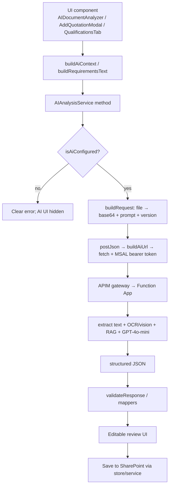

# SmartBid 2.0 — AI Backend API Contract (Reference)

> **Status:** Agreed integration contract for the secure Azure backend that
> **replaces the Power Automate proof-of-concept**. Frontend wiring is in place
> (`AIAnalysisService`, `ai.config.ts`, `ai.prompts.ts`) behind the
> `AI_CONFIG.enabled` switch; the backend is IT's to build.
> **Aligns with existing types:** `IAIAnalysisRequest`, `IAIAnalysisResult`,
> `IQuotationExtractionResult`, `IAISuggestedClarification`, `IScopeItem`
> (`src/webparts/smartBid20/app/models/IAIAnalysis.ts`, `IBid.ts`).
>
> **This document has two parts.** **Part 1** explains how the AI flow is wired in the SmartBid
> frontend — every file created, what it does, how they connect, how the API is called, and
> exactly what IT must hand us. **Part 2** is the backend API contract IT implements.

---

# Part 1 — How the AI flow works in SmartBid (frontend)

## A. Big picture

Every AI feature follows the same path: a UI component collects an input (a file or the current
BID), calls **one** method on **`AIAnalysisService`** (the single gateway client), which
authenticates the signed-in user and POSTs to the **APIM gateway → Function App**. The backend
runs extraction + RAG + the model and returns structured JSON, which the service normalizes and
the component shows for **human review** before anything is saved to SharePoint.



Two rules hold everywhere:

- **Nothing secret in the browser.** The gateway token is per-user (Entra ID); model keys stay
  in Key Vault on the backend.
- **AI is gated.** Every AI button / drop zone is wrapped in `isAiConfigured()`, so with
  `AI_CONFIG.enabled = false` the UI shows no AI at all.

## B. Where IT plugs in — `config/ai.config.ts`

This single file is the switchboard between SmartBid and the Azure backend. **The only values IT
must give us are `apimBaseUrl` and `aadResource`** (plus, optionally, a short-lived
`subscriptionKey` for the very first tests). Once they are set and the backend is live, we flip
`enabled` to `true`.

| Field                       | Filled by             | Meaning                                                                                                                                 |
| --------------------------- | --------------------- | --------------------------------------------------------------------------------------------------------------------------------------- |
| `enabled`                   | **us**                | Master on/off. `isAiConfigured()` also requires `apimBaseUrl`.                                                                          |
| `apimBaseUrl`               | **IT**                | APIM gateway base URL (e.g. `https://<apim>.azure-api.net/smartbid`).                                                                   |
| `aadResource`               | **IT**                | Entra ID App ID URI the gateway validates tokens for (e.g. `api://<app-id>`). Needs the matching API permission approved in the tenant. |
| `subscriptionKey`           | **IT (testing only)** | APIM subscription key, sent in `Ocp-Apim-Subscription-Key`. Must stay empty in shared/prod builds.                                      |
| `subscriptionKeyHeaderName` | us                    | Header name for the key above.                                                                                                          |
| `requestTimeoutMs`          | us                    | Client-side timeout (default 120s).                                                                                                     |
| `sendPromptFromClient`      | us                    | When `true`, we send our prompt + version so the prompt lives in this repo.                                                             |
| `endpoints.*`               | us                    | Relative paths appended to `apimBaseUrl`: `/scope/generate`, `/quotation/extract`, `/clarifications/suggest`, `/chat`.                  |

`isAiConfigured()` returns `enabled && apimBaseUrl` is set; `buildAiUrl(path)` joins the base URL
with an endpoint path.

## C. The four use cases and their UI entry points

| Use case                       | Where the user triggers it                                                 | Component → service method → endpoint                                                       |
| ------------------------------ | -------------------------------------------------------------------------- | ------------------------------------------------------------------------------------------- |
| **Scope of Supply**            | BID → **AI** tab; BID → **Scope** tab (AI modal); **Templates** page       | `AIDocumentAnalyzer` → `analyzeDocument` / `analyzeDocumentForTemplate` → `/scope/generate` |
| **Quotation extraction**       | **Quotations** page drop zone; **Add Quotation** modal ("Extract with AI") | `AddQuotationModal.handleExtract` → `extractQuotation` → `/quotation/extract`               |
| **Clarifications — on demand** | BID → **Qualifications** tab ("Suggest with AI")                           | `QualificationsTab` → `suggestClarifications` → `/clarifications/suggest`                   |
| **Clarifications — inline**    | Returned together with a scope analysis                                    | part of `/scope/generate` response → `ClarificationSuggestionsModal`                        |
| **BID chat** (future)          | —                                                                          | `buildBidChatPrompt` / `endpoints.chat` (not wired yet)                                     |

## D. Files — what each does and how they connect

**Config**

- `config/ai.config.ts` — the switchboard (§B): `AI_CONFIG`, `isAiConfigured()`, `buildAiUrl()`.
- `config/ai.prompts.ts` — versioned prompts kept in-repo: `buildScopeOfSupplyPrompt()`,
  `buildQuotationExtractionPrompt()`, `buildClarificationSuggestionPrompt()`, `buildBidChatPrompt()`
  and their `*_VERSION` tags. Sent to the backend when `sendPromptFromClient` is true.

**Models** (`models/IAIAnalysis.ts`, re-exported from `models/index.ts`)

- `AIUseCase`, `IAIAnalysisContext`, `IAIAnalysisRequest`, `IAIAnalysisResult`, `IAIAnalysisError`,
  `IAIImportMeta`, `IAISuggestedClarification`, `IExtractedQuotationLine`,
  `IQuotationExtractionResult` — the exact shapes defined in Part 2.

**Service — the only code that talks to the gateway** (`services/AIAnalysisService.ts`)

- Public methods: `analyzeDocument(file, bidNumber, context, signal)`,
  `analyzeDocumentForTemplate(file, templateId, context, signal)`,
  `extractQuotation(file, context, signal)`,
  `suggestClarifications(requirementsText, context, signal)`.
- Private plumbing: `ensureConfigured()` (guards `isAiConfigured`), `buildRequest()`
  (`fileToBase64` + attaches prompt/version), `postJson()` (`fetch` with the user's Entra ID
  bearer token from `AiAuthService`), `withAbort()` (timeout +
  cancel), `validateResponse()` / `validateQuotationResult()` / `parseClarifications()` (normalize
  and tag `source:"ai"`, `aiPendingReview:true`), `describeHttpError()` (maps 401/403/422/429/500
  to friendly messages).

**Utils — pure mappers/helpers (no I/O)**

- `utils/aiContext.ts` — `buildAiContext(bid)` → `IAIAnalysisContext` with a rich `contextSummary`;
  `buildRequirementsText(bid)` → serialized requirements text for clarification requests.
- `utils/aiQuotationMapper.ts` — `IQuotationLineDraft`; `resolveQuotationGroup(name…)` maps AI
  group/sub-group **names** to configured **ids** (case-insensitive); `mapExtractedQuotationLine(s)`
  turns backend lines into modal-ready rows.
- `utils/aiClarificationMapper.ts` — `mapSuggestedClarification()` turns a suggestion into a BID
  `IClarificationItem`.

**Components**

- `components/common/AIDocumentAnalyzer.tsx` — reusable upload → analyze → **editable preview**
  panel for scope. Calls the scope methods, receives `IAIAnalysisResult`, and emits
  `onImport(items, meta)` where `meta: IAIImportMeta` carries the diff counts + `suggestedClarifications`.
  Accepts a `contextSummary` prop.
- `components/bid/ClarificationSuggestionsModal.tsx` — reusable checkbox review modal for suggested
  clarifications; `onAccept(accepted)`.
- `components/bid/AddQuotationModal.tsx` — shared Add-Quotation modal; new `initialFile` /
  `autoExtract` props and an "Extract with AI" button → `handleExtract` → `extractQuotation` →
  `mapExtractedQuotationLines`; logs an `ai-quotation-extract` activity entry.
- `components/bid/AITab.tsx` — the BID **AI** tab; hosts `AIDocumentAnalyzer` and passes
  `buildAiContext(bid).contextSummary`.
- `components/bid/QualificationsTab.tsx` — the "Suggest with AI" button → `suggestClarifications` →
  `ClarificationSuggestionsModal` → `saveClarifications`.
- `components/bid/ScopeOfSupplyTab.tsx` — the editable scope grid embedded by the analyzer as the
  review surface (`onAiImport`).

**Pages**

- `pages/QuotationsPage.tsx` — the AI **drop zone** that opens the shared `AddQuotationModal` with
  `autoExtract`.
- `pages/BidDetailPage.tsx` — `importAiScope()` merges reviewed AI scope into the BID and writes the
  activity log; opens `ClarificationSuggestionsModal` from `meta.suggestedClarifications`;
  `acceptAiClarifications()` → `savePatch`.
- `pages/TemplatesPage.tsx` — AI scope import for templates.

## E. How one request actually flows (scope example)

1. User drops a client PDF in **AIDocumentAnalyzer** (BID → AI tab).
2. The tab builds context with `buildAiContext(bid)` and calls
   `AIAnalysisService.analyzeDocument(file, bidNumber, context, signal)`.
3. `ensureConfigured()` checks `isAiConfigured()`. If off, it throws a clear "ask IT for the
   endpoint" error (and the button wouldn't have shown anyway).
4. `buildRequest()` converts the file to **base64** (`fileContent`) and — because
   `sendPromptFromClient` is true — attaches `systemPrompt` + `promptVersion`.
5. `postJson('/scope/generate', request)` builds the URL with `buildAiUrl()`, asks
   `AiAuthService` for the signed-in user's access token (MSAL, authorization code + PKCE) and
   POSTs it as `Authorization: Bearer …`. `withAbort()` enforces the timeout / cancellation.
6. On a non-2xx, `describeHttpError()` turns the status into a friendly message. On success the
   JSON is parsed.
7. `validateResponse()` normalizes items (assigns `id` / `lineNumber`, tags `source:"ai"`,
   `aiPendingReview:true`) and `parseClarifications()` reads `suggestedClarifications`.
8. The analyzer shows an **editable** preview. On confirm it calls `onImport(items, meta)`;
   `BidDetailPage.importAiScope()` merges the items and appends an activity-log entry. If
   `meta.suggestedClarifications` is non-empty, `ClarificationSuggestionsModal` opens so the user
   accepts the ones they want.
9. The user saves; the BID is persisted to SharePoint through the store/service — **the AI never
   writes directly**.

Quotation and clarification flows have the same shape: `AddQuotationModal.handleExtract` →
`extractQuotation` → `mapExtractedQuotationLines` (fills the form), and `QualificationsTab` →
`suggestClarifications` → `ClarificationSuggestionsModal`.

> **In short:** IT gives us `apiBaseUrl` + the SPA app registration (`auth.clientId`,
> `auth.scopes`, `auth.redirectUri`) and implements the endpoints and
> the RAG index described in Part 2. We set those in `ai.config.ts`, flip `enabled = true`, and
> every screen above lights up.

---

# Part 2 — Backend API contract (for IT)

## 1. Architecture (no new Azure resource)

```
SmartBid (browser)
  → sends the client file as base64 (fileContent) + BID context + our system prompt
  → POST to APIM gateway (Entra ID auth) → Function App (secure backend)
      → Key Vault provides the Azure OpenAI credential (Managed Identity)
      → backend extracts document text (TEXT-FIRST); if a page has no usable text
        it falls back to OCR / vision using GPT-4o-mini (multimodal)
      → AI Search retrieves relevant datasheets / catalog / past clarifications (RAG)
      → backend appends a "Reference Material" block to our prompt (see §5)
      → Azure OpenAI (GPT-4o-mini) returns structured JSON
  ← structured JSON (scope / quotation / clarifications)
  → human review & confirm → save to SharePoint
```

Resources used — **all already in the approved list**: Azure OpenAI (GPT-4o-mini,
multimodal), Embeddings deployment, Azure AI Search, APIM + Function App, Key Vault,
Application Insights, Log Analytics. **No Document Intelligence, no Power Automate, no pdf.js.**

> **PDF handling (important):** the frontend does **not** extract text. It always sends the
> raw file as **base64** in `fileContent`. The backend is responsible for text-first
> extraction and OCR/vision fallback for scanned pages. This removes the browser pdf.js
> limitation and handles scanned documents.

---

## 2. Authentication

- Calls go directly to the **Function App** (`AI_CONFIG.apiBaseUrl`), protected by EasyAuth.
- Per-user **Entra ID** token acquired in the browser with **MSAL — authorization code + PKCE**
  against SmartBid's own **SPA app registration** (`AI_CONFIG.auth.clientId`), requesting
  `AI_CONFIG.auth.scopes` (the Function App's `user_impersonation` scope). Same SSO/MFA identity
  as SharePoint; **no key and no client secret in the browser**.
- The tenant-wide SPFx `webApiPermissionRequests` / `AadHttpClient` path is **no longer used** —
  the API permission is scoped to the SmartBid app registration only.
- The backend reaches Azure OpenAI / AI Search with its **Managed Identity**.
- Transport: **HTTPS** only. The Function App must allow CORS for the SharePoint origin
  (`https://oceaneering.sharepoint.com`) including the `Authorization` header.

```
Authorization: Bearer <Entra ID access token>   (MSAL auth code + PKCE)
Content-Type: application/json
```

---

## 3. Endpoint — Generate Scope of Supply

**`POST {apimBaseUrl}/scope/generate`**

Takes the client technical document (**base64**) + BID context + our system prompt, runs
text-first extraction (OCR/vision fallback) and RAG over the catalog index, and returns a
pre-built Scope of Supply for human review.

### Common request envelope — `IAIAnalysisRequest`

Shared by all document endpoints (`useCase` selects the behaviour):

| Field            | Type       | Notes                                                                         |
| ---------------- | ---------- | ----------------------------------------------------------------------------- |
| `fileContent`    | `string`   | **Base64 of the raw file.** Primary input; backend extracts text + OCR/vision |
| `documentText`   | `string`   | Optional pre-extracted text; used instead of `fileContent` when non-empty     |
| `fileName`       | `string`   | Original file name, e.g. `"client-scope.pdf"`                                 |
| `division`       | `string`   | BID division context (e.g. `"SSR-ROV"`)                                       |
| `serviceLine`    | `string`   | BID service line context (e.g. `"ROV"`)                                       |
| `resourceTypes`  | `string[]` | Valid resource types from system config (guides categorization)               |
| `contextSummary` | `string`   | Human-readable BID context (division, client, project, field, vessel)         |
| `bidNumber`      | `string`   | Optional — for logging/traceability                                           |
| `templateId`     | `string`   | Optional — set instead of `bidNumber` when analyzing for a template           |
| `useCase`        | `string`   | `"scope-of-supply"` \| `"quotation"` \| `"clarification"` \| `"chat"`         |
| `systemPrompt`   | `string`   | Our prompt (sent when `AI_CONFIG.sendPromptFromClient = true`) — see §5       |
| `promptVersion`  | `string`   | Version tag of the prompt above, for traceability                             |

```json
{
  "fileName": "petrobras-rov-scope.pdf",
  "fileContent": "<base64 of the PDF>",
  "documentText": "",
  "division": "SSR-ROV",
  "serviceLine": "ROV",
  "resourceTypes": ["ROV Asset", "Tooling", "Survey Equipment", "Personnel"],
  "contextSummary": "BID: REQ-2026-0010 | Division: SSR-ROV | Service line: ROV | Client: Petrobras",
  "bidNumber": "REQ-2026-0010",
  "useCase": "scope-of-supply",
  "systemPrompt": "<SmartBid scope prompt>",
  "promptVersion": "scope-v2"
}
```

### Response body — `IAIAnalysisResult`

| Field                     | Type                          | Notes                                                                        |
| ------------------------- | ----------------------------- | ---------------------------------------------------------------------------- |
| `scopeItems`              | `IScopeItem[]`                | Structured scope items (sections + line items)                               |
| `warnings`                | `string[]`                    | Truncation, low confidence, duplicated boundaries, etc.                      |
| `chunksProcessed`         | `number`                      | `>1` when a large document was split                                         |
| `isComplete`              | `boolean`                     | `false` if the document exceeded a single analysis pass                      |
| `sourceDocument`          | `string`                      | Echo of `fileName`                                                           |
| `analyzedAt`              | `string`                      | ISO timestamp                                                                |
| `promptVersion`           | `string`                      | Optional — echo of the prompt version used                                   |
| `suggestedClarifications` | `IAISuggestedClarification[]` | Optional — clarifications inferred from scope + retrieved past ones (see §7) |

```json
{
  "scopeItems": [
    {
      "id": "ai_a1b2c3",
      "lineNumber": 1,
      "isSection": true,
      "sectionId": null,
      "sectionTitle": "ROV System",
      "clientDocRef": "",
      "description": "",
      "compliance": null,
      "resourceType": "",
      "resourceSubType": "",
      "equipmentOffer": "",
      "partNumber": "",
      "qtyOperational": 0,
      "qtySpare": 0,
      "needsCertification": false,
      "comments": "",
      "importedFromTemplate": "ai-analysis",
      "clientRequirement": "",
      "clientSpecs": []
    },
    {
      "id": "ai_d4e5f6",
      "lineNumber": 2,
      "isSection": false,
      "sectionId": "ai_a1b2c3",
      "sectionTitle": "",
      "clientDocRef": "3.1",
      "description": "Work class ROV rated to 3000 msw",
      "compliance": null,
      "resourceType": "ROV Asset",
      "resourceSubType": "Work Class ROV",
      "equipmentOffer": "",
      "partNumber": "",
      "qtyOperational": 1,
      "qtySpare": 0,
      "needsCertification": false,
      "comments": "",
      "importedFromTemplate": "ai-analysis",
      "clientRequirement": "Work class ROV rated to 3000 msw",
      "clientSpecs": ["Depth rating: 3000 msw", "Class: Work Class"]
    }
  ],
  "warnings": [],
  "chunksProcessed": 1,
  "isComplete": true,
  "sourceDocument": "petrobras-rov-scope.pdf",
  "analyzedAt": "2026-08-04T18:30:00.000Z",
  "suggestedClarifications": []
}
```

### Field reference — `IScopeItem` (key fields the AI fills)

| Field                              | Type             | AI fills                                   |
| ---------------------------------- | ---------------- | ------------------------------------------ |
| `isSection`                        | `boolean`        | Marks a section header row                 |
| `sectionId`                        | `string \| null` | Parent section for a line item             |
| `sectionTitle`                     | `string`         | Section name (when `isSection = true`)     |
| `clientDocRef`                     | `string`         | Reference in the client doc (e.g. `"3.1"`) |
| `description`                      | `string`         | Short item description                     |
| `resourceType` / `resourceSubType` | `string`         | Mapped to system-config resource types     |
| `qtyOperational` / `qtySpare`      | `number`         | Quantities                                 |
| `clientRequirement`                | `string`         | Main requirement text                      |
| `clientSpecs`                      | `string[]`       | Detailed spec lines                        |
| `importedFromTemplate`             | `string`         | Set to `"ai-analysis"` for provenance      |

> `id` and `lineNumber` may be assigned by the frontend on import (as the current
> `AIAnalysisService.validateResponse` already does) — the backend can leave them blank.

---

## 4. Error response — `IAIAnalysisError`

Non-2xx responses return:

```json
{
  "error": "Analysis failed",
  "details": "The document could not be parsed. Try a text-based PDF or use manual entry."
}
```

| HTTP          | Meaning                                         | Frontend behavior                                  |
| ------------- | ----------------------------------------------- | -------------------------------------------------- |
| `400`         | Invalid request (missing `fileContent`/context) | Show validation message                            |
| `401` / `403` | Auth failed / not permitted                     | Re-authenticate                                    |
| `422`         | Document unreadable even after OCR/vision       | Suggest manual entry fallback                      |
| `429`         | Rate/quota limit                                | Ask user to retry shortly                          |
| `500`         | Backend/model error                             | Show generic error; manual entry remains available |

---

## 5. Prompt assembly & RAG grounding contract

SmartBid sends its **own system prompt** (`systemPrompt` + `promptVersion`) when
`AI_CONFIG.sendPromptFromClient = true`, so the prompt lives in this repo and the team can
iterate on it (`src/webparts/smartBid20/app/config/ai.prompts.ts`).

**Backend responsibility:** after retrieving matches from AI Search, the backend **appends a
delimited "Reference Material" block** to our prompt at the agreed marker, then calls the model.
The frontend never sees the retrieved chunks.

The backend also **uses the BID metadata we send** (`division`, `serviceLine`, `resourceTypes`,
`contextSummary`): it prepends them to the AI Search query so retrieval is biased towards the
right business area, and injects them into the prompt as a "BID CONTEXT" block.

```
<our system prompt …>

=== BID CONTEXT (from SmartBid) ===
Division / Service line / Resource types / BID context summary
=== END BID CONTEXT ===

=== REFERENCE MATERIAL (retrieved by backend — do not invent beyond this) ===
[Datasheet/manual excerpts]
[Assets Catalog records: pn + specs]
[Approved past clarifications]
=== END REFERENCE MATERIAL ===
```

Grounding rules the prompt enforces (backend must fill the block accordingly):

- **Datasheet / manual excerpts** → match client specs to real equipment capability.
- **Assets Catalog records** → fill `equipmentOffer` and `partNumber` **only** from the catalog;
  **never invent a part number**; leave `partNumber` blank when unknown.
- **Approved past clarifications** → basis for `suggestedClarifications`.

If IT prefers to own the prompt inside the Function App, set `sendPromptFromClient = false`; the
backend then supplies both the base prompt and the Reference Material.

---

## 6. Endpoint — Extract Quotation

**`POST {apimBaseUrl}/quotation/extract`** — supplier quotation document → structured line items.
Uses the common request envelope (§3) with `useCase = "quotation"`; same auth and error model.
Context is the **global catalog** (no bid), so `contextSummary` may be empty.

### Response body — `IQuotationExtractionResult`

| Field            | Type                        | Notes                                    |
| ---------------- | --------------------------- | ---------------------------------------- |
| `items`          | `IExtractedQuotationLine[]` | One entry per supplier line item         |
| `warnings`       | `string[]`                  | Low confidence, unreadable regions, etc. |
| `sourceDocument` | `string`                    | Echo of `fileName`                       |
| `extractedAt`    | `string`                    | ISO timestamp                            |

#### `IExtractedQuotationLine`

| Field                   | Type                        | Notes                                                |
| ----------------------- | --------------------------- | ---------------------------------------------------- |
| `partNumber`            | `string`                    | OII / manufacturer part number                       |
| `description`           | `string`                    | Item description                                     |
| `supplier`              | `string`                    | Vendor name                                          |
| `cost`                  | `number`                    | Unit cost or day rate in the original currency       |
| `currency`              | `string`                    | ISO code (`USD`, `BRL`, `EUR`, …)                    |
| `leadTimeDays`          | `number`                    | `0` when unspecified                                 |
| `quotationDate`         | `string`                    | ISO date, or `""` when unspecified                   |
| `type`                  | `"acquisition" \| "rental"` | Buy vs. day rate                                     |
| `notes`                 | `string`                    | Free-form notes                                      |
| `suggestedGroupName`    | `string`                    | Optional — mapped to a config group id in the UI     |
| `suggestedSubGroupName` | `string`                    | Optional — mapped to a config sub-group id in the UI |
| `confidence`            | `number`                    | Optional — 0..1                                      |

> The frontend maps `suggestedGroupName` / `suggestedSubGroupName` (names) to the configured
> Favorite group/sub-group **ids** case-insensitively (`utils/aiQuotationMapper.ts`); unmatched
> names are left blank for the user. `costUSD` is computed on the frontend from config exchange rates.

```json
{
  "items": [
    {
      "partNumber": "SUB-1234",
      "description": "Subsea connector, 7-pin",
      "supplier": "Acme Subsea",
      "cost": 4200,
      "currency": "USD",
      "leadTimeDays": 45,
      "quotationDate": "2026-07-30",
      "type": "acquisition",
      "notes": "MOQ 2",
      "suggestedGroupName": "Connectors",
      "suggestedSubGroupName": "Subsea",
      "confidence": 0.82
    }
  ],
  "warnings": [],
  "sourceDocument": "acme-quote.pdf",
  "extractedAt": "2026-08-04T18:30:00.000Z"
}
```

---

## 7. Endpoint — Suggest Clarifications

**`POST {apimBaseUrl}/clarifications/suggest`** — current BID requirements → suggested
clarifications/qualifications, grounded (RAG) in **approved** past clarifications. No file needed.

### Request body (envelope subset)

| Field                            | Type       | Notes                                                  |
| -------------------------------- | ---------- | ------------------------------------------------------ |
| `documentText`                   | `string`   | Serialized current BID scope/requirements              |
| `fileContent`                    | `string`   | `""` — not used for this endpoint                      |
| `division`                       | `string`   | Retrieval filter/context                               |
| `serviceLine`                    | `string`   | Retrieval filter/context                               |
| `resourceTypes`                  | `string[]` | Retrieval context                                      |
| `contextSummary`                 | `string`   | BID context summary                                    |
| `useCase`                        | `string`   | `"clarification"`                                      |
| `systemPrompt` / `promptVersion` | `string`   | Our clarification prompt (when `sendPromptFromClient`) |

### Response body — `IAISuggestedClarification[]`

| Field           | Type                                 | Notes                                             |
| --------------- | ------------------------------------ | ------------------------------------------------- |
| `baseType`      | `"Clarification" \| "Qualification"` | Question vs. exception                            |
| `description`   | `string`                             | Short topic / title                               |
| `clarification` | `string`                             | Text to send to the client                        |
| `rationale`     | `string`                             | Optional — why it is suggested                    |
| `relatedRef`    | `string`                             | Optional — client doc ref / scope this relates to |
| `confidence`    | `number`                             | Optional — 0..1                                   |

> Also returned inline on the scope endpoint as `IAIAnalysisResult.suggestedClarifications`.
> The frontend maps accepted entries to `IClarificationItem` (`utils/aiClarificationMapper.ts`).

```json
[
  {
    "baseType": "Clarification",
    "description": "ROV depth rating",
    "clarification": "Please confirm the required ROV depth rating (3000 msw assumed).",
    "rationale": "Matched an approved past clarification on depth rating.",
    "relatedRef": "3.1",
    "confidence": 0.77
  }
]
```

---

## 8. Knowledge base ingestion (the "brain") — background, not called by the frontend

An ingestion process (can run **inside the same Function App** — no new resource) embeds each
source into Azure AI Search. Trigger on upload/update, or scheduled batch. **Start with a single
index**; split later only if governance/volume requires.

| Source (SharePoint)            | What to embed (per record/chunk)                                                        | Return / use                         | Filter            |
| ------------------------------ | --------------------------------------------------------------------------------------- | ------------------------------------ | ----------------- |
| Datasheets + Manuals libraries | Chunked PDF text                                                                        | Excerpts → match specs to capability | —                 |
| `Assets Catalog_` list         | `title` + `subtitle` + `commonlyUsedNames` + `description` + `features1..3` + `keyword` | `pn` as the canonical part number    | —                 |
| `Clarifications Database` list | `etTopic` + `clarification` + `clientReply`                                             | `baseType` → basis for suggestions   | `approved = true` |

- `/scope/generate` and `/clarifications/suggest` query this index (RAG) and inject results via §5.
- **Never** surface a part number that is not present in `Assets Catalog_`.

---

## 9. Notes & assumptions

- **No pdf.js / no browser extraction.** The frontend always sends the raw file as **base64**
  (`fileContent`); the backend does **text-first** extraction with **OCR/vision fallback**
  (GPT-4o-mini multimodal) for scanned pages.
- **Human-in-the-loop:** every AI output (scope, quotation, clarifications) is reviewed and
  editable before it is saved; imported scope items are tagged `importedFromTemplate: "ai-analysis"`.
- One quotation document is assumed to be **one supplier** (multiple line items allowed).
- This contract mirrors the existing `AIAnalysisService` shapes so switching the backend on is a
  **config change** (`AI_CONFIG.enabled = true` + `apimBaseUrl` / `aadResource`) on the frontend.
