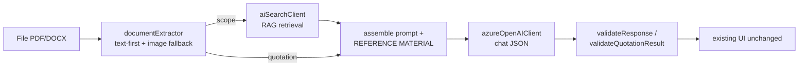

# SmartBid 2.0 — Browser-Only AI Implementation Plan (No Function App)

> **STATUS: DEFERRED / FUTURE REFERENCE.**
> The current codebase **keeps the Function App + APIM backend approach** (see
> [SmartBid-AI-Backend-API-Contract.md](SmartBid-AI-Backend-API-Contract.md)).
> This document preserves the full design for a **browser-only** architecture (all AI
> orchestration in the SPFx client) in case IT confirms there will be **no Function App** and we
> migrate. Nothing here is wired into the shipping code yet.

---

## 1. Why this document exists

IT (Travis) indicated: _"Function App is not configured. AI endpoints will be directly used in the
SPFx application."_ That removes the backend that was going to run the AI business logic
(orchestration). This document captures the analysis and the concrete migration plan so we can
execute it later without re-deriving everything.

**Decision (2026-08):** keep the Function App/APIM approach in code **for now**; preserve this
browser-only plan for a future pivot.

---

## 2. Architecture: with Function App vs. browser-only

### 2.1 Current (kept for now) — Function App backend

```
SPFx (browser) → APIM (Entra auth) → Function App (orchestration)
   → Azure OpenAI (chat)  → Azure AI Search (RAG)  → (Key Vault optional)
```

The Function App is the "brain": extracts text, runs RAG retrieval, assembles the prompt, calls
the model, returns structured JSON. Business logic lives server-side.

### 2.2 Future — browser-only (this document)



The SPFx client becomes the orchestrator. No server-side compute. Each Azure call is authenticated
with the **signed-in user's Entra ID token** via the SPFx `AadHttpClient` (no keys in the browser).

---

## 3. Key technical concepts (must-know before implementing)

### 3.1 CORS vs. Authentication (they are different problems)

- **Auth (Entra ID token)** answers "who are you and can you use this resource?".
- **CORS** is a **browser** rule: a server must return `Access-Control-Allow-Origin` for the calling
  site, or the browser blocks the response. A valid token does **not** bypass CORS.

**Consequence:**

- **Azure OpenAI** does **not** expose a CORS allow-list → the browser **cannot** call it directly.
  It needs a proxy that injects CORS headers. That proxy is typically **APIM** (`cors` policy).
  _Reference:_ [APIM cors policy](https://learn.microsoft.com/en-us/azure/api-management/cors-policy)
  ("adds CORS support … to allow cross-domain calls from browser-based clients"); Microsoft's
  [baseline OpenAI chat architecture](https://learn.microsoft.com/en-us/azure/architecture/ai-ml/architecture/baseline-microsoft-foundry-chat)
  never calls OpenAI from the browser.
- **Azure AI Search** **supports CORS per index** (`corsOptions.allowedOrigins`) → **can** be called
  directly from the browser.

> **APIM is NOT the same as the Function App.** Dropping the Function App does not remove the CORS
> need. Even browser-only, **OpenAI still needs APIM (or another proxy) for CORS**; AI Search does not.

### 3.2 Authentication (Entra ID, no keys)

- Auth is per-user via `AadHttpClient` (delegated token). No API keys in the browser bundle.
- **RBAC roles** (assign to the ~4 users who use AI, ideally via an Entra group):
  - `Cognitive Services OpenAI User` on the Azure OpenAI resource.
  - `Search Index Data Reader` on the Azure AI Search service.
- **Azure OpenAI requires a custom subdomain** (`https://<resource>.openai.azure.com`) or Entra
  tokens return `401`.
- Token scope/audience: OpenAI = `https://ai.azure.com/.default` (or
  `https://cognitiveservices.azure.com/.default`); Search = `https://search.azure.com/.default`.
- Role assignments can take up to ~5 min to propagate (a fresh `403` is often just propagation).

### 3.3 `webApiPermissionRequests` — resource depends on the APIM decision

| Resource                                                                  | How it's called         | `resource` in webApiPermissionRequests                          | `scope`              |
| ------------------------------------------------------------------------- | ----------------------- | --------------------------------------------------------------- | -------------------- |
| **Azure AI Search**                                                       | Direct (CORS per index) | Azure AI Search 1st-party resource (`https://search.azure.com`) | `user_impersonation` |
| **Azure OpenAI (via APIM, auth boundary)**                                | Browser → APIM          | Custom **APIM app registration** display name                   | its custom scope     |
| **Azure OpenAI (via APIM, transparent CORS proxy forwarding user token)** | Browser → APIM → OpenAI | Azure Cognitive Services 1st-party resource                     | `user_impersonation` |
| **Azure OpenAI (fully direct)**                                           | Browser → OpenAI        | Cognitive Services (blocked by CORS — not viable)               | `user_impersonation` |

- **AI Search entry can be defined now.** **OpenAI entry waits on the APIM decision.**
- Exact 1st-party display names must be confirmed in the tenant (they must match exactly on the
  SharePoint Admin → API access approval). Delegated `user_impersonation` on 1st-party resources can
  need explicit admin approval.

### 3.4 Governance without a Function App (mostly preserved **if APIM stays**)

- **Rate limiting** is an **APIM** feature (`rate-limit-by-key`, `quota-by-key`) + the OpenAI
  deployment's TPM/RPM caps. It was never exclusive to the Function App.
- **Logging/cost**: enable **diagnostic settings** on Azure OpenAI and AI Search → **Log Analytics**
  (captures requests + **token usage** for cost). APIM → App Insights logs every gateway call
  (server-side, tamper-proof). SPFx can send client-side UX telemetry via the **App Insights JS SDK**
  (less trustworthy for audit). Add **Azure Cost Management budget + alerts** on the OpenAI resource.
- The only thing genuinely lost: a place for **custom server-side business logic / guardrails** beyond
  APIM policies + Azure OpenAI's built-in content filter.

### 3.5 Document reading (text-first, vision fallback) — moves to the browser

- Current code sends the raw file as **base64**; the **backend** extracted text and fell back to
  **OCR/vision (multimodal model)** for scanned pages. Browser-only, that step must run client-side.
- Azure OpenAI's chat API accepts **text or images**, not a raw PDF. So:
  - **Text PDF** → `pdf.js` `getTextContent()` → send text (cheap).
  - **Scanned/photo PDF** → `pdf.js` rasterize page to image → send as `image_url` to a **multimodal**
    model (the model does the "OCR"). **Requires `gpt-5.1-mini` to be multimodal (confirm with Travis).**
  - **.docx** → `mammoth` → text.
- **Cost control:** decide per page — only rasterize pages that have no extractable text.

---

## 4. Implementation plan (phases)

**Finalized decisions:**

- Scanned-PDF image path: **implement now, behind a `multimodal` flag** (off until Travis confirms).
- Scope this round: **Scope generation (RAG) + Quotation extraction** only (not `suggestClarifications`,
  not chat).
- Old transport: **keep as a disabled fallback** behind a `transport: "client" | "legacy"` selector
  (default `"client"` once migrated).

### Phase 1 — Config + permissions + deps

1. Restructure [ai.config.ts](src/webparts/smartBid20/app/config/ai.config.ts):
   - `openAi`: `baseUrl` (APIM proxy OR openai.azure.com), `deployment` (`gpt-5.1-mini`),
     `apiVersion`, `resource` (token audience/App ID URI), `multimodal` (bool).
   - `search`: `endpoint`, `indexName` (`smartbid-docs-index`), `apiVersion`, `resource`,
     `vectorField` (`text_vector`), `semanticConfig`, `topK`.
   - `rag`: `enabled`. Keep master `enabled`, `requestTimeoutMs`.
   - `transport`: `"client" | "legacy"` (default `"client"` after migration).
   - **KEEP** legacy fields (`apimBaseUrl`, `endpoints`, `subscriptionKey`, `sendPromptFromClient`,
     `buildAiUrl`) for the `"legacy"` fallback.
2. [package-solution.json](config/package-solution.json): add `webApiPermissionRequests` — **AI Search
   now**, **OpenAI after APIM decision** (see §3.3).
3. [package.json](package.json): add `pdfjs-dist` + `mammoth`. Configure the **pdf.js worker**
   (`GlobalWorkerOptions.workerSrc`) for the SPFx bundle — _validate in the workbench (risk area)_.

### Phase 2 — New client-side utilities (`app/utils/`)

4. `documentExtractor.ts` — `File → { text: string, pageImages: string[] }` (pdf.js text-first +
   image fallback; mammoth for `.docx`).
5. `aiSearchClient.ts` — RAG retrieval via **integrated vectorization** (send text; Search vectorizes),
   token via `SPService.context.aadHttpClientFactory.getClient(search.resource)`.
6. `azureOpenAIClient.ts` — chat completions (`response_format: json_object`), supports text + image
   parts, token via `getClient(openAi.resource)`. Reuse `withAbort` for timeout.

### Phase 3 — Rewrite `AIAnalysisService` internals (keep the public API)

7. `analyzeDocument` / `analyzeDocumentForTemplate` (scope, RAG): extract → retrieve → assemble
   `buildScopeOfSupplyPrompt(resourceTypes)` + `REFERENCE MATERIAL` block + user content →
   `azureOpenAIClient` → **`validateResponse()` (unchanged)**.
8. `extractQuotation` (no RAG): extract → `buildQuotationExtractionPrompt()` → `azureOpenAIClient` →
   **`validateQuotationResult()` (unchanged)**.
9. `suggestClarifications` / chat: out of scope this round (keep pointing at the inactive legacy path).
10. Keep old transport (`postJson`, `buildRequest`, `fileToBase64`, `buildAiUrl`) behind
    `transport: "legacy"`. Keep `ensureConfigured`, `withAbort`, `describeHttpError`.

### Phase 4 — Wire-up, gating, verification

11. `isAiConfigured()` still governs the 4 UI gates (`AddQuotationModal`, `QualificationsTab`,
    `QuotationsPage`, `AIDocumentAnalyzer`) — **no UI changes**.
12. Error UX: reuse `describeHttpError` (401/403 no-RBAC, 429, 422). Add a friendly "no AI access"
    message for non-authorized users (403).

---

## 5. Config shape (illustrative skeleton)

```typescript
// ai.config.ts (restructured — illustrative)
export interface IAiConfig {
  enabled: boolean;
  transport: "client" | "legacy"; // "client" = browser orchestration; "legacy" = Function App
  requestTimeoutMs: number;

  openAi: {
    baseUrl: string; // APIM proxy URL OR https://<res>.openai.azure.com
    deployment: string; // "gpt-5.1-mini"
    apiVersion: string; // e.g. "2024-10-21"
    resource: string; // token audience / App ID URI (APIM app OR cognitiveservices)
    multimodal: boolean; // enable scanned-page image input
  };

  search: {
    endpoint: string; // https://<svc>.search.windows.net
    indexName: string; // "smartbid-docs-index"
    apiVersion: string; // e.g. "2024-07-01"
    resource: string; // https://search.azure.com
    vectorField: string; // "text_vector"
    semanticConfig?: string; // "smartbid-semantic-config"
    topK: number; // 5
  };

  rag: { enabled: boolean };

  // --- LEGACY (kept for transport:"legacy" fallback) ---
  apimBaseUrl: string;
  subscriptionKey: string;
  subscriptionKeyHeaderName: string;
  sendPromptFromClient: boolean;
  endpoints: {
    generateScope: string;
    extractQuotation: string;
    suggestClarifications: string;
    chat: string;
  };
}

export function isAiConfigured(): boolean {
  if (!AI_CONFIG.enabled) return false;
  return AI_CONFIG.transport === "legacy"
    ? AI_CONFIG.apimBaseUrl.trim().length > 0
    : AI_CONFIG.openAi.baseUrl.trim().length > 0;
}
```

---

## 6. New client utilities (illustrative skeletons)

### 6.1 `documentExtractor.ts`

```typescript
import * as pdfjs from "pdfjs-dist";
import mammoth from "mammoth";
// GlobalWorkerOptions.workerSrc must be set for SPFx (bundle asset or CDN).

export interface IExtractedDocument {
  text: string;
  pageImages: string[];
}

export async function extractDocument(file: File): Promise<IExtractedDocument> {
  const name = file.name.toLowerCase();
  if (name.endsWith(".docx") || name.endsWith(".doc")) {
    const buf = await file.arrayBuffer();
    const res = await mammoth.extractRawText({ arrayBuffer: buf });
    return { text: res.value || "", pageImages: [] };
  }
  // PDF: text-first, image fallback per page
  const data = new Uint8Array(await file.arrayBuffer());
  const pdf = await pdfjs.getDocument({ data }).promise;
  const texts: string[] = [];
  const images: string[] = [];
  for (let p = 1; p <= pdf.numPages; p++) {
    const page = await pdf.getPage(p);
    const content = await page.getTextContent();
    const pageText = content.items
      .map((i: any) => i.str)
      .join(" ")
      .trim();
    if (pageText.length > 20) {
      texts.push(pageText);
    } else {
      // scanned page → rasterize to image (only when multimodal is enabled at call site)
      const viewport = page.getViewport({ scale: 2 });
      const canvas = document.createElement("canvas");
      canvas.width = viewport.width;
      canvas.height = viewport.height;
      const ctx = canvas.getContext("2d")!;
      await page.render({ canvasContext: ctx, viewport }).promise;
      images.push(canvas.toDataURL("image/png"));
    }
  }
  return { text: texts.join("\n\n"), pageImages: images };
}
```

### 6.2 `aiSearchClient.ts`

```typescript
import { AadHttpClient, IHttpClientOptions } from "@microsoft/sp-http";
import { SPService } from "../services/SPService";
import { AI_CONFIG } from "../config/ai.config";

export interface IRetrievedChunk {
  title: string;
  chunk: string;
  sourceUrl: string;
  manufacturer?: string;
  docModel?: string;
}

export async function retrieveContext(
  query: string,
): Promise<IRetrievedChunk[]> {
  const s = AI_CONFIG.search;
  const url = `${s.endpoint}/indexes/${s.indexName}/docs/search?api-version=${s.apiVersion}`;
  const body = {
    search: query, // hybrid: keyword + vector
    vectorQueries: [
      { kind: "text", text: query, fields: s.vectorField, k: s.topK },
    ],
    select: "title,chunk,sourceUrl,manufacturer,docModel",
    top: s.topK,
  };
  const client = await SPService.context.aadHttpClientFactory.getClient(
    s.resource,
  );
  const options: IHttpClientOptions = {
    headers: { "Content-Type": "application/json" },
    body: JSON.stringify(body),
  };
  const res = await client.post(url, AadHttpClient.configurations.v1, options);
  const json = await res.json();
  return (json.value || []) as IRetrievedChunk[];
}
```

### 6.3 `azureOpenAIClient.ts`

```typescript
import { AadHttpClient, IHttpClientOptions } from "@microsoft/sp-http";
import { SPService } from "../services/SPService";
import { AI_CONFIG } from "../config/ai.config";

type Part =
  | { type: "text"; text: string }
  | { type: "image_url"; image_url: { url: string } };
export interface IChatMessage {
  role: "system" | "user" | "assistant";
  content: string | Part[];
}

export async function chatJson(messages: IChatMessage[]): Promise<any> {
  const o = AI_CONFIG.openAi;
  // baseUrl points to APIM proxy OR the OpenAI resource; path shape depends on that choice.
  const url = `${o.baseUrl.replace(/\/+$/, "")}/openai/deployments/${o.deployment}/chat/completions?api-version=${o.apiVersion}`;
  const body = {
    messages,
    response_format: { type: "json_object" },
    temperature: 0,
  };
  const client = await SPService.context.aadHttpClientFactory.getClient(
    o.resource,
  );
  const options: IHttpClientOptions = {
    headers: { "Content-Type": "application/json" },
    body: JSON.stringify(body),
  };
  const res = await client.post(url, AadHttpClient.configurations.v1, options);
  const json = await res.json();
  return JSON.parse(json.choices[0].message.content);
}
```

### 6.4 `AIAnalysisService` orchestration (pseudocode — public API unchanged)

```typescript
// analyzeDocument (scope, RAG)
const doc = await extractDocument(file);
const chunks = AI_CONFIG.rag.enabled
  ? await retrieveContext(doc.text.slice(0, 8000))
  : [];
const reference = chunks
  .map((c) => `[${c.title}] (${c.sourceUrl})\n${c.chunk}`)
  .join("\n\n---\n\n");
const systemPrompt =
  `${buildScopeOfSupplyPrompt(context.resourceTypes)}\n\n` +
  `=== REFERENCE MATERIAL (do not invent beyond this) ===\n${reference}\n=== END REFERENCE MATERIAL ===`;
const userParts = [{ type: "text", text: doc.text }];
if (AI_CONFIG.openAi.multimodal)
  doc.pageImages.forEach((u) =>
    userParts.push({ type: "image_url", image_url: { url: u } }),
  );
const raw = await chatJson([
  { role: "system", content: systemPrompt },
  { role: "user", content: userParts },
]);
return AIAnalysisService.validateResponse(raw, file.name); // UNCHANGED

// extractQuotation (no RAG)
const doc2 = await extractDocument(file);
const raw2 = await chatJson([
  { role: "system", content: buildQuotationExtractionPrompt() },
  { role: "user", content: doc2.text },
]);
return AIAnalysisService.validateQuotationResult(raw2, file.name); // UNCHANGED
```

---

## 7. What stays stable (reuse map)

| Need                   | Reuse (do not rewrite)                                                                       |
| ---------------------- | -------------------------------------------------------------------------------------------- |
| Response normalization | `AIAnalysisService.validateResponse`, `validateQuotationResult`, `parseClarifications`       |
| Timeout / errors       | `withAbort`, `describeHttpError`, `ensureConfigured`                                         |
| Prompts                | `buildScopeOfSupplyPrompt`, `buildQuotationExtractionPrompt` + version consts                |
| Types                  | `IAIAnalysisResult`, `IQuotationExtractionResult`, `IExtractedQuotationLine`, `IScopeItem`   |
| Mappers                | `mapExtractedQuotationLines`, `mapSuggestedClarification`                                    |
| UI                     | `AIDocumentAnalyzer`, `AddQuotationModal`, `QualificationsTab`, `QuotationsPage` (unchanged) |
| Gate                   | `isAiConfigured()`                                                                           |

---

## 8. Verification checklist

1. `npm install --legacy-peer-deps`, then `gulp bundle` → no TS errors (ES5 target; avoid `flatMap`).
2. `gulp serve` (workbench): pdf.js worker loads; text PDF → text; scanned PDF → page image.
3. `enabled = false` → zero AI UI (all 4 gates).
4. With Travis's endpoints: AI Search returns chunks; OpenAI returns valid JSON; `AIDocumentAnalyzer`
   renders scope items; `AddQuotationModal` prefills via `mapExtractedQuotationLines`.
5. CORS/auth are **runtime/infra** — fully testable only after: APIM decision, RBAC on the 4 users,
   OpenAI custom subdomain, index `corsOptions.allowedOrigins = https://oceaneering.sharepoint.com`.

---

## 9. Open questions for Travis (consolidated)

1. **APIM in front of Azure OpenAI?** Browser can't call OpenAI directly (CORS). Which mode: APIM as
   auth boundary (custom app token) or transparent CORS proxy forwarding the user's OpenAI token?
   _(This decides the OpenAI `webApiPermissionRequests` resource.)_
2. **RBAC on the 4 users** (`Cognitive Services OpenAI User` + `Search Index Data Reader`) — via an
   Entra group?
3. **Is `gpt-5.1-mini` multimodal** (image input) for scanned pages?
4. Provide: OpenAI endpoint (+ **custom subdomain**), chat deployment name, embedding deployment name +
   dimensions, AI Search service name + index name, and the exact **1st-party resource display names**
   for the permission requests.
5. Enable **diagnostic settings** (OpenAI + AI Search → Log Analytics) and an **App Insights**
   connection string for client telemetry; set a **Cost Management budget**.

---

## Appendix A — Azure AI Search setup (index / data source / skillset / indexer)

> Runs entirely in Azure (the indexer's identity reads SharePoint). **Independent of the Function App**
> — needed for the RAG flow regardless of browser-only vs. backend. Preview feature; requires AI Search
> **Basic tier+**. The indexer uses a **separate Entra app** ("App B") with Microsoft Graph
> **application** permissions `Files.Read.All` + `Sites.Read.All` (client secret or federated identity;
> Managed Identity preferred). Scoped to the `smartBidDocs` library folders **Datasheets** and
> **Manuals and Catalogs** only.

### A.1 Data source (folder-scoped)

```json
{
  "name": "smartbid-docs-datasource",
  "type": "sharepoint",
  "credentials": {
    "connectionString": "SharePointOnlineEndpoint=https://oceaneering.sharepoint.com/sites/G-OPGSSRBrazilEngineering;ApplicationId=<APP_B_CLIENT_ID>;ApplicationSecret=<APP_B_CLIENT_SECRET>;TenantId=<TENANT_ID>"
  },
  "container": {
    "name": "useQuery",
    "query": "includeFolder=oceaneering.sharepoint.com/sites/G-OPGSSRBrazilEngineering/smartBidDocs/Datasheets;includeFolder=oceaneering.sharepoint.com/sites/G-OPGSSRBrazilEngineering/smartBidDocs/Manuals and Catalogs;additionalColumns=DocType,DocCategory,Manufacturer,DocModel,DocKeywords,DocDescription,DocRevision"
  }
}
```

> Notes: renaming a folder breaks incremental indexing and requires updating this query. If the space
> in `Manuals and Catalogs` is rejected, try `Manuals%20and%20Catalogs`.

### A.2 Index

```json
{
  "name": "smartbid-docs-index",
  "fields": [
    {
      "name": "chunk_id",
      "type": "Edm.String",
      "key": true,
      "searchable": true,
      "filterable": false,
      "sortable": true,
      "analyzer": "keyword"
    },
    { "name": "parent_id", "type": "Edm.String", "filterable": true },
    { "name": "chunk", "type": "Edm.String", "searchable": true },
    { "name": "title", "type": "Edm.String", "searchable": true },
    { "name": "sourceUrl", "type": "Edm.String", "filterable": true },
    {
      "name": "docType",
      "type": "Edm.String",
      "searchable": true,
      "filterable": true,
      "facetable": true
    },
    {
      "name": "docCategory",
      "type": "Edm.String",
      "searchable": true,
      "filterable": true,
      "facetable": true
    },
    {
      "name": "manufacturer",
      "type": "Edm.String",
      "searchable": true,
      "filterable": true,
      "facetable": true
    },
    {
      "name": "docModel",
      "type": "Edm.String",
      "searchable": true,
      "filterable": true
    },
    { "name": "docKeywords", "type": "Edm.String", "searchable": true },
    { "name": "docDescription", "type": "Edm.String", "searchable": true },
    { "name": "docRevision", "type": "Edm.String", "filterable": true },
    {
      "name": "text_vector",
      "type": "Collection(Edm.Single)",
      "searchable": true,
      "dimensions": 1536,
      "vectorSearchProfile": "smartbid-hnsw-profile"
    }
  ],
  "vectorSearch": {
    "algorithms": [
      {
        "name": "smartbid-hnsw",
        "kind": "hnsw",
        "hnswParameters": {
          "metric": "cosine",
          "m": 4,
          "efConstruction": 400,
          "efSearch": 500
        }
      }
    ],
    "vectorizers": [
      {
        "name": "smartbid-openai-vectorizer",
        "kind": "azureOpenAI",
        "azureOpenAIParameters": {
          "resourceUri": "<AZURE_OPENAI_ENDPOINT>",
          "deploymentId": "<EMBEDDING_DEPLOYMENT_NAME>",
          "modelName": "<EMBEDDING_MODEL_NAME>"
        }
      }
    ],
    "profiles": [
      {
        "name": "smartbid-hnsw-profile",
        "algorithm": "smartbid-hnsw",
        "vectorizer": "smartbid-openai-vectorizer"
      }
    ]
  },
  "semantic": {
    "configurations": [
      {
        "name": "smartbid-semantic-config",
        "prioritizedFields": {
          "titleField": { "fieldName": "title" },
          "prioritizedContentFields": [{ "fieldName": "chunk" }],
          "prioritizedKeywordsFields": [
            { "fieldName": "docKeywords" },
            { "fieldName": "docCategory" }
          ]
        }
      }
    ]
  }
}
```

> `dimensions` must match the embedding deployment (1536 = `text-embedding-3-small`/`ada-002`;
> 3072 = `text-embedding-3-large`). The `vectorizer` lets the browser send **text** queries and have
> AI Search embed them server-side (no embedding call from the client).

### A.3 Skillset (split + embedding + projections)

```json
{
  "name": "smartbid-docs-skillset",
  "skills": [
    {
      "@odata.type": "#Microsoft.Skills.Text.SplitSkill",
      "name": "split-skill",
      "textSplitMode": "pages",
      "maximumPageLength": 2000,
      "pageOverlapLength": 500,
      "context": "/document",
      "inputs": [{ "name": "text", "source": "/document/content" }],
      "outputs": [{ "name": "textItems", "targetName": "pages" }]
    },
    {
      "@odata.type": "#Microsoft.Skills.Text.AzureOpenAIEmbeddingSkill",
      "name": "embedding-skill",
      "resourceUri": "<AZURE_OPENAI_ENDPOINT>",
      "deploymentId": "<EMBEDDING_DEPLOYMENT_NAME>",
      "modelName": "<EMBEDDING_MODEL_NAME>",
      "dimensions": 1536,
      "context": "/document/pages/*",
      "inputs": [{ "name": "text", "source": "/document/pages/*" }],
      "outputs": [{ "name": "embedding", "targetName": "text_vector" }]
    }
  ],
  "indexProjections": {
    "selectors": [
      {
        "targetIndexName": "smartbid-docs-index",
        "parentKeyFieldName": "parent_id",
        "sourceContext": "/document/pages/*",
        "mappings": [
          { "name": "chunk", "source": "/document/pages/*" },
          { "name": "text_vector", "source": "/document/pages/*/text_vector" },
          { "name": "title", "source": "/document/metadata_spo_item_name" },
          {
            "name": "sourceUrl",
            "source": "/document/metadata_spo_item_weburi"
          },
          { "name": "docType", "source": "/document/DocType" },
          { "name": "docCategory", "source": "/document/DocCategory" },
          { "name": "manufacturer", "source": "/document/Manufacturer" },
          { "name": "docModel", "source": "/document/DocModel" },
          { "name": "docKeywords", "source": "/document/DocKeywords" },
          { "name": "docDescription", "source": "/document/DocDescription" },
          { "name": "docRevision", "source": "/document/DocRevision" }
        ]
      }
    ],
    "parameters": { "projectionMode": "skipIndexingParentDocuments" }
  }
}
```

### A.4 Indexer (daily schedule)

```json
{
  "name": "smartbid-docs-indexer",
  "dataSourceName": "smartbid-docs-datasource",
  "targetIndexName": "smartbid-docs-index",
  "skillsetName": "smartbid-docs-skillset",
  "schedule": { "interval": "PT24H", "startTime": "2026-08-21T03:00:00Z" },
  "parameters": {
    "batchSize": 10,
    "configuration": {
      "indexedFileNameExtensions": ".pdf,.docx,.doc,.pptx,.xlsx,.txt",
      "excludedFileNameExtensions": ".png,.jpg,.jpeg,.gif",
      "dataToExtract": "contentAndMetadata"
    }
  },
  "fieldMappings": [
    {
      "sourceFieldName": "metadata_spo_site_library_item_id",
      "targetFieldName": "parent_id"
    }
  ]
}
```

> Incremental: even daily, it only processes changed files. Trigger on demand via
> `POST .../indexers/smartbid-docs-indexer/run` when needed.

### A.5 (Optional) Metadata auto-fill — "Option B"

The `smartBidDocs` metadata columns are currently empty. Empty columns **do not break** indexing and
**do not affect** semantic search (that comes from the PDF content). To gain structured filters
without manual data entry, add a `WebApiSkill` that calls a backend endpoint to extract
`docType/manufacturer/docModel/docKeywords/docDescription` from the content and write them to the
**index** fields (not the SharePoint columns). Deferred — not needed for the MVP. Alternatively derive
`docCategory` from the folder path (`metadata_spo_item_path`).

---

## Appendix B — Caveats summary

- **Lists are not indexable** by the SharePoint indexer: `Assets Catalog_` and `Clarifications Database`
  can't use this indexer. Browser-only advantage: the SPFx app can read those **lists via PnPjs** and
  append them to the RAG "Reference Material" client-side (future enhancement).
- **Preview + Basic tier** required for the SharePoint indexer.
- **Two Entra apps:** App A = SPFx → gateway (delegated user token); App B = AI Search → SharePoint
  indexer (Graph application permissions). They are different apps with different purposes.
