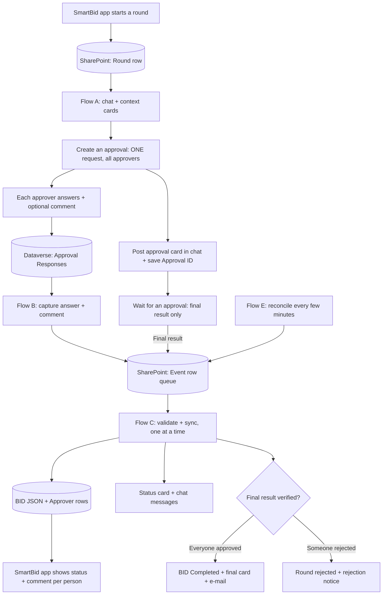

# SmartBid 2.0 — Native Teams Approvals: Power Automate Build Guide (IT Handoff)

| Item               | Value                                                                               |
| ------------------ | ----------------------------------------------------------------------------------- |
| Audience           | Oceaneering IT / Power Platform team that will **build and operate** the flows      |
| Prepared by        | SmartBid 2.0 team — Brazil Engineering                                              |
| Contact            | `<SmartBid team contact — name / e-mail>`                                           |
| SharePoint         | `https://oceaneering.sharepoint.com/sites/G-OPGSSRBrazilEngineering`                |
| Date               | 2026-10-02                                                                          |
| Status             | Design specification for implementation — **not** an exported or tenant-tested flow |
| Portuguese version | [APPROVALS-NATIVE.md](./APPROVALS-NATIVE.md) (same design, internal notes)          |

> **How to read this document.** Steps are written in build order. Anything marked **Verify** depends
> on the tenant (connector output paths, Dataverse states, permissions) and must be confirmed in a
> test run before go-live. Please do not replace a **Verify** item with an assumption — report the
> finding back to the SmartBid team (§16).

---

## 0. Summary

SmartBid 2.0 is a SharePoint (SPFx) application used by Brazil Engineering to manage BID requests.
At the end of a BID, a group of approvers from different sectors must approve it. Today this is done
by a Power Automate flow that posts **one card per approver** in a Teams group chat
(see [README.md](./README.md), Portuguese — **previous design, for reference only**).

We want to switch to the **native Teams Approvals** experience:

- **One approval request per BID round**, assigned to **all** approvers at once.
- Approvers answer **in any order** with **Approve** or **Reject** and an **optional comment**.
- **Everyone must approve**; a single **Reject** ends the request as rejected.
- **Each individual answer and comment must reach SmartBid as soon as it is submitted**, while the
  other approvers are still pending — not only when the whole request is finished.

### 0.1 What IT is asked to build

| ID  | Suggested flow name                    | Trigger                                                  | Purpose                                                                                                |
| --- | -------------------------------------- | -------------------------------------------------------- | ------------------------------------------------------------------------------------------------------ |
| A   | `SmartBid – Native Approval Round`     | SharePoint item **created** (Round row)                  | Creates the chat and **one** collective approval, waits for the final result, queues the result        |
| B   | `SmartBid – Native Approval Responses` | Dataverse **Approval Response** row added/modified       | Captures each individual answer + comment as soon as it is submitted and queues it                     |
| C   | `SmartBid – Native Approval Sync`      | SharePoint item **created** (Event row)                  | **Only writer** of approval decisions to the BID; validates, updates SharePoint, status card, messages |
| D   | `SmartBid – Native Approval Reminders` | Recurrence (hourly)                                      | @mentions approvers who have not answered after 24 h                                                   |
| E   | `SmartBid – Native Approval Reconcile` | Recurrence (every 1–5 min)                               | Safety net: recovers responses/results that were missed and retries failed events                      |
| F   | `SmartBid – Approval Override Notice`  | SharePoint item **created or modified** (Round override) | Posts the override notice once and asks for the native request to be cancelled                         |

### 0.2 What is **not** in IT scope

- **SharePoint lists, columns, choice values, indexes and list permissions** — done by the SmartBid team (§4).
- **The SPFx application** (starting rounds, polling the open BID, showing per-person comments,
  Engineering override) — done by the SmartBid team.

IT only reads/writes the SharePoint lists through the flows, following the data contract in §4.

---

## 1. Responsibilities

| Area                                                                                   | Owner         | Notes                                                                      |
| -------------------------------------------------------------------------------------- | ------------- | -------------------------------------------------------------------------- |
| Flows A–F, connections, connection references, environment                             | **IT**        | Recommended: one Power Platform **solution** containing all flows          |
| Service account that owns the flows and connections                                    | **IT**        | Send the account UPN to the SmartBid team (needed for list permissions)    |
| Licensing (Dataverse connector is **Premium**), DLP policies, Dataverse security roles | **IT**        | Go/no-go gate in §3                                                        |
| Proof of concept for partial-response capture (§3.3)                                   | **IT**        | SmartBid team provides test approvers                                      |
| SharePoint columns, choices, indexes, unique key (§4.3)                                | SmartBid team | IT verifies internal names before building                                 |
| SharePoint permissions for the flow service account on both lists                      | SmartBid team | Contribute on `smartbid-approvals` and `smartbid-tracker`                  |
| SPFx app changes (polling, comment display, override)                                  | SmartBid team | No app change is required from IT                                          |
| Adaptive Card and e-mail templates                                                     | SmartBid team | Provided in [cards/](./cards/) and [email/](./email/); IT wires the tokens |
| End-to-end testing and cutover                                                         | **Joint**     | §14 and §15                                                                |

---

## 2. How the solution works

### 2.1 Business rules

1. When a SmartBid user starts an approval round, the app creates a **Round row** in the SharePoint
   list `smartbid-approvals`. This row is the trigger for Flow A.
2. Flow A creates a Teams group chat and **one** native approval request of type
   **`Approve/Reject - Everyone must approve`**, assigned to every approver (deduplicated by e-mail).
3. Approvers can answer from the Teams chat card, the Approvals app in Teams, or the approval e-mail.
   All of them answer the **same** request.
4. Each answer (decision + optional comment) is written back to the BID **immediately**, so the
   SmartBid app shows "Laura approved — comment: ..." while the others are still pending.
5. If everyone approves, the BID is closed as approved (status card, final card and e-mail).
   If anyone rejects, the round is closed as **rejected** (no success messages).
6. Being a chat member does **not** make a person an approver. Engineers and analysts are added
   to the chat for visibility only.

> **Do not** create one approval per person, and **do not** use `First to respond`: the first
> answer would close the request without the others.

### 2.2 Why several flows are needed

- **`Wait for an approval` only returns at the end** (everyone approved, or someone rejected).
  It does **not** release the flow when one approver answers. So Flow A alone cannot report
  partial progress.
- Individual answers are stored by the Approvals service in **Dataverse**, table
  **Approval Response**. Flow B listens to that table to capture each answer as it happens.
- Flows A and B never write to the BID directly. They put an **Event row** in a SharePoint queue
  (the same `smartbid-approvals` list, `RecordType = Event`). Flow C processes those events **one at
  a time**, so two flows never overwrite the BID at the same moment.
- Flow E periodically compares Dataverse with SharePoint to recover anything that was missed.

### 2.3 Diagram



### 2.4 How the flows find the correct approval (correlation)

Many SmartBid rounds can be running at the same time, and the Dataverse **Approval Response** table
also contains answers to approvals from **other teams and applications** in the same environment.
The flows never search by title or by person. They use IDs:

1. When Flow A creates the native approval, it immediately saves the returned **Approval ID** and the
   **environment ID** on that round's **Round row** (`NativeApprovalId`, `NativeEnvironment`).
2. Every Approval Response row in Dataverse contains a **lookup to the approval it belongs to**
   (`_msdyn_flow_approvalresponse_approval_value`).
3. Flow B reads that lookup and searches `smartbid-approvals` for a Round row with the **same**
   `NativeApprovalId`:
   - **Found (exactly one)** → it is a SmartBid round; the answer is queued for that round.
   - **Not found** → it is not a SmartBid approval (or Flow A has not saved the ID yet). Flow B ends
     **without writing anything**. If it was a SmartBid answer that arrived too early, Flow E
     recovers it on its next run, because Flow E queries Dataverse **by Approval ID** for every
     open SmartBid round.

Example: three SmartBid rounds are open with Approval IDs `X`, `Y` and `Z`. An answer linked to `Y`
updates only the round whose Round row has `NativeApprovalId = Y`. An answer linked to `W`
(another department's approval) is ignored.

> **Verify (PoC, §3.3):** the Approval ID returned by `Create an approval` must be the **same GUID**
> found in `_msdyn_flow_approvalresponse_approval_value` (or in `msdyn_flow_approvalresponseidx_approvalid`)
> of that approval's responses. The whole design depends on this match.

### 2.5 Glossary

| Term            | Meaning                                                                                               |
| --------------- | ----------------------------------------------------------------------------------------------------- |
| BID             | One item in `smartbid-tracker`. All BID data is stored as a JSON string in the `jsondata` column      |
| Round           | One approval cycle of a BID (`round` = 1, 2, …). A rejected BID can get a new round later             |
| Round row       | Item in `smartbid-approvals` with `RecordType = Round`, created by the app. Trigger for Flow A        |
| Approver row    | Item with `RecordType = Approver`: one per **person + sector** responsibility, created by Flow A      |
| Event row       | Item with `RecordType = Event`: queued work for Flow C, created by Flows A, B and E                   |
| Responsibility  | One person approving for one sector. The same person may represent two sectors → two responsibilities |
| Unique approver | One person (e-mail). The native request contains each person **once**, even with several sectors      |
| Approval ID     | ID of the single native approval request of a round. Identifies the **request**                       |
| Response ID     | `msdyn_flow_approvalresponseid`. Identifies one person's **answer**                                   |
| RoundItemId     | SharePoint item ID of the Round row. Identifies **our** tracking record                               |

The three IDs above must never be used interchangeably.

### 2.6 Same person in more than one sector

The app may list the same person for two sectors (two responsibilities). The native request asks
that person **once**. Rules:

- `Assigned to` contains each e-mail once.
- The person's single answer, comment and date are applied to **all** of their responsibilities in
  that round (all their Approver rows and all their entries in the BID JSON).
- Progress in Teams is counted in **unique people**; the SmartBid app may also show responsibilities
  per sector. Do not mix the two counts.

---

## 3. Prerequisites and go/no-go gate (IT)

### 3.1 Platform checklist

| #   | Item                                                                                                                     | Why                                                    |
| --- | ------------------------------------------------------------------------------------------------------------------------ | ------------------------------------------------------ |
| 1   | Licence that covers the **Microsoft Dataverse** connector (Premium) for the flow owner / flows B, C, E                   | Partial-answer capture reads Dataverse                 |
| 2   | Environment where the approvals are created (start with **Default**) has the Approvals solution provisioned in Dataverse | Approval tables live in that environment               |
| 3   | Service account can **read Approval Responses of all approvers** (organisation scope), not only its own                  | Otherwise only the flow owner's answers are visible    |
| 4   | Service account can read the **Users** (`systemuser`) table                                                              | Needed to resolve who answered (owner → e-mail)        |
| 5   | Service account can register the Dataverse trigger (Callback Registration)                                               | Required by `When a row is added, modified or deleted` |
| 6   | DLP policy allows **Dataverse + SharePoint + Teams + Approvals + Office 365 Users + Mail** in the same flows             | Flows combine these connectors                         |
| 7   | Teams apps **Approvals** and **Workflows** allowed for all users involved                                                | Native approval card and Flow bot messages             |
| 8   | Service account has Contribute on the two SharePoint lists (granted by the SmartBid team)                                | Read/write rows and BID JSON                           |

### 3.2 Service account and connections

Use a service account approved by IT (not a personal account). It owns the flows and all
connections. Note: the account that creates the approval is visible to approvers as the creator,
even when the `Requestor` field is filled.

| Connector                     | Used by    | Actions                                                                                                                                                                    |
| ----------------------------- | ---------- | -------------------------------------------------------------------------------------------------------------------------------------------------------------------------- |
| Approvals (Standard)          | A          | `Create an approval`, `Wait for an approval`                                                                                                                               |
| Microsoft Dataverse (Premium) | B, C, E    | Trigger on Approval Responses, `Get a row by ID`, `List rows` (Responses, Users, Approvals)                                                                                |
| SharePoint                    | A–F        | Get/Create/Update item, `Send an HTTP request to SharePoint` (ETag writes)                                                                                                 |
| Microsoft Teams               | A, C, D, F | `Create a chat`, `Post card in a chat or channel`, `Update an adaptive card in a chat or channel`, `Post message in a chat or channel`, `Get an @mention token for a user` |
| Office 365 Users              | A          | `Get my profile (V2)` (identity that creates the chat)                                                                                                                     |
| Mail                          | C, F       | `Send an email notification (V3)`                                                                                                                                          |

Recommended: use **environment variables** in the solution for the site URL and the two list names.

### 3.3 Mandatory proof of concept (before building Flows B and C)

The whole "partial progress" requirement depends on Dataverse exposing an individual answer
**while the request is still pending**. Please prove it first:

1. In the target environment, create a small test flow: `Create an approval`
   (`Approve/Reject - Everyone must approve`) assigned to **three** test users, then
   `Wait for an approval`. Record the **Approval ID** output.
2. Ask **one** test user to approve **with a comment**. The other two do nothing.
3. Using the service account, run Dataverse `List rows` on **Approval Responses** with Filter rows
   `_msdyn_flow_approvalresponse_approval_value eq <Approval ID GUID>` and confirm:
   - a row exists for that user while the request is still pending;
   - `msdyn_flow_approvalresponse_response` = `Approve`;
   - `msdyn_flow_approvalresponse_comments` contains the comment;
   - which `statuscode` value the row has after the click (`192350000` Reviewing,
     `192350001` Saved, `192350002` Committed) and which state proves the answer was **submitted**;
   - the lookup GUID equals the Approval ID returned by `Create an approval`;
   - `_ownerid_value` resolves, via the **Users** table, to the user's e-mail.
4. Create a test Flow B trigger (§7.2) and confirm it **fires** for that answer with the
   service account and Organization scope.
5. Repeat with a **Reject** and comment, and with an answer given from the e-mail / Approvals app.
6. Record which timestamp represents the click (commonly `createdon`; confirm it is not created
   before the submission).
7. Inspect the outputs of `Wait for an approval` after completion and record the exact paths of:
   outcome, responses array, responder e-mail/UPN, display name, decision, comments, response date,
   and completion date.
8. Identify the columns in the Dataverse **Approval** table (`msdyn_flow_approval`) that show the
   request's final state/result (needed by Flows C and E to verify a result).

**Go/no-go:** if step 3 or 4 fails (no individual row, no comment, or no trigger while others are
pending), **stop** and report to the SmartBid team before building anything else.

### 3.4 If Dataverse cannot be approved

The collective approval still works with the Standard Approvals connector alone, and the **final**
result can still be synchronised. However, **partial progress and partial comments are not
possible** in that case. Please do not replace the collective request with one request per person
as a workaround — discuss the fallback with the SmartBid team first.

---

## 4. Inputs provided by the SmartBid team

### 4.1 Site and lists

| List                 | Purpose                                                               |
| -------------------- | --------------------------------------------------------------------- |
| `smartbid-approvals` | Round rows (app), Approver rows (Flow A), Event rows (queue)          |
| `smartbid-tracker`   | One item per BID; `Title` = BID number; BID data in `jsondata` (JSON) |

Both lists have a required `Title` column — **every Create item / Update item must fill `Title`**
(use the BID number).

### 4.2 `smartbid-approvals` — existing columns (created automatically by the app)

| Internal name                                      | Type                                                       | Used on                    |
| -------------------------------------------------- | ---------------------------------------------------------- | -------------------------- |
| `Title`, `jsondata`                                | Text / multiline                                           | All rows                   |
| `RecordType`                                       | Choice: Round / Approver (+ Event, §4.3)                   | All rows                   |
| `BidNumber`                                        | Text                                                       | All rows                   |
| `RoundNumber`                                      | Number                                                     | All rows                   |
| `ExpectedApproverCount`                            | Number (responsibilities)                                  | Round, Approver            |
| `ApproverEmail`, `ApproverName`                    | Text                                                       | Approver                   |
| `Sector`, `SectorLabel`                            | Text                                                       | Approver                   |
| `ApprovalStatus`                                   | Choice: Pending / Approved / Overridden (+ Rejected, §4.3) | Round, Approver            |
| `RespondedDate`                                    | Date/Time                                                  | Approver                   |
| `ChatId`, `StatusCardMessageId`                    | Text                                                       | Round, Approver            |
| `OverriddenBy`, `OverriddenDate`, `OverrideReason` | Text / Date/Time / multiline                               | Round (written by the app) |

### 4.3 `smartbid-approvals` — new columns and choices (created by the SmartBid team)

Choice values added (existing values are kept):

- `RecordType`: **Event**
- `ApprovalStatus`: **Rejected**

New columns (all optional, empty on rows that do not use them):

| Internal name                                                    | Type                                                                 | Used on         | Meaning                                                    |
| ---------------------------------------------------------------- | -------------------------------------------------------------------- | --------------- | ---------------------------------------------------------- |
| `RoundItemId`                                                    | Number (0 decimals), indexed                                         | Approver, Event | SharePoint ID of the Round row                             |
| `NativeApprovalId`                                               | Text, indexed                                                        | Round, Event    | ID of the **single** native approval of the round          |
| `NativeEnvironment`                                              | Text                                                                 | Round, Event    | Environment ID where the approval was created              |
| `NativeCreatedDate`                                              | Date/Time                                                            | Round           | When the native approval was created                       |
| `NativeExpectedCount`                                            | Number                                                               | Round           | Number of **unique** approvers                             |
| `NativeCardMessageId`                                            | Text                                                                 | Round           | Teams message ID of the native approval card               |
| `NativeCardMessageLink`                                          | Multiline plain text                                                 | Round           | Link to that message                                       |
| `NativeOutcome`                                                  | Text                                                                 | Round, Approver | Round: final result. Approver: that person's decision      |
| `NativeComments`                                                 | Multiline plain text                                                 | Approver        | That person's comment, verbatim (Dataverse max 4000 chars) |
| `NativeResponseDate`                                             | Date/Time                                                            | Approver        | Native answer date                                         |
| `NativeResponseId`                                               | Text                                                                 | Approver, Event | Dataverse Response ID                                      |
| `NativeSourceVersion`                                            | Text                                                                 | Approver, Event | Dataverse `versionnumber` applied                          |
| `NativeTrackingStatus`                                           | Choice: Creating / Waiting / Completed / Cancelled / Expired / Error | Round           | Technical life-cycle of the native request                 |
| `NativeEventKey`                                                 | Text, indexed, **enforce unique values**                             | Event           | Deduplication key                                          |
| `NativeEventState`                                               | Choice: Pending / Applied / Ignored / Error, indexed                 | Event           | Queue state                                                |
| `LastReminderDate`                                               | Date/Time                                                            | Approver        | Last reminder sent to that person                          |
| `LastNativeSyncDate`                                             | Date/Time                                                            | Round           | Last successful sync by Flow C                             |
| `CompletionNotified`                                             | Yes/No, default No                                                   | Round           | All final notifications sent                               |
| `FinalStatusNotified`, `FinalCardNotified`, `FinalEmailNotified` | Yes/No, default No                                                   | Round           | Each final notification sent                               |
| `OverrideNotified`                                               | Yes/No, default No                                                   | Round           | Override notice already posted (Flow F)                    |

> **Verify** the internal names in List settings before building. If a column was created with a
> different internal name, tell the SmartBid team rather than adapting the expressions silently.

### 4.4 Row types in `smartbid-approvals`

| `RecordType` | Created by    | Read/updated by | Fires                                        |
| ------------ | ------------- | --------------- | -------------------------------------------- |
| `Round`      | SmartBid app  | A, C, D, E, F   | Flow A (on create), Flow F (when Overridden) |
| `Approver`   | Flow A        | C, D            | Nothing (filtered out by trigger conditions) |
| `Event`      | Flows A, B, E | C, E            | Flow C (on create)                           |

### 4.5 Round row payload (`jsondata` written by the app)

```json
{
  "bidNumber": "REQ-2026-0010",
  "round": 1,
  "approvers": [
    {
      "sector": "project",
      "sectorLabel": "Project",
      "members": [
        {
          "name": "João Silva",
          "email": "jsilva@oceaneering.com",
          "role": "PM"
        }
      ],
      "isAutoLocked": false
    }
  ],
  "requestedBy": { "name": "Ana", "email": "ana@oceaneering.com" },
  "engineerResponsible": [
    { "name": "Raphael Costa", "email": "rcosta1@oceaneering.com" }
  ],
  "analyst": [
    { "name": "Laura Campanati", "email": "lcampanati@oceaneering.com" }
  ],
  "client": "Petrobras",
  "requestedDate": "2026-07-30T12:00:00.000Z",
  "deepLink": "https://.../#/bid/REQ-2026-0010?tab=approval",
  "status": "pending",
  "capexUSD": 123456,
  "division": "SSR-ROV",
  "serviceLine": "ROV"
}
```

Sample for the schema only — at runtime always use the trigger data.

- `approvers[]` = sectors; `members[]` = the people approving for that sector. **Only these people are approvers.**
- `engineerResponsible[]` and `analyst[]` = chat members only (not approvers, unless also listed in `approvers`).
- `isAutoLocked` means the sector is mandatory in the app; it does **not** mean automatic approval.
- Sectors waived in the app are simply not present; the flow must not add sectors.
- The Round row columns also contain `BidNumber`, `RoundNumber`, `ApprovalStatus = Pending` and
  `ExpectedApproverCount` (number of **responsibilities**).

### 4.6 BID JSON in `smartbid-tracker` — what the flows may write

The BID JSON is large (costs, scope, attachments, logs, etc.). **Only Flow C writes to it, and only
the fields below.** Every other property must be preserved exactly as read.

Approval entries are matched by `approvals[].round` **and** `approvals[].stakeholder.email`
(case-insensitive). The current round is the **last** element of `approvalRounds[]`.

| JSON path                               | Value                                                         | When                                |
| --------------------------------------- | ------------------------------------------------------------- | ----------------------------------- |
| `approvals[].status`                    | `approved` or `rejected` (lower-case)                         | Each verified answer                |
| `approvals[].decision`                  | `approved` or `rejected`                                      | Each verified answer                |
| `approvals[].comments`                  | Comment text verbatim, or `null` when the person left none    | Each verified answer                |
| `approvals[].respondedDate`             | ISO 8601 UTC string (native answer date)                      | Each verified answer                |
| `approvals[].approvedVia`               | `Approvals`                                                   | Each verified answer                |
| `approvalRounds[current].approvals`     | Copy of the current round's entries from `approvals[]`        | Each verified answer                |
| `approvalRounds[current].status`        | `rejected` on a reject; `approved` on final approval          | Reject / final approval             |
| `approvalRounds[current].completedDate` | ISO 8601 UTC                                                  | Final result (approved or rejected) |
| `approvalStatus`                        | `rejected` on a reject; `approved` **only** on final approval | Reject / final approval             |
| `currentStatus`                         | `Completed`                                                   | Final approval only                 |
| `currentPhase`                          | `Close Out`                                                   | Final approval only                 |
| `completedDate`                         | ISO 8601 UTC                                                  | Final approval only                 |

Important rules:

- **Never set `approvalStatus = approved` in a partial update.** The app automatically completes
  the BID when it sees `approved`.
- On a reject, do **not** change `currentStatus`, `currentPhase` or the BID `completedDate`.
- Never change entries of **previous** rounds.
- The app also writes to this item (users editing the BID), so every write must use **ETag**
  (`If-Match`) and retry on HTTP 412 (§8.5).

### 4.7 Templates (provided)

| File                                                           | Used by | Purpose                                |
| -------------------------------------------------------------- | ------- | -------------------------------------- |
| [`cards/01-welcome.json`](./cards/01-welcome.json)             | A       | Welcome / BID context card             |
| [`cards/02-status.json`](./cards/02-status.json)               | A, C, F | Live status card (progress)            |
| `cards/03-approver.json`                                       | —       | **Do not use** (old per-approver card) |
| [`cards/04-final.json`](./cards/04-final.json)                 | C       | Final card — **approved only**         |
| [`email/completion-email.html`](./email/completion-email.html) | C       | Final e-mail — **approved only**       |

The templates contain `[[TOKEN]]` placeholders (mapping in §12). Card and message texts are in
**Portuguese** because the users are in Brazil; keep that language in any new message.

---

## 5. Build conventions (apply to all flows)

1. **Rename actions exactly** as written in this guide. Expressions reference action names
   (`body('Parse_JSON')`), so a different name breaks them.
2. **Select in text mode:** when a Select map is a single expression, switch the Map field to text
   mode (the `T` icon) instead of key/value mode.
3. **`Title` is required** in every SharePoint Create item / Update item.
4. **Dates are stored in UTC.** Convert only for display:
   `convertFromUtc(<date>, 'E. South America Standard Time', 'dd/MM/yyyy HH:mm')`.
5. **ISO 8601 durations:** days go before `T` — `P28D` is valid, `PT28D` is invalid; hours use `PT24H`.
6. **Escape single quotes in OData filters:** `replace(<value>, '''', '''''')`.
7. **Build JSON with `setProperty()` / `createArray()` and serialise with `string()`.** Never build
   JSON by concatenating text — comments contain quotes and line breaks.
8. **`Terminate` must not be inside `Apply to each` or `Do until`.** Inside loops use Conditions to skip work.
9. **HTTP 412 must not abort a retry loop:** the Compose after the HTTP action uses
   _Configure run after_ = **is successful** and **has failed**.
10. **Choice columns** may arrive as an object (`{ "Value": "Approved" }`). For robust checks use
    `contains(toLower(string(item()?['ApprovalStatus'])), 'approved')`.
11. **Error handling:** wrap each flow's main logic in a Scope `Scope_Main` and add a Scope
    `Scope_OnError` that runs after _has failed_ / _has timed out_, records the error state (§6–§8)
    and notifies the support mailbox agreed with the SmartBid team.

---

## 6. Flow A — `SmartBid – Native Approval Round`

Purpose: for each new Round row, create **one** chat, **one** collective approval request, wait
for the final result and queue it for Flow C.

### Phase 1 — Trigger, variables, approvers

**A1. Trigger** — SharePoint **When an item is created**, site above, list `smartbid-approvals`.

**A2. Trigger condition** (Settings → Trigger conditions):

```text
@equals(triggerOutputs()?['body/RecordType/Value'], 'Round')
```

If the Choice arrives as plain text in your tenant, use
`@equals(triggerOutputs()?['body/RecordType'], 'Round')`. Approver and Event rows must **not** start
this flow. Do **not** set trigger concurrency to 1 on Flow A: it waits for weeks and would block
every other BID.

> The flow checker may warn "Your flow may have a circular loop" because Flow A creates items in
> the same list. The trigger condition prevents the loop; the warning can be ignored.

**A3. Parse JSON** — rename to `Parse_JSON`.

- Content: `triggerOutputs()?['body/jsondata']`
- Schema: _Generate from sample_ with §4.5, then make optional strings tolerant
  (`"type": ["string", "null"]`) and remove fields that may be missing from `required`.

**A4. Initialize variables** (all at the top level):

| Name                | Type    | Value                                         |
| ------------------- | ------- | --------------------------------------------- |
| `varBidNumber`      | String  | `body('Parse_JSON')?['bidNumber']`            |
| `varRound`          | Integer | `int(body('Parse_JSON')?['round'])`           |
| `varRoundItemId`    | Integer | `int(triggerOutputs()?['body/ID'])`           |
| `varDeepLink`       | String  | `body('Parse_JSON')?['deepLink']`             |
| `varRequestedBy`    | String  | `body('Parse_JSON')?['requestedBy']?['name']` |
| `varClient`         | String  | `coalesce(body('Parse_JSON')?['client'], '')` |
| `varDivision`       | String  | `body('Parse_JSON')?['division']`             |
| `varServiceLine`    | String  | `body('Parse_JSON')?['serviceLine']`          |
| `varApprovers`      | Array   | `json('[]')`                                  |
| `varApproverEmails` | Array   | `json('[]')`                                  |
| `varDuplicateRows`  | Array   | `json('[]')`                                  |
| `varBidItemId`      | Integer | `0`                                           |
| `varChatId`         | String  | empty                                         |
| `varStatusMsgId`    | String  | empty                                         |
| `varFlowOwnerEmail` | String  | empty                                         |
| `varApprovalId`     | String  | empty                                         |
| `varEnvironment`    | String  | `workflow()?['tags']?['environmentName']`     |

> **Verify** that `varEnvironment` contains the real environment **ID** (for example
> `Default-<tenant-guid>` or a GUID), not a display name such as "Default". Flows A, B, C and E
> must all use the same value.

**A5. Flatten responsibilities** — two nested Apply to each (concurrency 1):

- `Apply_to_each_sector` over `body('Parse_JSON')?['approvers']`
- inside it, `Apply_to_each_member` over `items('Apply_to_each_sector')?['members']`
- **Append to array variable** `varApprovers` the object:

| Field         | Value                                              |
| ------------- | -------------------------------------------------- |
| `name`        | `items('Apply_to_each_member')?['name']`           |
| `email`       | `toLower(items('Apply_to_each_member')?['email'])` |
| `role`        | `items('Apply_to_each_member')?['role']`           |
| `sector`      | `items('Apply_to_each_sector')?['sector']`         |
| `sectorLabel` | `items('Apply_to_each_sector')?['sectorLabel']`    |

- **Append to array variable** `varApproverEmails`: `toLower(items('Apply_to_each_member')?['email'])`

After the loops, **Compose** `comUniqueApproverEmails` (one entry per person):

```text
union(variables('varApproverEmails'), variables('varApproverEmails'))
```

Validation (Condition; if any fails → mark Round row `NativeTrackingStatus = Error`, notify, Terminate _Failed_):

- `length(variables('varApprovers'))` is greater than 0;
- no empty e-mail in `varApproverEmails`;
- `length(variables('varApprovers'))` equals `int(triggerOutputs()?['body/ExpectedApproverCount'])`.

> `union()` removes identical text only. If the same person could appear with two different
> addresses (aliases), report it — do not guess domains.

**A6. Find the BID and confirm the round** — `Get_items` on `smartbid-tracker`:

- Filter Query: `Title eq '@{replace(variables('varBidNumber'), '''', '''''')}'`
- Top count: `2` (to detect duplicates). Require **exactly one** item.
- Set `varBidItemId` = `int(first(body('Get_items')?['value'])?['ID'])`.
- Parse its `jsondata` and confirm the **last** `approvalRounds[]` element has
  `round = varRound`, `status = pending` and no `override`.
- The app may save the BID a few seconds after creating the Round row: wrap this step in a
  `Do until` (Count 5, with a 1-minute Delay) until the condition is true.

If there is no single matching BID or the round is not current/pending, mark the Round row
`NativeTrackingStatus = Error`, notify and end **without** creating anything.

**A7. Claim the round (prevents duplicate requests)** — before creating the chat or the approval:

1. SharePoint **Get item** `Get_Round_claim` — list `smartbid-approvals`, Id = `variables('varRoundItemId')`.
2. Condition: `NativeTrackingStatus` is empty **and** `NativeApprovalId` is empty. If not → another
   run already owns this round: Terminate (_Cancelled_) without creating anything.
3. **Send an HTTP request to SharePoint** `Send_HTTP_claim`:
   - Method `POST`, Uri `_api/web/lists/getbytitle('smartbid-approvals')/items(@{variables('varRoundItemId')})`
   - Headers: `X-HTTP-Method: MERGE`, `If-Match: @{body('Get_Round_claim')?['{ETag}']}`,
     `Content-Type: application/json;odata=nometadata`
   - Body (expression): `json('{"NativeTrackingStatus":"Creating"}')`
4. Compose `comClaimStatus` = `outputs('Send_HTTP_claim')?['statusCode']` with run after
   _is successful_ and _has failed_. Continue only if it equals `204`; otherwise Terminate (_Cancelled_).

A Round row left in `Creating` after a failure must be **investigated**, not reset automatically:
the chat or the approval may already exist.

### Phase 2 — Chat, context cards, tracking rows

**A8. Get my profile (V2)** — rename `Get_my_profile_(V2)`. Set `varFlowOwnerEmail` =
`toLower(coalesce(body('Get_my_profile_(V2)')?['mail'], body('Get_my_profile_(V2)')?['userPrincipalName']))`.

**A9. Chat members:**

- Select `selEngineerEmails` (text mode): From `coalesce(body('Parse_JSON')?['engineerResponsible'], json('[]'))`,
  Map `toLower(item()?['email'])`.
- Select `selAnalystEmails` (text mode): From `coalesce(body('Parse_JSON')?['analyst'], json('[]'))`,
  Map `toLower(item()?['email'])`.
- Compose `comAllMembers`:

  ```text
  union(union(outputs('comUniqueApproverEmails'), body('selEngineerEmails')), body('selAnalystEmails'))
  ```

- Filter array `filChatMembers`, From `outputs('comAllMembers')`, condition (advanced mode):

  ```text
  @and(not(empty(item())), not(equals(item(), variables('varFlowOwnerEmail'))))
  ```

  The connection owner is always in the chat; removing it here only avoids a duplicate member.

**A10. Create a chat** — Teams **Create a chat**, rename `Create_a_chat`:

- Members to add: `join(body('filChatMembers'), ';')`
- Title: `SmartBid Approval — @{variables('varBidNumber')} (Round @{variables('varRound')})`
- Set `varChatId` = `body('Create_a_chat')?['id']`

**Verify** the connector's member limit and that all members are internal users.

**A11. Update item** `Update_Round_chat` (Round row): `Title` = `varBidNumber`, `ChatId` = `varChatId`,
`NativeExpectedCount` = `length(outputs('comUniqueApproverEmails'))`.

**A12. Welcome card** — build the approver list in Markdown:

- Select `selWelcomeMD` (text mode), From `variables('varApprovers')`, Map:
  `concat('- ⏳ **', item()?['name'], '** — ', item()?['sectorLabel'])`
- Join `joinWelcomeMD`, separator `decodeUriComponent('%0A')`
- Compose `comAprovadoresMD` = `body('joinWelcomeMD')`
- Teams **Post card in a chat or channel** `Post_card_Welcome`: Post as _Flow bot_, Post in
  _Group chat_, Group chat = `varChatId`, Adaptive Card = content of `01-welcome.json` with tokens
  replaced (§12.1).

**A13. Status card** — **Post card in a chat or channel** `Post_card_Status` (Flow bot, Group chat,
`varChatId`) with `02-status.json` and initial values (§12.2): `0/N` people, all pending.

**A14. Save the status card message ID** — set `varStatusMsgId` = `body('Post_card_Status')?['id']`
(**Verify**: use the _Message ID_ dynamic content; it is not the Approval ID), then Update item
`Update_Round_statusmsg`: `Title`, `StatusCardMessageId` = `varStatusMsgId`.

**A15. Approver rows (idempotent)** — Apply to each `Apply_to_each_createrow` over
`variables('varApprovers')`, **concurrency 1**:

1. Get items `Get_existing_approver_row` on `smartbid-approvals`, Filter Query:

   ```text
   RecordType eq 'Approver' and RoundItemId eq @{variables('varRoundItemId')} and Sector eq '@{replace(items('Apply_to_each_createrow')?['sector'], '''', '''''')}' and ApproverEmail eq '@{replace(items('Apply_to_each_createrow')?['email'], '''', '''''')}'
   ```

2. Switch on the number of rows:
   - **0** → Create item `Create_ApproverRow`:

     | Column                           | Value                                 |
     | -------------------------------- | ------------------------------------- |
     | `Title` / `BidNumber`            | `varBidNumber`                        |
     | `RecordType`                     | `Approver`                            |
     | `RoundNumber` / `RoundItemId`    | `varRound` / `varRoundItemId`         |
     | `ApproverEmail` / `ApproverName` | current item `email` / `name`         |
     | `Sector` / `SectorLabel`         | current item `sector` / `sectorLabel` |
     | `ApprovalStatus`                 | `Pending`                             |
     | `ChatId` / `StatusCardMessageId` | `varChatId` / `varStatusMsgId`        |
     | `ExpectedApproverCount`          | `length(variables('varApprovers'))`   |

   - **1** → reuse it; do **not** reset its decision, comment or dates.
   - **more than 1** → Append the current item to `varDuplicateRows`.

3. After the loop: if `varDuplicateRows` is not empty → Round row `NativeTrackingStatus = Error`,
   notify, Terminate _Failed_ (outside the loop). Do not create the native approval.

This loop **only creates tracking rows**. It never calls `Create an approval`.

### Phase 3 — One request, one card, one wait

**A16. Re-check before creating** — Get item `Get_Round_precreate` (Round row). Continue only if
`NativeApprovalId` is still empty and `ApprovalStatus` is not `Overridden`. Re-read the BID and
confirm the round is still current and pending. Otherwise mark Error/notify and end.

> Use **`Create an approval` + `Wait for an approval`** (two actions), not
> `Start and wait for an approval`: the Approval ID must be saved **before** waiting.

**A17. Create an approval** — Approvals connector, rename `Create_native_approval`, **outside any loop**:

| Field                 | Value                                                                                                          |
| --------------------- | -------------------------------------------------------------------------------------------------------------- |
| Approval type         | **Approve/Reject - Everyone must approve**                                                                     |
| Title                 | `SmartBid — @{variables('varBidNumber')} — Round @{variables('varRound')} — SP @{variables('varRoundItemId')}` |
| Assigned to           | `join(outputs('comUniqueApproverEmails'), ';')`                                                                |
| Details               | Markdown below                                                                                                 |
| Item link             | `variables('varDeepLink')`                                                                                     |
| Item link description | `Abrir BID no SmartBid`                                                                                        |
| Requestor             | `body('Parse_JSON')?['requestedBy']?['email']` (if the field is available)                                     |
| Enable notifications  | Yes                                                                                                            |
| Enable reassignment   | No (approvers are defined by SmartBid)                                                                         |

Details (Portuguese, shown to approvers):

```text
**BID:** @{variables('varBidNumber')}
**Cliente:** @{variables('varClient')}
**Divisão:** @{variables('varDivision')}
**Service line:** @{variables('varServiceLine')}
**Rodada:** @{variables('varRound')}
**Solicitado por:** @{variables('varRequestedBy')}

Todos os aprovadores podem responder em qualquer ordem. A aprovação exige concordância de todos.
Uma recusa encerra a solicitação como rejeitada. Inclua um comentário quando necessário.
Se você representa mais de um setor, sua resposta vale para todas as suas responsabilidades nesta rodada.
```

(English: everyone can answer in any order; all must agree; one rejection closes the request as
rejected; add a comment if needed; if you represent more than one sector, your answer applies to all
of them.)

**A18. Save the Approval ID immediately** — set `varApprovalId` = the **Approval ID** output of
`Create_native_approval` (**Verify** the path; usually `body('Create_native_approval')?['name']`).
Then Update item `Update_Round_native` (Round row):

| Column                 | Value            |
| ---------------------- | ---------------- |
| `Title`                | `varBidNumber`   |
| `NativeApprovalId`     | `varApprovalId`  |
| `NativeEnvironment`    | `varEnvironment` |
| `NativeCreatedDate`    | `utcNow()`       |
| `NativeTrackingStatus` | `Waiting`        |

Do not write any outcome or comment here — nobody has answered yet. If this update fails after the
request was created, do **not** create another request: mark Error and recover the existing one.

**A19. Post the native approval card in the chat** — Teams **Post card in a chat or channel**,
rename `Post_native_card`: Flow bot, Group chat, `varChatId`, Adaptive Card = the
**Teams Adaptive Card** output of `Create_native_approval` (whole output, unedited — do not wrap it in
another JSON). Then Update item: `NativeCardMessageId` and `NativeCardMessageLink` from the post output.

- Do **not** use `03-approver.json` or `Post adaptive card and wait for a response`.
- **Verify** in the group chat that approvers can click Approve/Reject and comment on this card.
  If the card does not work in the tenant, post a message with a link to the request in the
  Approvals app instead — **never** create additional requests as a workaround.

**A20. Wait for an approval** — rename `Wait_native_approval`: Approval ID = `variables('varApprovalId')`,
Settings → **Timeout = `P28D`** (a flow run is limited to 30 days in total).

- While approvers answer one by one, this action keeps waiting. Partial answers are handled by Flow B.
- It returns when everyone approved or someone rejected.

### Phase 4 — Queue the final result

**A21. Failure / timeout path** — add a Scope after `Wait_native_approval` that runs on _has failed_ /
_has timed out_: Update Round row `NativeTrackingStatus` = `Expired` (timeout) or `Error` (failure),
notify the support mailbox. **Do not** treat timeout/failure as Approve or Reject and **do not**
create a new request. Answers already captured stay valid.

**A22. Normalise the final responses** — Select `selFinalResponses`, From
`body('Wait_native_approval')?['responses']` (**Verify** field names in the run output):

| Key            | Value                                                                                           |
| -------------- | ----------------------------------------------------------------------------------------------- |
| `email`        | `toLower(coalesce(item()?['responder']?['email'], item()?['responder']?['userPrincipalName']))` |
| `name`         | `item()?['responder']?['displayName']`                                                          |
| `response`     | `item()?['approverResponse']`                                                                   |
| `comments`     | `item()?['comments']`                                                                           |
| `responseDate` | `item()?['responseDate']`                                                                       |

Process **all** responses (never `first()`). After a reject the array can be incomplete because the
others did not need to answer.

**A23. Create the result Event** — Compose `comResultEvent`:

```text
setProperty(setProperty(setProperty(setProperty(setProperty(setProperty(json('{}'),
  'kind', 'result'),
  'nativeApprovalId', variables('varApprovalId')),
  'nativeEnvironment', variables('varEnvironment')),
  'outcome', body('Wait_native_approval')?['outcome']),
  'completionDate', body('Wait_native_approval')?['completionDate']),
  'responses', body('selFinalResponses'))
```

Then Create item `Create_ResultEvent` in `smartbid-approvals`:

| Column                                   | Value                                                                                                             |
| ---------------------------------------- | ----------------------------------------------------------------------------------------------------------------- |
| `Title` / `BidNumber` / `RoundNumber`    | `varBidNumber` / `varBidNumber` / `varRound`                                                                      |
| `RecordType`                             | `Event`                                                                                                           |
| `RoundItemId`                            | `varRoundItemId`                                                                                                  |
| `NativeApprovalId` / `NativeEnvironment` | `varApprovalId` / `varEnvironment`                                                                                |
| `NativeEventKey`                         | `result:@{variables('varEnvironment')}:@{variables('varApprovalId')}:@{body('Wait_native_approval')?['outcome']}` |
| `NativeEventState`                       | `Pending`                                                                                                         |
| `jsondata`                               | `string(outputs('comResultEvent'))`                                                                               |

If Create item fails because the key already exists, the result is already queued — treat it as success.

**A24. End.** Flow A **does not** write the result to the BID and does not send success messages.
Flow C does that after validation.

---

## 7. Flow B — `SmartBid – Native Approval Responses`

Purpose: as soon as an approver submits an answer, queue it (decision + comment) for Flow C.

### 7.1 Dataverse table and columns

Table **Approval Response** (`msdyn_flow_approvalresponse`) is a **standard table of the Approvals
service**. It is **not** created by us. One row = one person's answer to one approval.
Do not confuse it with **Approval Request** (`msdyn_flow_approvalrequest`), which is the service's
internal per-person assignment.

| Information               | Column                                                                                                                |
| ------------------------- | --------------------------------------------------------------------------------------------------------------------- |
| Table (display / logical) | Approval Responses / `msdyn_flow_approvalresponse`                                                                    |
| Entity set (Web API)      | `msdyn_flow_approvalresponses`                                                                                        |
| Response ID               | `msdyn_flow_approvalresponseid`                                                                                       |
| Link to the approval      | `msdyn_flow_approvalresponse_approval` (lookup); value in Web API JSON: `_msdyn_flow_approvalresponse_approval_value` |
| Approval ID mirror (text) | `msdyn_flow_approvalresponseidx_approvalid`                                                                           |
| Decision                  | `msdyn_flow_approvalresponse_response`                                                                                |
| Comment (max 4000 chars)  | `msdyn_flow_approvalresponse_comments`                                                                                |
| Responder                 | `ownerid` → `_ownerid_value` (Dataverse user ID, **not** Entra ID)                                                    |
| State                     | `statuscode`: 192350000 Reviewing, 192350001 Saved, 192350002 Committed                                               |
| Dates / version           | `createdon`, `modifiedon`, `versionnumber`                                                                            |

The owner is a **Dataverse user ID**. Resolve it through the Dataverse **Users** table
(`internalemailaddress`, `domainname`, `fullname`) — it cannot be passed to Office 365 Users directly.
Do **not** use `createdby` as the approver: it may be a system/service identity.

### 7.2 Trigger

Microsoft Dataverse — **When a row is added, modified or deleted**:

- Change type: **Added or Modified**
- Table name: **Approval Responses**
- Scope: **Organization** (requires the permission in §3.1)
- Select columns (applies to modifications):
  `statuscode,msdyn_flow_approvalresponse_response,msdyn_flow_approvalresponse_comments`
  (do not add lookup columns here; the connector does not support them in this field)
- Optional, after the PoC: Filter rows with the submitted state, e.g. `statuscode eq 192350002`.

Notes:

- This trigger fires for **every** approval answer in the environment, including non-SmartBid
  approvals. Keep the "not ours" path as short as possible (one SharePoint lookup, then end).
- A create/update may fire more than once. Duplicates are handled by the event key.

### 7.3 Steps

**B1. Get a row by ID** `Get_native_response` — table Approval Responses, Row ID = row ID from the
trigger, Select columns:

```text
msdyn_flow_approvalresponseid,msdyn_flow_approvalresponseidx_approvalid,msdyn_flow_approvalresponse_response,msdyn_flow_approvalresponse_comments,createdon,modifiedon,versionnumber,statuscode,_ownerid_value,_msdyn_flow_approvalresponse_approval_value
```

Always read the comment **here**; the trigger payload may not include it.

**B2. Submitted?** — Condition: `statuscode` equals the value proven in the PoC **and** the decision is
`Approve` or `Reject`. Otherwise end (Terminate _Succeeded_). Reviewing/Saved rows are not decisions.

**B3. Approval GUID** — Compose `comApprovalGuid`:

```text
coalesce(body('Get_native_response')?['_msdyn_flow_approvalresponse_approval_value'], body('Get_native_response')?['msdyn_flow_approvalresponseidx_approvalid'])
```

**B4. Is it a SmartBid round?** — Get items `Get_Round_by_approval` on `smartbid-approvals`, Top 2:

```text
RecordType eq 'Round' and NativeApprovalId eq '@{outputs('comApprovalGuid')}'
```

Also require `NativeEnvironment` of the row = `workflow()?['tags']?['environmentName']`.

- **0 rows** → end (Terminate _Succeeded_). Not ours, or Flow A has not saved the ID yet (Flow E will
  recover it). **Do not** copy anything to SharePoint.
- **2 rows** → data error: notify, end.
- **1 row** → continue.

**B5. Resolve the responder** — Get a row by ID `Get_native_user`, table **Users**, Row ID =
`body('Get_native_response')?['_ownerid_value']`, Select columns `internalemailaddress,domainname,fullname`.
Compose `comResponderEmail` = `toLower(coalesce(body('Get_native_user')?['internalemailaddress'], body('Get_native_user')?['domainname']))`.

**B6. Response date** — Compose `comResponseDate` = the timestamp validated in the PoC
(commonly `body('Get_native_response')?['createdon']`). Never use the time of the flow run.

**B7. Build the event** — Compose `comResponseItem`:

```text
setProperty(setProperty(setProperty(setProperty(setProperty(json('{}'),
  'email', outputs('comResponderEmail')),
  'name', body('Get_native_user')?['fullname']),
  'response', body('Get_native_response')?['msdyn_flow_approvalresponse_response']),
  'comments', body('Get_native_response')?['msdyn_flow_approvalresponse_comments']),
  'responseDate', outputs('comResponseDate'))
```

Compose `comResponseEvent`:

```text
setProperty(setProperty(setProperty(setProperty(setProperty(setProperty(json('{}'),
  'kind', 'response'),
  'nativeApprovalId', outputs('comApprovalGuid')),
  'nativeEnvironment', workflow()?['tags']?['environmentName']),
  'nativeResponseId', body('Get_native_response')?['msdyn_flow_approvalresponseid']),
  'sourceVersion', string(body('Get_native_response')?['versionnumber'])),
  'responses', createArray(outputs('comResponseItem')))
```

Resulting JSON (example):

```json
{
  "kind": "response",
  "nativeApprovalId": "<collective Approval ID>",
  "nativeEnvironment": "<environment ID>",
  "nativeResponseId": "<Response ID>",
  "sourceVersion": "<versionnumber>",
  "responses": [
    {
      "email": "lcampanati@oceaneering.com",
      "name": "Laura Campanati",
      "response": "Approve",
      "comments": "Comentário teste Laura",
      "responseDate": "2026-10-02T09:18:13Z"
    }
  ]
}
```

**B8. Create item** `Create_ResponseEvent` in `smartbid-approvals`:

| Column                                     | Value                                                  |
| ------------------------------------------ | ------------------------------------------------------ |
| `Title` / `BidNumber` / `RoundNumber`      | from the Round row found in B4                         |
| `RecordType`                               | `Event`                                                |
| `RoundItemId`                              | Round row `ID`                                         |
| `NativeApprovalId` / `NativeEnvironment`   | `comApprovalGuid` / environment ID                     |
| `NativeResponseId` / `NativeSourceVersion` | Response ID / `versionnumber`                          |
| `NativeEventKey`                           | `response:<environment>:<Response ID>:<versionnumber>` |
| `NativeEventState`                         | `Pending`                                              |
| `jsondata`                                 | `string(outputs('comResponseEvent'))`                  |

If Create item fails because the key already exists → already queued → success.

Flow B **does not** write the BID and does not post messages. Identity validation (is this person an
approver of this round?) is done by Flow C.

---

## 8. Flow C — `SmartBid – Native Approval Sync`

Purpose: the **single writer** of approval decisions. It validates each event against Dataverse,
updates the BID JSON and the Approver rows, refreshes the status card and sends notifications.

### 8.1 Trigger and concurrency

- SharePoint **When an item is created**, list `smartbid-approvals`.
- Trigger condition: `@equals(triggerOutputs()?['body/RecordType/Value'], 'Event')`
- Settings → **Concurrency control: On, degree of parallelism = 1**. This serialises Flow C runs
  (it does not guarantee chronological order, so every step must be idempotent).
- Flow C **never** calls `Create an approval`.

### 8.2 Load and validate the event

**C1. Parse JSON** `Parse_Event` — Content `triggerOutputs()?['body/jsondata']`, schema:

```json
{
  "type": "object",
  "properties": {
    "kind": { "type": "string" },
    "nativeApprovalId": { "type": ["string", "null"] },
    "nativeEnvironment": { "type": ["string", "null"] },
    "nativeResponseId": { "type": ["string", "null"] },
    "sourceVersion": { "type": ["string", "null"] },
    "outcome": { "type": ["string", "null"] },
    "completionDate": { "type": ["string", "null"] },
    "originalEventId": { "type": ["integer", "null"] },
    "responses": { "type": ["array", "null"] }
  }
}
```

**C2. Replay signals** — if `kind = replay` (created by Flow E), Get item the original event
(`originalEventId`), and continue with **its** `jsondata`. At the end update both the original and
the signal. If the original is already `Applied`, mark the signal `Ignored` and end.

**C3. Round row** — Get item `Get_Round_sync`, Id = `triggerOutputs()?['body/RoundItemId']`. Require:
`RecordType = Round`, `NativeApprovalId` and `NativeEnvironment` equal to the event's values.
Compose `comRoundNumber` = `int(body('Get_Round_sync')?['RoundNumber'])` and parse the Round row
`jsondata` (`Parse_Round_payload`, schema from §4.5) for chat/e-mail recipients.

**C4. Override check** — if the Round row `ApprovalStatus` is `Overridden`: mark the event
`Ignored` (keep it for audit) and end. No BID write, no messages.

**C5. Verify against the source (Dataverse)** — the SharePoint queue is **not** proof of a decision
(any user who can add items to the list could create an Event row). Rebuild the response data from
Dataverse:

- `kind = response`: Get a row by ID on Approval Responses with `nativeResponseId`. Require: lookup
  = `nativeApprovalId`, submitted `statuscode`, decision `Approve`/`Reject`. Resolve the owner through
  Users. Use the **Dataverse** values (decision, comment, date, e-mail) — not the values in the event.
- `kind = result`: List rows on Approval Responses filtered by the approval GUID (§10.2 filter) and
  read the approval row in `msdyn_flow_approval` to confirm it is completed with the same outcome
  (columns identified in the PoC, §3.3 step 8).
- If Dataverse cannot be read (permission or error) → event `Error`, end. Never write unverified data.

Store the verified list in Compose `comVerifiedResponses`. Each item has the `responses[]` fields
(`email`, `name`, `response`, `comments`, `responseDate`) plus `nativeResponseId` and `sourceVersion`
when Dataverse provides them (never invented).

**C6. BID** — Get items on `smartbid-tracker`, `Title eq '<BidNumber escaped>'`, Top 2, exactly one;
store its ID in `varBidItemId`.

### 8.3 Decision mapping

| Native answer | Approver row `ApprovalStatus` | BID `approvals[].status` / `decision`      |
| ------------- | ----------------------------- | ------------------------------------------ |
| `Approve`     | `Approved`                    | `approved` / `approved`                    |
| `Reject`      | `Rejected`                    | `rejected` / `rejected`                    |
| No answer     | stays `Pending`               | stays `pending` (no invented date/comment) |

Any other value is an **integration error** (event `Error`), never an automatic rejection.

The comment belongs to **that person's** answer only. Never copy one person's comment to another
person, to a round summary or to the BID's general comments.

### 8.4 Apply each verified answer

Apply to each `Apply_to_each_responses` over `outputs('comVerifiedResponses')`, **concurrency 1**:

**C7.** Compose `comCurrentResponse` = `items('Apply_to_each_responses')`.

**C8.** Compose `comDecisionStatus` (only after confirming the value is `Approve` or `Reject`):

```text
if(equals(outputs('comCurrentResponse')?['response'], 'Approve'), 'approved', 'rejected')
```

**C9.** Get items `Get_person_rows` — the person's responsibilities in this round:

```text
RecordType eq 'Approver' and RoundItemId eq @{triggerOutputs()?['body/RoundItemId']} and ApproverEmail eq '@{replace(outputs('comCurrentResponse')?['email'], '''', '''''')}'
```

- **0 rows** → the responder is not an approver of this round (or identity mismatch): event `Error`,
  skip this answer (audit; do not guess domains or aliases).
- Compose `comIsNew` = `not(equals(string(first(body('Get_person_rows')?['value'])?['NativeResponseId']), string(outputs('comCurrentResponse')?['nativeResponseId'])))`
  (used later so each person/decision produces **one** chat message). For result events without a
  Response ID, compare `NativeOutcome` + `NativeResponseDate` instead.
- If the stored `NativeSourceVersion` is **greater** than `outputs('comCurrentResponse')?['sourceVersion']`
  (compare as numbers) → older event: skip the write for this answer (do not overwrite newer data).

**C10. Write the BID with ETag** (section 8.5).

**C11. Update the person's Approver rows** — Apply to each over `Get_person_rows` value, Update item:

| Column                                     | Value                                      |
| ------------------------------------------ | ------------------------------------------ |
| `Title`                                    | BID number                                 |
| `ApprovalStatus`                           | `Approved` or `Rejected`                   |
| `RespondedDate` / `NativeResponseDate`     | verified `responseDate`                    |
| `NativeOutcome`                            | `Approve` / `Reject`                       |
| `NativeComments`                           | verified comment (leave unchanged if null) |
| `NativeResponseId` / `NativeSourceVersion` | verified values (when available)           |

All rows of the person get the **same** decision, comment and date (§2.6).

### 8.5 BID write-back with ETag (incremental)

Use a `Do until` `Do_until_write_inc` with **Count = 5**, **Timeout = `PT5M`**. Inside, in this order:

1. **Get item** `Get_BID_inc` — `smartbid-tracker`, Id = `varBidItemId` (re-read in **every** attempt).
2. **Parse JSON** `Parse_BID_inc` — Content `body('Get_BID_inc')?['jsondata']`, minimal schema that keeps
   all other properties:

   ```json
   {
     "type": "object",
     "properties": {
       "approvals": { "type": "array" },
       "approvalRounds": { "type": "array" }
     }
   }
   ```

3. **Compose** `comLastRound_inc` = `last(coalesce(body('Parse_BID_inc')?['approvalRounds'], json('[]')))`
4. **Filter array** `filPersonApprovals_inc`, From `body('Parse_BID_inc')?['approvals']`:

   ```text
   @and(equals(string(item()?['round']), string(outputs('comRoundNumber'))), equals(toLower(string(item()?['stakeholder']?['email'])), toLower(outputs('comCurrentResponse')?['email'])))
   ```

5. **Compose** `comCanWrite_inc` (guards — current round, no override, not already approved, the
   number of JSON entries for this person equals their Approver rows):

   ```text
   and(
     equals(string(outputs('comLastRound_inc')?['round']), string(outputs('comRoundNumber'))),
     empty(outputs('comLastRound_inc')?['override']),
     not(equals(string(outputs('comLastRound_inc')?['status']), 'approved')),
     equals(length(body('filPersonApprovals_inc')), length(body('Get_person_rows')?['value']))
   )
   ```

6. **Condition** on `comCanWrite_inc`. In the **Yes** branch:

   a. **Select** `selApprovals_inc` (text mode), From `body('Parse_BID_inc')?['approvals']`:

   ```text
   if(
     and(
       equals(string(item()?['round']), string(outputs('comRoundNumber'))),
       equals(toLower(string(item()?['stakeholder']?['email'])), toLower(outputs('comCurrentResponse')?['email']))
     ),
     setProperty(setProperty(setProperty(setProperty(setProperty(item(),
       'status', outputs('comDecisionStatus')),
       'decision', outputs('comDecisionStatus')),
       'respondedDate', if(empty(outputs('comCurrentResponse')?['responseDate']), item()?['respondedDate'], outputs('comCurrentResponse')?['responseDate'])),
       'comments', if(contains(outputs('comCurrentResponse'), 'comments'), outputs('comCurrentResponse')?['comments'], item()?['comments'])),
       'approvedVia', 'Approvals'),
     item()
   )
   ```

   No sector filter here: one answer updates **all** of the person's responsibilities.

   b. **Filter array** `filRoundApprovals_inc`, From `body('selApprovals_inc')`:
   `@equals(string(item()?['round']), string(outputs('comRoundNumber')))`

   c. **Select** `selRounds_inc` (text mode), From `body('Parse_BID_inc')?['approvalRounds']`:

   ```text
   if(equals(string(item()?['round']), string(outputs('comRoundNumber'))),
     setProperty(
       setProperty(item(), 'approvals', body('filRoundApprovals_inc')),
       'status', if(equals(outputs('comDecisionStatus'), 'rejected'), 'rejected', item()?['status'])),
     item())
   ```

   d. **Compose** `comBidInc`:

   ```text
   setProperty(
     setProperty(
       setProperty(body('Parse_BID_inc'), 'approvals', body('selApprovals_inc')),
       'approvalRounds', body('selRounds_inc')),
     'approvalStatus', if(equals(outputs('comDecisionStatus'), 'rejected'), 'rejected', body('Parse_BID_inc')?['approvalStatus']))
   ```

   An **Approve** never sets `approvalStatus = approved` here (only the final result does, §8.8).

   e. **Send an HTTP request to SharePoint** `Send_HTTP_inc`:

   | Field   | Value                                                                                                                    |
   | ------- | ------------------------------------------------------------------------------------------------------------------------ |
   | Method  | `POST`                                                                                                                   |
   | Uri     | `_api/web/lists/getbytitle('smartbid-tracker')/items(@{variables('varBidItemId')})`                                      |
   | Headers | `X-HTTP-Method: MERGE`; `If-Match: @{body('Get_BID_inc')?['{ETag}']}`; `Content-Type: application/json;odata=nometadata` |
   | Body    | expression: `setProperty(json('{}'), 'jsondata', string(outputs('comBidInc')))`                                          |
   - `If-Match` must be the ETag just read (no `*`, **no space or TAB before `@`**).
   - The Body must be an **expression returning an object**, not a text template. The designer may
     show "Enter a valid JSON" — it is a false positive; check Code view shows `@setProperty(...)`.
   - Disable the action's automatic retry policy for 412 (a retry would resend a stale ETag).

   f. **Compose** `comContinue_inc` = `outputs('Send_HTTP_inc')?['statusCode']`, run after
   _is successful_ **and** _has failed_.

7. `Do until` exit condition (advanced mode):

   ```text
   @or(equals(outputs('comCanWrite_inc'), false), equals(outputs('Send_HTTP_inc')?['statusCode'], 204))
   ```

Results: `204` = written. `412` = someone else changed the BID → loop re-reads and recalculates.
Guard false = "skipped by guard" (record it, it is not an error unless unexpected). Loop exhausted
without 204 = event `Error`.

Only after the JSON write is confirmed, update the Approver rows (C11) and the Round row
`LastNativeSyncDate`. If one of the two writes fails, the event stays `Error` for reconciliation.

### 8.6 Progress, status card and chat confirmation

After the loop over answers:

1. Get items `Get_round_rows`: `RecordType eq 'Approver' and RoundItemId eq <RoundItemId>`.
2. Unique approved people: Filter `filApprovedRows`
   (`@contains(toLower(string(item()?['ApprovalStatus'])), 'approved')`) → Select `selApprovedEmails`
   (text mode, `toLower(item()?['ApproverEmail'])`) → Compose `comApprovedPeople` =
   `length(union(body('selApprovedEmails'), body('selApprovedEmails')))`.
3. Same for rejected (`'rejected'`) → `comRejectedPeople`.
4. `comTotalPeople` = `int(body('Get_Round_sync')?['NativeExpectedCount'])` (unique people; not chat members).
5. Progress bar: `comFilled` = `div(mul(outputs('comApprovedPeople'), 10), max(outputs('comTotalPeople'), 1))`, then

   ```text
   concat(substring('▓▓▓▓▓▓▓▓▓▓', 0, outputs('comFilled')), substring('░░░░░░░░░░', 0, sub(10, outputs('comFilled'))))
   ```

6. Approver list: Select `selStatusMD` (text mode) over `Get_round_rows` value:

   ```text
   concat(if(contains(toLower(string(item()?['ApprovalStatus'])), 'approved'), '✅', if(contains(toLower(string(item()?['ApprovalStatus'])), 'rejected'), '❌', '⏳')), ' **', item()?['ApproverName'], '** — ', item()?['SectorLabel'])
   ```

   Join `joinStatusMD` with `decodeUriComponent('%0A')`. One line per responsibility is fine; the
   **counts** must use unique people.

7. Teams **Update an adaptive card in a chat or channel** `Update_StatusCard`: Message ID =
   Round row `StatusCardMessageId`, card `02-status.json` (§12.2).
8. If `comIsNew` was true for an answer, post **one** message per person/decision
   (Teams **Post message in a chat or channel**, Flow bot, Group chat = Round row `ChatId`):
   `✅ **<name>** aprovou.` or `❌ **<name>** recusou.`
   **Do not include the comment text** in the chat (comments are shown only in SmartBid to authorised users).

### 8.7 Reject (mandatory behaviour)

When a verified **Reject** is applied:

- The person's decision, date and comment are saved immediately (8.5 already sets the round and
  `approvalStatus` to `rejected`).
- Update the Round row: `ApprovalStatus = Rejected` (this also stops reminders).
- Do **not** set `currentStatus = Completed` or the BID `completedDate`; do not change `currentPhase`.
- People who approved stay `approved`; people who did not answer stay `pending` — do not mark everybody rejected.
- Late answers that were submitted before the closing may still be recorded for history, but
  never reopen the round or change `rejected` back.

### 8.8 Final result (`kind = result`)

1. Apply **all** verified responses with the routine above (8.4–8.5). Do not erase comments/dates
   because of ordering or incomplete payloads.
2. Confirm the result belongs to the current round and `NativeApprovalId`, with no override.
3. **Outcome `Approve`:** require that every approval entry of the round in the JSON is `approved`
   **and** every Approver row is `Approved`. Any mismatch → event `Error` (never auto-fill missing approvals).
4. **Outcome `Reject`:** require the rejecting answer; keep everybody else's real state.
5. Compose `comCompletionDate` = native completion date; if unavailable, the latest verified
   `responseDate` (documented fallback).
6. Write the closure with the **same ETag loop**, using names ending in `_final`
   (`Get_BID_final`, `Parse_BID_final`, `selRounds_final`, `comBidFinal`, `Send_HTTP_final`,
   `comContinue_final`):
   - Approved — round entry: `status = approved`, `completedDate = comCompletionDate`; BID:

     ```text
     setProperty(setProperty(setProperty(setProperty(setProperty(
       body('Parse_BID_final'), 'approvalRounds', body('selRounds_final')),
       'approvalStatus', 'approved'),
       'currentStatus', 'Completed'),
       'currentPhase', 'Close Out'),
       'completedDate', outputs('comCompletionDate'))
     ```

   - Rejected — round entry: `status = rejected`, `completedDate = comCompletionDate`; BID:
     `approvalStatus = rejected` only.

7. After `204`: Update the Round row — `ApprovalStatus` = `Approved`/`Rejected`, `NativeOutcome`,
   `NativeTrackingStatus = Completed`, `LastNativeSyncDate`.

A late event can never reopen a closed round, turn a rejection into an approval, or change a newer round.

### 8.9 Notifications — only after the BID is persisted

**Approved** (each step sets its flag on the Round row right after it succeeds):

1. Update the status card: badge `✅ Concluído`, full bar → `FinalStatusNotified = Yes`.
2. Post `04-final.json` (§12.3) → `FinalCardNotified = Yes`.
3. Send `completion-email.html` (§12.4) with Mail **Send an email notification (V3)** →
   `FinalEmailNotified = Yes`.
4. When all three are Yes → `CompletionNotified = Yes`.

If a notification fails after the BID was closed, repeat **only the missing notification**
(use the flags); never start a new round or re-apply the decision.

**Rejected:** update the status card with badge `❌ Rejeitado` (do not show a full success bar) and post:

```text
❌ **Rodada @{rodada} do BID @{bid} rejeitada** por @{nome} em @{data BRT}.
Abra o BID no SmartBid: @{deepLink}
```

Do **not** reuse `04-final.json` or `completion-email.html` (they say "approved by everyone"). A
rejection e-mail is optional and has no template yet (§17).

### 8.10 Close the event

- Success → event `NativeEventState = Applied` (only after BID **and** Approver rows were written).
- Override / superseded / duplicate → `Ignored`.
- Any validation or write failure → `Error` (Flow E will retry through a replay signal).

Keep Event rows for audit (retention agreed with the SmartBid team, §17).

---

## 9. Flow D — `SmartBid – Native Approval Reminders`

1. **Recurrence**: every 1 hour.
2. Get items — Round rows to remind:
   `RecordType eq 'Round' and NativeTrackingStatus eq 'Waiting' and ApprovalStatus eq 'Pending'`.
3. For each round (concurrency 1):
   - Skip if `ChatId` or `NativeApprovalId` is empty, or the BID round is no longer current.
   - Get items: Approver rows of the round with `ApprovalStatus eq 'Pending'`.
   - Unique e-mails: Select e-mails → `union(x, x)`.
   - For each unique person: take the person's `LastReminderDate` (or the Round row
     `NativeCreatedDate` if empty). If 24 h or more have passed:
     - Teams **Get an @mention token for a user** (the person's e-mail);
     - **Post message in a chat or channel** (Flow bot, Group chat = `ChatId`):

       ```text
       ⏰ Lembrete: @{mention token}, sua resposta para o BID @{BidNumber} (rodada @{RoundNumber}) ainda está pendente. Responda no card de aprovação acima ou no app Approvals do Teams.
       ```

       (English: reminder — your answer is still pending; reply on the approval card above or in the Approvals app.)

     - Update **all** that person's pending Approver rows: `LastReminderDate = utcNow()`.

Never create approvals here, never remind people who already answered, and stop reminding when the
round is Rejected, Overridden, Completed, Expired or Error.

---

## 10. Flow E — `SmartBid – Native Approval Reconcile`

Purpose: make sure no answer or result is lost (early answers, failed runs, throttling).

### 10.1 Schedule

**Recurrence** every 1–5 minutes (agree the interval with the SmartBid team based on licence/API
limits; §17).

### 10.2 Missing answers

1. Get items — Round rows with `NativeTrackingStatus` = `Waiting` or `Error` and `NativeApprovalId` not empty.
2. For each round: Dataverse **List rows** on Approval Responses, Filter rows:

   ```text
   _msdyn_flow_approvalresponse_approval_value eq <NativeApprovalId GUID>
   ```

   (GUID without quotes; do not type `$filter=` in the field; enable pagination if needed.)

3. For each **submitted** row (same rule as B2): build the key
   `response:<environment>:<Response ID>:<versionnumber>`; Get items Event rows with
   `NativeEventKey eq '<key>'`; if none, create the Event exactly as Flow B (B5–B8).

### 10.3 Stuck events

For Event rows with `NativeEventState` = `Pending` (older than ~10 minutes) or `Error`, create a
**replay signal** instead of editing the old event (editing does not fire Flow C):

- `RecordType = Event`, `NativeEventState = Pending`, same `RoundItemId` / `NativeApprovalId` / `NativeEnvironment`,
- `NativeEventKey` = `replay:<original Event ID>:<guid()>`,
- `jsondata` = `{"kind":"replay","originalEventId":<ID>}` built with `setProperty()`.

Do not create a new signal if one for the same original is still Pending; limit attempts
(e.g. 3) and then notify support.

### 10.4 Missing final result

If the native approval is completed (checked in `msdyn_flow_approval`) but no `result:` Event exists
for it (for example Flow A failed or timed out after the approver clicked), build the result event
from Dataverse (outcome from the approval row, responses from List rows) and create it with the
key `result:<environment>:<Approval ID>:<outcome>`. Never create a new approval.

Flow E **never writes the BID**. Everything goes through Flow C.

---

## 11. Engineering override and Flow F

### 11.1 What the SmartBid app does (context)

An active Engineering member can override the approval in the app (BID in Close Out, justification
required). The app itself writes the BID (`approvalStatus = approved`, `currentStatus = Completed`,
`approvalRounds[].override`, …) and, if a round is running, sets the Round row
`ApprovalStatus = Overridden` + `OverriddenBy`, `OverriddenDate`, `OverrideReason`.
Approver rows are not changed (history is kept).

### 11.2 Rules for all flows after an override

- Flow C: events of an overridden round → `Ignored`; never write the BID.
- Flow D: no more reminders.
- Flows A/C: no success card or e-mail.

### 11.3 Flow F — `SmartBid – Approval Override Notice`

1. Trigger: SharePoint **When an item is created or modified**, list `smartbid-approvals`, trigger
   conditions (one per line):

   ```text
   @equals(triggerOutputs()?['body/RecordType/Value'], 'Round')
   @equals(triggerOutputs()?['body/ApprovalStatus/Value'], 'Overridden')
   @not(equals(triggerOutputs()?['body/OverrideNotified'], true))
   ```

2. If `ChatId` is not empty — Teams **Post message in a chat or channel** (Flow bot, Group chat):

   ```text
   ⚡ **Aprovação encerrada por override** — BID **@{BidNumber}** (rodada @{RoundNumber})
   Por: @{OverriddenBy} em @{convertFromUtc(OverriddenDate, 'E. South America Standard Time', 'dd/MM/yyyy HH:mm')}
   Motivo: @{OverrideReason}
   As respostas pendentes desta aprovação não têm mais efeito.
   ```

   Optionally update the status card with badge `⚡ Override`.

3. If `NativeApprovalId` is not empty — e-mail the support mailbox / flow owner: "cancel native
   approval `<NativeApprovalId>` (BID, round)".
4. Update the Round row: `OverrideNotified = Yes` (prevents duplicate notices when the row is updated again).

### 11.4 Cancelling the native request (manual)

Marking the Round row Overridden does **not** cancel the native request, and the Standard Approvals
connector does not offer a cancel action. Procedure:

1. Take `NativeApprovalId` from the Round row.
2. The **creator** of the request (the flow service account) opens the Approvals app/center → _Sent_,
   finds that request and cancels it.
3. After confirming, set Round row `NativeTrackingStatus = Cancelled`.

There is only **one** request per round — never "N individual requests". Do not modify Dataverse
approval tables directly and do not use internal Teams endpoints.

---

## 12. Card and e-mail token mapping

Replace each `[[TOKEN]]` in the template with the expression shown (inside the existing quotes).

### 12.1 `01-welcome.json` (Flow A, A12)

| Token                  | Expression                                                      |
| ---------------------- | --------------------------------------------------------------- |
| `[[BID_NUMBER]]`       | `@{variables('varBidNumber')}`                                  |
| `[[CLIENT]]`           | `@{variables('varClient')}`                                     |
| `[[DIVISION]]`         | `@{variables('varDivision')}`                                   |
| `[[SERVICE_LINE]]`     | `@{variables('varServiceLine')}`                                |
| `[[REQUESTED_BY]]`     | `@{variables('varRequestedBy')}`                                |
| `[[TOTAL_COUNT]]`      | `@{length(outputs('comUniqueApproverEmails'))}` (unique people) |
| `[[APPROVER_LIST_MD]]` | `@{outputs('comAprovadoresMD')}`                                |
| `[[DEEP_LINK]]`        | `@{variables('varDeepLink')}`                                   |

### 12.2 `02-status.json` (Flow A initial, Flow C updates)

| Token                  | Flow A (initial)                                                               | Flow C (each update)                                                |
| ---------------------- | ------------------------------------------------------------------------------ | ------------------------------------------------------------------- |
| `[[BID_NUMBER]]`       | `@{variables('varBidNumber')}`                                                 | Round row `BidNumber`                                               |
| `[[CLIENT]]`           | `@{variables('varClient')}`                                                    | Round payload `client`                                              |
| `[[UPDATED_AT]]`       | `@{convertFromUtc(utcNow(), 'E. South America Standard Time', 'dd/MM HH:mm')}` | same                                                                |
| `[[STATUS_BADGE]]`     | `⏳ Em andamento`                                                              | `⏳ Em andamento` / `❌ Rejeitado` / `✅ Concluído` / `⚡ Override` |
| `[[PROGRESS_BAR]]`     | `░░░░░░░░░░`                                                                   | `comProgressBar` (§8.6)                                             |
| `[[APPROVED_COUNT]]`   | `0`                                                                            | `comApprovedPeople`                                                 |
| `[[TOTAL_COUNT]]`      | `@{length(outputs('comUniqueApproverEmails'))}`                                | `comTotalPeople` (`NativeExpectedCount`)                            |
| `[[APPROVER_LIST_MD]]` | `@{outputs('comAprovadoresMD')}`                                               | `body('joinStatusMD')`                                              |

Flow C must read everything from the Round row / event — it cannot reference Flow A's variables.

### 12.3 `04-final.json` (Flow C, approved only)

| Token                          | Value                                                                                                            |
| ------------------------------ | ---------------------------------------------------------------------------------------------------------------- |
| `[[BID_NUMBER]]`, `[[CLIENT]]` | Round row / payload                                                                                              |
| `[[TOTAL_COUNT]]`              | `comTotalPeople`                                                                                                 |
| `[[COMPLETED_AT]]`             | `comCompletionDate` converted to `E. South America Standard Time`, `dd/MM/yyyy HH:mm`                            |
| `[[DURATION]]`                 | `concat(div(sub(ticks(outputs('comCompletionDate')), ticks(<payload requestedDate>)), 864000000000), ' dia(s)')` |
| `[[APPROVER_LIST_MD]]`         | `body('joinStatusMD')` after the final update                                                                    |
| `[[DEEP_LINK]]`                | payload `deepLink`                                                                                               |

### 12.4 `completion-email.html` (Flow C, approved only)

Paste the HTML into the **Body** of `Send an email notification (V3)` in code view and replace:
`[[BID_NUMBER]]`, `[[CLIENT]]`, `[[DIVISION]]`, `[[SERVICE_LINE]]`, `[[REQUESTED_BY]]` (payload),
`[[COMPLETED_AT]]`, `[[DURATION]]` (as in 12.3), `[[DEEP_LINK]]`, and `[[APPROVER_ROWS_HTML]]`:

- Select `selEmailRows` (text mode) over the round's Approver rows:

  ```text
  concat('<tr>',
    '<td style="padding:10px 12px;border-bottom:1px solid #e2e8f0;font-weight:600">', item()?['ApproverName'], '</td>',
    '<td style="padding:10px 12px;border-bottom:1px solid #e2e8f0">', item()?['SectorLabel'], '</td>',
    '<td style="padding:10px 12px;border-bottom:1px solid #e2e8f0">', convertFromUtc(item()?['RespondedDate'], 'E. South America Standard Time', 'dd/MM/yyyy HH:mm'), '</td>',
    '</tr>')
  ```

- Join `joinEmailRows` with separator `''`.

Recipients: **To** = unique approver e-mails; **CC** = requester, engineers and analysts from the
Round payload, minus anyone already in To (Filter array:
`@and(not(empty(item())), not(contains(<To array>, item())))`), joined with `;`.

Comments are **not** included in the e-mail by default. If they are ever added, they must be
HTML-escaped (`& < > " '`) and respect BID permissions — never concatenate free text as trusted HTML.

The V3 action sends from a generic Microsoft sender; first e-mails may land in Junk.

---

## 13. Troubleshooting

| Symptom                                            | Check                                                                                                      |
| -------------------------------------------------- | ---------------------------------------------------------------------------------------------------------- |
| First approval closes the request                  | Approval type is `First to respond`; must be `Everyone must approve`                                       |
| Three Approval IDs for three people                | `Create an approval` is inside a loop; move it out and assign everyone in one action                       |
| Teams shows approved, SmartBid still Pending       | Follow the chain: Flow B run → Event row → Flow C run → BID JSON → app refresh                             |
| Comment visible in Teams but not in the BID        | `Get_native_response` selects the comments column? Flow C wrote `approvals[].comments`?                    |
| Comments appear only when everybody finished       | Only `Wait for an approval` is being used; Flow B is missing or not firing                                 |
| Flow B never fires for partial answers             | Environment, Dataverse privileges, Organization scope, DLP, `statuscode` filter (test with others pending) |
| Owner ID does not work in Office 365 Users         | It is a Dataverse user ID — resolve through the Dataverse Users table                                      |
| Collective card does not accept clicks in the chat | Whole "Teams Adaptive Card" output used? Assignees/policies/client; fall back to a link, not a new request |
| HTTP 412 every time                                | Space/TAB before `@` in `If-Match`; ETag must come from the Get item of the **same** attempt               |
| "Enter a valid JSON" on the HTTP Body              | False positive for an object expression; confirm `@setProperty(...)` in Code view                          |
| `'Title' is required` on Update item               | Fill `Title` with the BID number                                                                           |
| `PT28D is not a valid TimeSpan`                    | Use `P28D` (days before `T`)                                                                               |
| Event arrived before the Approval ID was saved     | Expected occasionally; Flow E recovers it                                                                  |
| Comment disappears after a replay                  | Old/incomplete data overwriting newer: Flow C must re-read Dataverse and respect `NativeSourceVersion`     |
| "Approved by everyone" sent after a rejection      | Reject and Approve paths mixed; final card/e-mail only on verified outcome `Approve`                       |
| People count higher than in Teams                  | Same person in two sectors counted twice; count unique e-mails                                             |
| Circular loop warning in flow checker              | Expected (A creates items in its own trigger list); the trigger condition prevents the loop                |

---

## 14. Acceptance tests

### 14.1 Flow tests (IT)

| #   | Scenario                                                 | Expected                                                                                                         |
| --- | -------------------------------------------------------- | ---------------------------------------------------------------------------------------------------------------- |
| 1   | Round with 3 approvers                                   | 1 chat, 1 request, 1 `NativeApprovalId`, 3 assignees                                                             |
| 2   | Third approver answers first                             | Accepted; no dependency on order                                                                                 |
| 3   | Only Laura approves, with comment                        | Laura `approved` + comment in BID JSON and Approver row; others `pending`; Wait still waiting; BID not Completed |
| 4   | Approve without comment                                  | `comments` null/empty; no comment copied from someone else                                                       |
| 5   | Comment with quotes, accents, line breaks and `<script>` | Stored verbatim in JSON; nothing executed; not posted to chat                                                    |
| 6   | Two answers within seconds                               | Both persisted; no lost comment; counts never go backwards                                                       |
| 7   | One Reject with comment                                  | Person `rejected` + comment; round/BID `rejected`; reminders stop; others keep real state; no success messages   |
| 8   | Everyone approves                                        | All answers reconciled, BID Completed, final card and e-mail sent once                                           |
| 9   | Answer from e-mail / Approvals app instead of chat       | Same sync as from chat                                                                                           |
| 10  | Chat-only participant (engineer/analyst)                 | Cannot answer; nothing recorded                                                                                  |
| 11  | Same person in two sectors                               | One assignee; both responsibilities updated; counted once; one chat message                                      |
| 12  | Duplicate trigger / old version event                    | No duplicate history/messages; newer data not overwritten                                                        |
| 13  | Answer before Approval ID saved; Flow B or C failure     | Flow E recovers; no new request; no invented approval                                                            |
| 14  | Non-SmartBid approval answered in the same environment   | Flow B ends without writing anything                                                                             |
| 15  | Event row created manually in SharePoint (forged)        | Flow C fails Dataverse verification → `Error`; BID unchanged                                                     |
| 16  | Override during a running round                          | Events `Ignored`; reminders stop; one override notice; manual cancel procedure works                             |
| 17  | New round after a rejected one                           | Old events never touch the new round; old comments remain in history                                             |
| 18  | Wait timeout / flow failure                              | `Expired` / `Error`; no approval or rejection invented; Flow E recovers result if completed                      |

### 14.2 Joint end-to-end tests (IT + SmartBid team)

| #   | Scenario                                                       | Expected                                                               |
| --- | -------------------------------------------------------------- | ---------------------------------------------------------------------- |
| 19  | SmartBid Overview/Approvals open, an approver answers in Teams | Status and comment appear in the app without manual refresh (app side) |
| 20  | A user is editing the BID while Flow C writes                  | No lost edit (ETag on the flow side; safe refresh on the app side)     |
| 21  | User without access to the BID                                 | Comments not exposed by chat, e-mail or queue                          |

---

## 15. Rollout and cutover

1. **IT:** licensing, DLP, Dataverse permissions, service account; run the PoC (§3.3) — **go/no-go**.
2. **IT → SmartBid team:** service account UPN and PoC findings (§16).
3. **SmartBid team:** create columns/choices/indexes/unique key (§4.3) and grant list permissions.
4. **IT:** build Flows C, B, E (and D, F) first, so that fast answers are never lost.
5. **IT:** build Flow A. Keep it **off** while the current flow is on.
6. **SmartBid team:** deploy the app changes (polling and comment display).
7. **Joint:** run all tests in §14 with test BIDs agreed with the SmartBid team.
8. **Cutover:** turn **off** the current per-approver flow (built from [README.md](./README.md)) for
   new rounds, then turn **on** Flow A. Both flows trigger on the same Round row — **never run both
   for the same round.** Turning off the old flow does not stop its runs already waiting; agree how
   to finish or cancel them.
9. **Go-live:** monitor event queue (Pending/Error), run failures and latency with a small BID first;
   keep a rollback plan (re-enable the old flow for new rounds).

---

## 16. What IT hands back to the SmartBid team

- Final flow names, owner (service account) and environment **ID** used in `NativeEnvironment`.
- PoC evidence (§3.3): submitted `statuscode`, Approval ID ↔ lookup match, comment visibility,
  timestamp to use, `Wait for an approval` output paths, `msdyn_flow_approval` result/state columns.
- Exported solution (`.zip`) for backup.
- Support mailbox used for flow alerts.
- If possible, read access to run history for the SmartBid team (co-owner or equivalent) to help troubleshooting.
- Any deviation from this document (renamed columns, different output paths, limits found).

---

## 17. Open items to agree with the SmartBid team

| #   | Topic                                                                                                                   | Default until agreed                                                    |
| --- | ----------------------------------------------------------------------------------------------------------------------- | ----------------------------------------------------------------------- |
| 1   | Closing side effects normally done by the app (sector durations, approval cycle KPI, activity log, document publishing) | Flow C writes only the fields in §4.6; SmartBid team specifies the rest |
| 2   | BID status/phase after a rejection                                                                                      | Unchanged (only approval fields become `rejected`)                      |
| 3   | Rejection e-mail (template, recipients)                                                                                 | Teams message only                                                      |
| 4   | Comments in chat messages or e-mails                                                                                    | Not included                                                            |
| 5   | Reminder cadence                                                                                                        | Every 24 h per person                                                   |
| 6   | Flow E interval vs. API/licence limits; option to rely on Flow E only if Flow B volume is too high                      | 5 minutes; Flow B enabled                                               |
| 7   | Retention of Event rows                                                                                                 | Keep; review after go-live                                              |
| 8   | Support mailbox for alerts and override cancellations                                                                   | To be defined                                                           |
| 9   | Rounds expected to last more than 28 days                                                                               | Not supported by Flow A's wait; needs a separate design                 |

---

## 18. References (consulted 2026-10-02)

- [Everyone must approve — all approve, or one rejection ends the request](https://learn.microsoft.com/en-us/power-automate/all-assigned-must-approve)
- [Approvals connector — actions and outputs](https://learn.microsoft.com/en-us/connectors/approvals/)
- [Native approvals in Teams](https://learn.microsoft.com/en-us/power-automate/teams/native-approvals-in-teams)
- [Microsoft Dataverse connector (Premium)](https://learn.microsoft.com/en-us/connectors/commondataserviceforapps/)
- [Approval Response table reference](https://learn.microsoft.com/en-us/power-apps/developer/data-platform/reference/entities/msdyn_flow_approvalresponse)
- [Approval Request table reference](https://learn.microsoft.com/en-us/power-apps/developer/data-platform/reference/entities/msdyn_flow_approvalrequest)
- [Dataverse trigger — added/modified, scope, permissions](https://learn.microsoft.com/en-us/power-automate/dataverse/create-update-delete-trigger)
- [Dataverse List rows — filters and pagination](https://learn.microsoft.com/en-us/power-automate/dataverse/list-rows)
- [Dataverse Web API lookup properties](https://learn.microsoft.com/en-us/power-apps/developer/data-platform/webapi/web-api-properties#lookup-properties)
- [Cancel an approval request (sender)](https://learn.microsoft.com/en-us/power-automate/modern-approvals#cancel-an-approval-request)
- [Power Automate limits and configuration (30-day run limit, concurrency)](https://learn.microsoft.com/en-us/power-automate/limits-and-config)
- [Microsoft Teams connector](https://learn.microsoft.com/en-us/connectors/teams/)
- [Practical example: partial approvers and comments in multi-user approvals](https://tomriha.com/see-who-already-approved-in-multi-user-task-power-automate/) — external, not an official contract

Data contract checked against the SmartBid source code:
[`ApprovalService.ts`](../src/webparts/smartBid20/app/services/ApprovalService.ts) (Round row payload) and
[`IBid.ts`](../src/webparts/smartBid20/app/models/IBid.ts) (`IBidApproval`, `IApprovalRound`).
