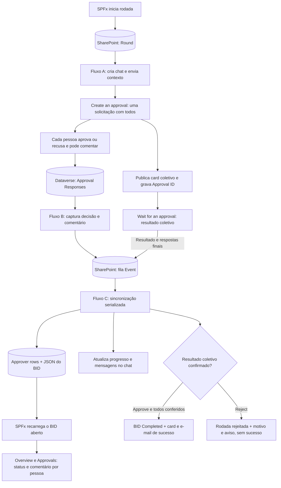

# Fluxo de Aprovação do BID — uma aprovação coletiva no Teams + acompanhamento no SPFx

Guia para adaptar o [README.md](./README.md) ao **Approvals nativo do Teams**, com o mesmo
funcionamento demonstrado nas imagens: **uma única solicitação por BID/rodada, contendo todos
os aprovadores**, sem ordem obrigatória, com **Approve / Reject** e comentário opcional.

Cada resposta deve ser refletida no SharePoint e nos widgets **Overview** e **Approvals** do
SPFx, **antes de todos terminarem**. O comentário deve permanecer associado à pessoa, decisão
e rodada, inclusive no histórico.

> **Escopo deste arquivo:** roteiro de configuração e implementação. Reformular a documentação
> não publica fluxos, cria colunas ou implementa o polling/exibição no SPFx. As mudanças no app
> necessárias para a atualização automática estão especificadas na §6 e precisam ser implementadas.
> O README e os artefatos originais permanecem intactos. Não execute o fluxo antigo e o novo
> na mesma rodada.

## O que será reutilizado

| Artefato                                                       | Uso                                                       |
| -------------------------------------------------------------- | --------------------------------------------------------- |
| [`cards/01-welcome.json`](./cards/01-welcome.json)             | Boas-vindas e contexto do BID                             |
| [`cards/02-status.json`](./cards/02-status.json)               | Progresso agregado atualizado pelo sincronizador          |
| `cards/03-approver.json`                                       | **Não usar**: não haverá um card personalizado por pessoa |
| [`cards/04-final.json`](./cards/04-final.json)                 | Conclusão **aprovada**, depois da persistência            |
| [`email/completion-email.html`](./email/completion-email.html) | E-mail final de aprovação                                 |

---

## 1. Visão geral

### 1.1 Uma solicitação para todos — sem aprovação sequencial

Configure **Create an approval**, uma única vez e **fora de qualquer loop de aprovadores**:

| Opção                                   | Configuração                                                    |
| --------------------------------------- | --------------------------------------------------------------- |
| Approval type                           | **`Approve/Reject - Everyone must approve`**                    |
| Assigned to                             | Todos os e-mails de aprovadores, únicos, separados por `;`      |
| Require responses in the assigned order | **Desligado**; não usar tipo Sequential approval                |
| Require a response from all recipients  | **Ligado**; corresponde a Everyone must approve                 |
| Enable reassignment                     | `No`, para preservar a atribuição definida pelo SmartBid        |
| Enable notifications                    | `Yes`                                                           |
| Comments                                | Comentário opcional na resposta nativa, sem formulário paralelo |

Os rótulos da interface Teams e os campos do conector não são necessariamente idênticos.
No Power Automate, **o tipo Everyone must approve define a regra**, em vez de reproduzir
manualmente os dois switches da janela Teams.

- Cada pessoa pode aprovar em qualquer ordem; não espera sua vez.
- **Todos aprovam:** resultado coletivo `Approve`.
- **Alguém recusa:** resultado coletivo `Reject`; não é necessário esperar os demais.
- Pertencer ao chat não transforma uma pessoa em aprovador.
- Existe **um único NativeApprovalId na Round row**, compartilhado por todas as respostas.
- As linhas individuais de SharePoint são apenas nosso acompanhamento; não são novas
  solicitações nativas.

> Não criar uma aprovação por pessoa e não usar `First to respond`: esse tipo permitiria
> que a primeira aprovação encerrasse o pedido coletivo sem a concordância dos demais.

### 1.2 Resultado final e respostas parciais são caminhos diferentes

`Wait for an approval` aguarda o **resultado coletivo**. Ele **não libera o fluxo a cada
aprovador** enquanto a solicitação continua pendente. Portanto, são necessários:

1. **Fluxo A — criação e resultado:** cria o chat e a aprovação coletiva, publica o card e
   aguarda o resultado final.
2. **Fluxo B — captura de respostas:** acompanha as respostas individuais no Dataverse,
   incluindo comentários, sem esperar o encerramento coletivo.
3. **Fluxo C — sincronizador:** único gravador das decisões do fluxo no BID; processa uma fila
   de respostas/resultados, atualiza SharePoint, progresso e mensagens.
4. **SPFx:** consulta o BID aberto periodicamente e atualiza o estado compartilhado dos widgets.

A fila impede que dois fluxos independentes disputem a escrita do JSON ou anunciem sucesso
antes de todos os comentários/decisões serem sincronizados. Ela fica na própria
`smartbid-approvals`, com `RecordType = Event`; nenhum item Event cria outra aprovação.



### 1.3 Requisito de licença e acesso — antes de construir

**Standard approvals** é Standard. Porém, a captura das respostas parciais descrita aqui
usa o conector **Microsoft Dataverse, classificado como Premium**.

Valide com TI:

- Licenciamento adequado para os fluxos que usam Dataverse; não presumir que o Microsoft 365
  básico cubra esse conector.
- Permissão para ler as respostas de **todos os aprovadores**, não apenas da conta do fluxo.
- Permissão para registrar o gatilho na tabela Callback Registration.
- Políticas DLP permitindo Dataverse + SharePoint + Teams na mesma solução.
- Ambiente correto e apps **Approvals** e **Workflows** habilitados no Teams.

O SPFx continuará lendo **SharePoint**, sem exigir acesso direto ao Dataverse de cada usuário.
Não coloque credenciais, tokens ou endpoints internos do Teams no navegador.

**Se Dataverse não for permitido:** a aprovação coletiva continua possível, e o resultado
final pode ser sincronizado com Standard approvals. Contudo, **esse fallback não atende ao
requisito de progresso/comentários parciais**. Não substitua silenciosamente a solicitação
coletiva por várias individuais nem prometa progresso parcial só com polling do SharePoint.

### 1.4 Pessoas únicas versus responsabilidades por setor

O app pode gerar duas entradas `IBidApproval` para a mesma pessoa em setores diferentes.
Uma aprovação coletiva nativa pede **uma resposta por pessoa**, não duas respostas por setor.

Neste desenho:

- Deduplicar os destinatários do Approvals por identidade canônica/e-mail.
- Preservar todas as entradas pessoa/setor no BID e as respectivas Approver rows.
- Aplicar a resposta da pessoa a **todas as suas responsabilidades na mesma rodada**, com
  o mesmo comentário e data. Informar essa regra nos detalhes da aprovação.
- Mostrar progresso nativo por **pessoas únicas**; os widgets existentes podem continuar
  contando responsabilidades por setor, mas precisam deixar clara essa diferença.

Se a operação exigir decisões independentes por setor para a mesma pessoa, esse requisito
precisa ser revisto: não é representado por uma única resposta no pedido coletivo mostrado.

---

## 2. Pré-requisitos e contrato de dados

### 2.1 O que já existe no app

`ApprovalService.ensureApprovalColumns()` provisiona na `smartbid-approvals`:

| Coluna                                             | Tipo / uso                              |
| -------------------------------------------------- | --------------------------------------- |
| `RecordType`                                       | Choice: Round / Approver                |
| `BidNumber`, `ApproverEmail`, `ApproverName`       | Texto                                   |
| `RoundNumber`, `ExpectedApproverCount`             | Número                                  |
| `Sector`, `SectorLabel`                            | Texto                                   |
| `ApprovalStatus`                                   | Choice: Pending / Approved / Overridden |
| `RespondedDate`                                    | Data/Hora                               |
| `ChatId`, `StatusCardMessageId`                    | Texto                                   |
| `OverriddenBy`, `OverriddenDate`, `OverrideReason` | Autor, data e motivo do override        |

`Title` e `jsondata` fazem parte da base existente. Preencha **Title em todo Create item /
Update item**. O app lê as decisões em `smartbid-tracker/jsondata`, não reconstrói
automaticamente o BID a partir das Approver rows.

### 2.2 Ajustes manuais de Choice

Antes de ativar os fluxos, acrescente opções sem remover as existentes:

- `RecordType`: adicionar **`Event`**.
- `ApprovalStatus`: adicionar **`Rejected`**.

Essas opções ainda não são provisionadas pelo código atual. `ensureApprovalColumns()` não
deve ser interpretado como implantação automática desta migração.

### 2.3 Colunas adicionais — criar manualmente

Crie com os nomes internos sem espaços abaixo, inicialmente opcionais. Não são novos campos
obrigatórios de `IBid` e não impedem o app de criar a Round row.

| Coluna                                                           | Tipo                                                                 | Local e significado                                                      |
| ---------------------------------------------------------------- | -------------------------------------------------------------------- | ------------------------------------------------------------------------ |
| `RoundItemId`                                                    | Número, zero casas decimais                                          | Approver/Event: ID exato da Round row                                    |
| `NativeApprovalId`                                               | Texto                                                                | Round/Event: ID da **única** aprovação; cópia opcional nas Approver rows |
| `NativeEnvironment`                                              | Texto                                                                | Ambiente da aprovação                                                    |
| `NativeCreatedDate`                                              | Data/Hora                                                            | Round: criação nativa                                                    |
| `NativeExpectedCount`                                            | Número                                                               | Round: quantidade de pessoas únicas                                      |
| `NativeCardMessageId`                                            | Texto                                                                | Round: mensagem do card coletivo                                         |
| `NativeCardMessageLink`                                          | Texto multilinha simples                                             | Round: link da mensagem coletiva                                         |
| `NativeOutcome`                                                  | Texto                                                                | Round: resultado coletivo; Approver: decisão individual                  |
| `NativeComments`                                                 | Texto multilinha simples                                             | Approver: comentário individual, sem HTML                                |
| `NativeResponseDate`                                             | Data/Hora                                                            | Approver: data nativa da decisão                                         |
| `NativeResponseId`                                               | Texto                                                                | Approver/Event: ID da resposta individual, quando disponível             |
| `NativeSourceVersion`                                            | Texto                                                                | Versão nativa usada na sincronização; não é número de rodada             |
| `NativeTrackingStatus`                                           | Choice: Creating / Waiting / Completed / Cancelled / Expired / Error | Round: ciclo técnico da aprovação coletiva                               |
| `NativeEventKey`                                                 | Texto                                                                | Event: chave de deduplicação                                             |
| `NativeEventState`                                               | Choice: Pending / Applied / Ignored / Error                          | Event: estado da fila                                                    |
| `LastReminderDate`                                               | Data/Hora                                                            | Approver: última cobrança                                                |
| `LastNativeSyncDate`                                             | Data/Hora                                                            | Round: última sincronização confirmada                                   |
| `CompletionNotified`                                             | Sim/Não, padrão No                                                   | Round: confirmação de notificações finais                                |
| `FinalStatusNotified`, `FinalCardNotified`, `FinalEmailNotified` | Sim/Não, padrão No                                                   | Round: confirmação separada de cada notificação final                    |

Indexe `NativeApprovalId`, `RoundItemId` e `NativeEventState`. Use chave única de evento,
quando habilitada/validada no SharePoint, ou um claim com ETag; busca seguida de Create sem
controle de concorrência não garante deduplicação. Os campos adicionais ficam vazios nas
linhas que não os usam.

**Uma Round row possui um Approval ID.** Não gerar um ID nativo diferente para cada Approver row.

### 2.4 Conexões

- Standard approvals: criar a solicitação e aguardar resultado.
- Microsoft Dataverse: ler Approval Responses e Users, gatilho de resposta e reconciliação.
- SharePoint: ler/gravar filas, acompanhamento e JSON do BID, com HTTP + ETag.
- Microsoft Teams: criar chat, publicar/atualizar cards e emitir @mentions.
- Office 365 Users: descobrir a identidade da conexão que cria o chat.
- Mail: `Send an email notification (V3)` para e-mail final, como no README.

Comece no ambiente **Default** e valide a visibilidade no Approvals do Teams. Todos os
fluxos de Dataverse devem apontar para o ambiente em que a solicitação foi criada.
Use uma conta de serviço aprovada pela TI; o criador do fluxo continua identificável no
Approvals, mesmo usando o campo Requestor.

### 2.5 Payload que o SPFx envia — preservado

`ApprovalService.startApprovalRound()` grava uma Round row com o contrato abaixo:

```json
{
  "bidNumber": "REQ-2026-0010",
  "round": 1,
  "approvers": [
    {
      "sector": "project",
      "sectorLabel": "Project",
      "members": [
        {
          "name": "João Silva",
          "email": "jsilva@oceaneering.com",
          "role": "PM"
        }
      ],
      "isAutoLocked": false
    }
  ],
  "requestedBy": { "name": "Ana", "email": "ana@oceaneering.com" },
  "engineerResponsible": [
    { "name": "Raphael Costa", "email": "rcosta1@oceaneering.com" }
  ],
  "analyst": [
    { "name": "Laura Campanati", "email": "lcampanati@oceaneering.com" }
  ],
  "client": "Petrobras",
  "requestedDate": "2026-07-30T12:00:00.000Z",
  "deepLink": "https://.../#/bid/REQ-2026-0010?tab=approval",
  "status": "pending",
  "capexUSD": 123456,
  "division": "SSR-ROV",
  "serviceLine": "ROV"
}
```

Exemplo apenas para o schema; em execução use **os dados reais do gatilho**.

- Engenheiros/analistas entram no chat; só participam da decisão se estiverem em `approvers`.
- `isAutoLocked` torna a seleção obrigatória; não autoriza aprovação automática.
- Setores dispensados pelo app não devem ser reinseridos pelo fluxo.
- Preserve `role`, `sector` e `sectorLabel` nas responsabilidades, mesmo ao deduplicar pessoas.

---

## 3. Fluxo A — criar o chat e uma aprovação coletiva

Nome sugerido: `SmartBid – Native Approval Round`.

### Fase 1 — Gatilho, variáveis e aprovadores

**1) Trigger:** SharePoint → **When an item is created**, lista `smartbid-approvals`.

**2) Trigger condition:**

```text
@equals(triggerOutputs()?['body/RecordType/Value'], 'Round')
```

Se Choice vier como string, use `@equals(triggerOutputs()?['body/RecordType'], 'Round')`.
Approver/Event não podem disparar este fluxo. Não serialize no gatilho um fluxo que aguarda
semanas; isso colocaria todos os BIDs atrás de um único run pendente.

**3) Parse JSON** — renomeie para `Parse_JSON`:

- Content: `triggerOutputs()?['body/jsondata']`.
- Schema: gerar a partir da §2.5 e ajustar campos opcionais conforme dados reais.

**4) Initialize variable**, todas no topo:

| Nome                                               | Tipo    | Valor                                         |
| -------------------------------------------------- | ------- | --------------------------------------------- |
| `varBidNumber`                                     | String  | `body('Parse_JSON')?['bidNumber']`            |
| `varRound`                                         | Integer | `int(body('Parse_JSON')?['round'])`           |
| `varRoundItemId`                                   | Integer | `int(triggerOutputs()?['body/ID'])`           |
| `varDeepLink`                                      | String  | `body('Parse_JSON')?['deepLink']`             |
| `varRequestedBy`                                   | String  | `body('Parse_JSON')?['requestedBy']?['name']` |
| `varClient`                                        | String  | `coalesce(body('Parse_JSON')?['client'], '')` |
| `varDivision`                                      | String  | `body('Parse_JSON')?['division']`             |
| `varServiceLine`                                   | String  | `body('Parse_JSON')?['serviceLine']`          |
| `varApprovers`                                     | Array   | `json('[]')`                                  |
| `varApproverEmails`                                | Array   | `json('[]')`                                  |
| `varBidItemId`                                     | Integer | `0`                                           |
| `varChatId`, `varStatusMsgId`, `varFlowOwnerEmail` | String  | Vazio                                         |

Não usar variáveis globais de decisão compartilhadas com outros runs. Fluxos B/C não acessam
essas variáveis; recebem sua correlação pela fila e pela Round row.

**5) Achatar responsabilidades** — dois Apply to each sequenciais:

- `Apply_to_each_sector`: `body('Parse_JSON')?['approvers']`.
- Dentro, `Apply_to_each_member`: `items('Apply_to_each_sector')?['members']`.
- Append to `varApprovers` um objeto, usando conteúdo dinâmico:

| Campo       | Valor                                              |
| ----------- | -------------------------------------------------- |
| name        | `items('Apply_to_each_member')?['name']`           |
| email       | `toLower(items('Apply_to_each_member')?['email'])` |
| role        | `items('Apply_to_each_member')?['role']`           |
| sector      | `items('Apply_to_each_sector')?['sector']`         |
| sectorLabel | `items('Apply_to_each_sector')?['sectorLabel']`    |

Append a `varApproverEmails`: `toLower(items('Apply_to_each_member')?['email'])`.

**Compose** `comUniqueApproverEmails`:

```text
union(variables('varApproverEmails'), variables('varApproverEmails'))
```

Valide e-mails não vazios/identidades canônicas, total maior que zero e quantidade de
responsabilidades igual a ExpectedApproverCount do gatilho. Aliases da mesma identidade
devem ser resolvidos antes do Assigned to; `union()` remove textos iguais, não aliases diferentes.

**6) Buscar BID** — `Get_items`, lista `smartbid-tracker`:

- Filter Query: `Title eq '@{replace(variables('varBidNumber'), '''', '''''')}'`.
- Exigir um único BID antes de usar `first()`; consultar até dois itens permite detectar duplicação.
- `varBidItemId` = `int(first(body('Get_items')?['value'])?['ID'])`.
- Releia o BID até a rodada inicial gravada pelo app estar disponível, com retry curto/limitado.
- Confirme última `approvalRounds[].round = varRound`, pending e sem override.

Se não houver correspondência, encerre sem criar solicitação. Não mande aprovações para uma
rodada antiga, vazia ou já encerrada.

### Fase 2 — Chat, contexto e acompanhamento

**7.1) Get my profile (V2)** (`Get_my_profile_(V2)`): obtenha o e-mail/UPN da identidade
que efetivamente cria o chat; guarde normalizado em `varFlowOwnerEmail`.

**7.2) Selects em modo texto:**

- `selEngineerEmails`, From = engineerResponsible, Map = `toLower(item()?['email'])`.
- `selAnalystEmails`, From = analyst, mesmo Map.
- `comAllMembers`:

```text
union(union(outputs('comUniqueApproverEmails'), body('selEngineerEmails')), body('selAnalystEmails'))
```

- `filChatMembers`, Filter array:

```text
@and(not(empty(item())), not(equals(item(), variables('varFlowOwnerEmail'))))
```

**7.3) Create a chat** (`Create_a_chat`):

- Members to add: `join(body('filChatMembers'), ';')`.
- Title: `SmartBid Approval — @{variables('varBidNumber')} (Round @{variables('varRound')})`.
- `varChatId` = `body('Create_a_chat')?['id']`.

O dono da conexão participa do chat; removê-lo de Members to add evita duplicação, não o
remove da conversa. Validar limite do conector de 20 membros e participantes internos.

**8) Update item** da Round row: Title = varBidNumber, ChatId = varChatId e
NativeExpectedCount = `length(outputs('comUniqueApproverEmails'))`.

**9) Welcome Card** — como no README, monte `selWelcomeMD` / `joinWelcomeMD` /
`comAprovadoresMD` com responsabilidades e setores; publique `Post_card_Welcome` usando
`01-welcome.json`. Informar que a decisão coletiva vale para todas as responsabilidades da pessoa.

**10) Status Card** — `Post_card_Status`, `02-status.json`, Flow bot / Group chat,
Chat = varChatId. Mostrar `0/N pessoas` e lista inicial; preservar a lista por setor se útil.

**11) Gravar StatusCardMessageId** na Round row, com **Message ID** de Post_card_Status,
não Approval ID. Os tokens são detalhados na §7.

**12) Criar Approver rows**, uma por responsabilidade pessoa/setor:

| Campo                        | Valor                                        |
| ---------------------------- | -------------------------------------------- |
| Title / BidNumber            | varBidNumber                                 |
| RecordType                   | Approver                                     |
| RoundNumber / RoundItemId    | varRound / varRoundItemId                    |
| ApproverEmail / ApproverName | Responsabilidade atual                       |
| Sector / SectorLabel         | Responsabilidade atual                       |
| ApprovalStatus               | Pending                                      |
| ChatId / StatusCardMessageId | Chat/mensagem da Round row                   |
| ExpectedApproverCount        | Quantidade de responsabilidades, como no app |

Esse Apply to each **somente cria acompanhamento**, nunca chama Create an approval.
Reprocessamento deve reutilizar a combinação RoundItemId + Sector + ApproverEmail.

Antes de cada Create item, use Get items com filtro dessa combinação:

- Zero linhas: criar a responsabilidade.
- Uma linha: reutilizar sem zerar decisão, comentário ou datas já recebidos.
- Mais de uma: registrar erro de duplicação e não prosseguir à criação nativa.

Trate a falha fora do loop; não colocar Terminate dentro do Apply to each. Para proteger
também contra **dois runs de A simultâneos**, usar claim da Round row com ETag e estado
Creating antes de criar chat/solicitação. Run que não obtém o claim entra em recuperação,
não cria recursos duplicados. Claim abandonado exige reconciliação, não reset automático
para tentar Create novamente.

### Fase 3 — Uma criação, uma publicação, uma espera

**13) Validar novamente a rodada** e conferir que a Round row ainda não possui NativeApprovalId.
Se possui, recuperar a mesma solicitação. ID vazio após uma falha não garante que Create
não tenha sucedido: verificar a solicitação nativa antes de repetir.

**14) Standard approvals → Create an approval**, nome `Create_native_approval`, fora dos loops:

| Campo                               | Valor                                                                                                          |
| ----------------------------------- | -------------------------------------------------------------------------------------------------------------- |
| Approval type                       | **Approve/Reject - Everyone must approve**                                                                     |
| Title                               | `SmartBid — @{variables('varBidNumber')} — Round @{variables('varRound')} — SP @{variables('varRoundItemId')}` |
| Assigned to                         | `join(outputs('comUniqueApproverEmails'), ';')`                                                                |
| Details                             | Contexto Markdown abaixo                                                                                       |
| Item link                           | varDeepLink                                                                                                    |
| Item link description               | Abrir BID no SmartBid                                                                                          |
| Requestor                           | E-mail do requestedBy, se disponível                                                                           |
| Enable notifications / reassignment | Yes / No                                                                                                       |

```text
**BID:** @{variables('varBidNumber')}
**Cliente:** @{variables('varClient')}
**Divisão:** @{variables('varDivision')}
**Service line:** @{variables('varServiceLine')}
**Rodada:** @{variables('varRound')}
**Solicitado por:** @{variables('varRequestedBy')}

Todos os aprovadores podem responder em qualquer ordem. A aprovação exige concordância de todos.
Uma recusa encerra a solicitação como rejeitada. Inclua um comentário quando necessário.
Se você representa mais de um setor, sua resposta vale para todas as suas responsabilidades nesta rodada.
```

**15) Persistir imediatamente** na **Round row**:

- NativeApprovalId = token **Approval ID** de Create_native_approval.
- NativeEnvironment = `workflow()?['tags']?['environmentName']`.
- NativeCreatedDate = `utcNow()`; NativeTrackingStatus = Waiting.
- Nas saídas usuais, Approval ID = `body('Create_native_approval')?['name']`; confirmar no teste.

Valide que NativeEnvironment contém o **identificador real do ambiente**. Se a tag não
vier no run, obter esse identificador de configuração aprovada do ambiente e usar o mesmo
valor em A/B/C; não substituir por texto genérico `Default`, pois é um nome de exibição,
não necessariamente o ID usado na correlação. ID/ambiente inválidos exigem recuperação.

Copiar o mesmo ID para Approver rows é opcional; a correlação canônica é a Round row.
Não atribua Outcome nem Comments globais a esse passo: ninguém respondeu ainda.

**16) Publicar o único card nativo** — Teams → **Post card in a chat or channel**,
nome `Post_native_card`, Flow bot / Group chat / Chat = varChatId:

- Adaptive Card = **Adaptive Card / Teams Adaptive Card** de Create_native_approval.
- Inserir saída completa, sem editar botões ou embrulhar o JSON como texto dentro de outro JSON.
- Não usar `03-approver.json`, `Post adaptive card and wait for a response` ou um listener
  genérico de cartões.
- Gravar NativeCardMessageId e NativeCardMessageLink na Round row.

Homologar o card coletivo clicável no Group chat. Uma mensagem postada via conector pode
não ter exatamente a apresentação da janela de criação manual do Approvals. A exigência
funcional é **um pedido com todos**, não reproduzir pixel a pixel a janela da imagem.
Se o card coletivo gerado não funcionar no tenant, manter o mesmo pedido no Approvals e
compartilhar um link no chat; não criar outros pedidos como workaround silencioso.

**17) Wait for an approval**, nome `Wait_native_approval`:

- Approval ID = o ID único persistido.
- Timeout = `P28D`, sem T; um run inteiro tem limite de 30 dias.
- Quando alguém aprova parcialmente, a ação continua aguardando. O fluxo B captura essa resposta.
- Quando todos aprovam ou alguém recusa, a ação retorna resultado e array Responses.

Falha, cancelamento ou timeout não equivalem a Reject nem Approve. Registre o estado técnico,
alerte o responsável e reconcilie o pedido; nunca crie outra aprovação só para destravar Wait.

### Fase 4 — Resultado coletivo vai para o mesmo sincronizador

**18) Normalizar as respostas finais** de `body('Wait_native_approval')?['responses']`:

| Campo normalizado | Saída de cada resposta                                                 |
| ----------------- | ---------------------------------------------------------------------- |
| email             | responder.email / userPrincipalName, normalizado e verificado          |
| name              | responder.displayName                                                  |
| response          | approverResponse: Approve ou Reject                                    |
| comments          | Campo comments, string; null vira vazio apenas quando o campo foi lido |
| responseDate      | responseDate original, não utcNow()                                    |

Não use `first()` para toda a solicitação coletiva. Itere todas as respostas retornadas.
Uma recusa pode deixar o array incompleto, porque os demais não precisaram responder.

**19) Create item**, na `smartbid-approvals`, RecordType = Event:

- NativeApprovalId / NativeEnvironment / RoundItemId = correlação da rodada.
- NativeEventKey = `result:<ambiente>:<ApprovalID>:<resultado>`.
- NativeEventState = Pending.
- `jsondata` = objeto normalizado de resultado (§4.4), serializado por `string()`.

**Não escrever o resultado diretamente no BID neste fluxo.** O sincronizador C processa
respostas e resultado na mesma rotina, sem competir com o fluxo de respostas parciais.
Não enviar card/e-mail de sucesso aqui antes de confirmar essa persistência.

**20) Encerrar a execução** depois de enfileirar o resultado. O pedido nativo pode estar
Completed enquanto o SPFx ainda mostra a última projeção; esse atraso de integração deve
ser tratado como “sincronizando”, não como nova aprovação necessária.

---

## 4. Fluxo B — capturar cada resposta e comentário antes do resultado final

Nome sugerido: `SmartBid – Native Approval Responses`.

### 4.1 Tabelas nativas e campos verificados

A tabela **Approval Response** representa uma resposta individual, ligada à aprovação
coletiva. Não confundir com **Approval Request**, que representa uma atribuição individual
criada internamente pelo próprio serviço; essas atribuições não são pedidos separados
criados pelo nosso fluxo.

| Informação                        | Tabela/campo Dataverse                                     |
| --------------------------------- | ---------------------------------------------------------- |
| Tabela de respostas               | `msdyn_flow_approvalresponse`                              |
| Entity set                        | `msdyn_flow_approvalresponses`                             |
| ID da resposta                    | `msdyn_flow_approvalresponseid`                            |
| Lookup da aprovação               | `msdyn_flow_approvalresponse_approval`                     |
| Lookup no JSON Web API            | `_msdyn_flow_approvalresponse_approval_value`              |
| Índice espelho do ID da aprovação | `msdyn_flow_approvalresponseidx_approvalid`                |
| Decisão                           | `msdyn_flow_approvalresponse_response`                     |
| Comentário                        | `msdyn_flow_approvalresponse_comments`                     |
| Proprietário/respondente          | ownerid, usualmente `_ownerid_value`; confirmar tipo Users |
| Datas/versão                      | createdon, modifiedon, versionnumber                       |

O owner da resposta é um **ID de usuário Dataverse**, não o ID Entra que se passa diretamente
ao Office 365 Users. Resolver por Dataverse **Users**, obtendo `internalemailaddress` e `fullname`,
e verificar correspondência com os destinatários definidos pelo app.

### 4.2 Gatilho — Added e Modified

Microsoft Dataverse → **When a row is added, modified or deleted**:

- Change type: **Added or Modified**.
- Table name: **Approval Responses**; usar nome lógico se a tabela não aparecer no designer.
- Scope: Organization, **somente com permissão aprovada** para esse alcance.
- Para Modified, Select columns: `statuscode,msdyn_flow_approvalresponse_response,msdyn_flow_approvalresponse_comments`.
- Não colocar lookup em Select columns; o conector não suporta esse tipo no filtro de colunas.

Um Create/Update pode disparar mais de uma vez. Capture alterações, não presuma entrega única.
Antes de sincronizar, releia a linha e confirme que é uma **decisão submetida**, não um rascunho.

O schema oficial lista `statuscode` **Reviewing = 192350000**, **Saved = 192350001** e
**Committed = 192350002**. Homologue a transição real após um clique, **com outros destinatários
ainda pendentes**. Use o estado que comprova submissão no tenant; Reviewing/Saved não devem
ser interpretados automaticamente como decisão só porque há texto no campo Response.
Se Committed só chegar ao encerrar o coletivo no ambiente, revisar esse filtro/integração
com evidência do serviço antes de afirmar que a captura parcial está pronta.

### 4.3 Reler o comentário e identificar a pessoa

1. **Get a row by ID**, nome `Get_native_response`, Approval Responses, ID do gatilho.
2. Select columns:

   ```text
   msdyn_flow_approvalresponseid,msdyn_flow_approvalresponseidx_approvalid,msdyn_flow_approvalresponse_response,msdyn_flow_approvalresponse_comments,createdon,modifiedon,versionnumber,statuscode,_ownerid_value,_msdyn_flow_approvalresponse_approval_value
   ```

3. **Get a row by ID**, nome `Get_native_user`, Users, usando o owner válido da resposta;
   selecionar `internalemailaddress,fullname`. Não usar createdby como aprovador: pode ser
   a infraestrutura que criou a linha.
4. Approval ID: lookup da aprovação ou índice espelho verificado. Não usar Title como chave
   definitiva e não tratar “Step 1/Step 2” da tela como setor ou ordem obrigatória.
5. Resolver email/UPN e validar que o respondente está no pedido coletivo.
6. Ler Comments **explicitamente no Get row**. O gatilho pode não trazer esse campo; ausência
   no payload do gatilho não significa que o usuário não comentou.

Não corrigir uma identidade divergente inventando sufixo de domínio. Resolver aliases
por mapeamento/identidade canônica verificados; falha de correspondência exige auditoria.
Limitar o coletor às aprovações correlacionadas ao SmartBid: não copiar comentários de
pedidos de outras aplicações para nossa lista. Correlação ainda ausente exige retry curto
ou reconciliação; um título parecido não basta para autorizar a aplicação da resposta.

Para datas parciais, o exemplo prático de integração usa `createdon` da resposta. Esse campo
é a criação do registro, não uma garantia universal do instante do clique. Homologue sua
correspondência; se o registro existir antes da submissão, capturar o timestamp da transição
submetida, sem confundir futuras modificações com uma nova decisão. Na reconciliação final,
use `responseDate` do conector como data autoritativa. Nunca substituir por horário do polling.

### 4.4 Contrato normalizado da fila

Crie `RecordType = Event`, NativeEventState = Pending e NativeEventKey =
`response:<ambiente>:<responseID>:<versão>`, guardando o objeto abaixo em `jsondata`:

```json
{
  "kind": "response",
  "nativeApprovalId": "<Approval ID coletivo>",
  "nativeEnvironment": "<ambiente>",
  "nativeResponseId": "<ID da resposta>",
  "sourceVersion": "<versão nativa>",
  "responses": [
    {
      "email": "lcampanati@oceaneering.com",
      "name": "Laura Campanati",
      "response": "Approve",
      "comments": "Comentário teste Laura",
      "responseDate": "2026-10-02T09:18:13Z"
    }
  ]
}
```

Exemplo de formato, não dados a importar. Monte um objeto com tokens/`setProperty()` e
serialize por `string()`: aspas e quebras de linha do comentário precisam ser escapadas
pelo serializador, não por concatenação manual de texto JSON.

Para evento **result**, o fluxo A envia o mesmo envelope, `kind = result`, todos os itens
de Responses e mais `outcome = Approve | Reject` e `completionDate` nativa, quando disponível.
IDs de resposta individuais podem não vir no Wait; não invente IDs nem substituir a
correlação individual existente por um ID de mensagem do Teams.

Se a resposta chegar antes de A gravar NativeApprovalId, preserve o evento para tentativa
posterior. Não descarte definitivamente uma resposta válida só porque a correlação ainda
não está visível. B não grava o BID nem publica progresso: C faz isso.

---

## 5. Fluxo C — sincronizar SharePoint, resultado e mensagens

Nome sugerido: `SmartBid – Native Approval Sync`.

### 5.1 Fila e concorrência

Trigger: SharePoint **When an item is created**, `smartbid-approvals`. Trigger condition:

```text
@equals(triggerOutputs()?['body/RecordType/Value'], 'Event')
```

Configure concorrência **1 neste sincronizador curto**, não no fluxo A que fica aguardando.
Essa configuração serializa runs de C; não garante ordem cronológica de chegada. Resultados
precisam reconciliar um snapshot, e os eventos devem ser idempotentes.

Atualizações em Round/Approver/Event não devem criar pedidos nativos. C **nunca** chama
Create an approval. Não iniciar outro escritor paralelo do BID no fluxo A ou B.

### 5.2 Correlacionar a rodada e validar identidade

- Parse JSON do evento.
- Buscar a Round row por NativeApprovalId + NativeEnvironment + RecordType Round.
- Exigir correspondência única; obter BidNumber, RoundNumber, ChatId e os totais.
- Buscar o BID por BidNumber e verificar a mesma rodada atual, sem override/substituição.
- Buscar as responsabilidades do respondente na rodada: **todos** os registros com seu
  e-mail canônico, não `first()` se há setores diferentes.
- Exigir que as responsabilidades correspondam à seleção da rodada e que a resposta seja
  exatamente `Approve` ou `Reject`.

**A fila não é prova de aprovação.** Restrinja escrita/alteração de Event às conexões dos
fluxos, conforme política SharePoint, e valide a origem novamente em C: resposta existente
no Dataverse, vinculada ao Approval ID correto, dono autorizado, submissão válida e comentário
original. Para Result, confirmar estado/resultado na origem nativa, não aceitar apenas
`outcome = Approve` enviado no JSON de um item SharePoint. Quem consegue criar um item Event
não deve poder fabricar uma decisão. Leitura nativa sem permissão/falha bloqueia a escrita.

Nomeie a leitura da Round row como `Get_Round_sync` e crie Compose `comRoundNumber` com
`int(body('Get_Round_sync')?['RoundNumber'])`. Processe Responses num Apply to each
**sequencial**, `Apply_to_each_responses`, e crie `comCurrentResponse` a partir do item
atual normalizado/verificado. Esses Composes pertencem a C, não a A/B.

Chaves diferentes: **Approval ID** identifica o pedido; **Response ID** identifica a decisão;
**RoundItemId** identifica nosso item SharePoint. Não usar esses IDs de forma intercambiável.

A serialização de C não protege salvamentos concorrentes do SPFx. Toda escrita do BID ainda
precisa de ETag/retry e de guarda de rodada/override.

### 5.3 Mapear a decisão e o comentário

| Resposta nativa | Approver row            | IBidApproval.status / decision                   |
| --------------- | ----------------------- | ------------------------------------------------ |
| Approve         | ApprovalStatus Approved | approved / approved                              |
| Reject          | ApprovalStatus Rejected | rejected / rejected                              |
| Sem resposta    | Continua Pending        | Continua pending, sem comentário/data inventados |

Em cada responsabilidade da pessoa, gravar:

- NativeOutcome = resposta nativa.
- NativeComments = comentário original, quando o campo foi lido.
- NativeResponseDate e RespondedDate = data original verificada.
- NativeResponseId e NativeSourceVersion = correlação/versão recebidas, quando disponíveis.
- No JSON do BID: `comments`, `respondedDate`, `decision`, `status`, `approvedVia = Approvals`.

**O comentário pertence à resposta da pessoa**, não ao resumo global nem ao comentário
livre geral do BID. Não colocar o mesmo comentário em aprovadores diferentes.

Reprocessar a mesma resposta deve preservar os dados, sem duplicar histórico/mensagens.
Um evento mais antigo não pode apagar comentário ou data mais recente. Campo Comments
ausente exige reler a origem; null confirmado representa ausência de comentário. Não usar
`coalesce(..., '')` em payload incompleto para apagar um texto que já havia sido recebido.

### 5.4 Write-back incremental com ETag

Para cada item normalizado, use Compose `comCurrentResponse` e `comDecisionStatus`:

```text
if(equals(outputs('comCurrentResponse')?['response'], 'Approve'), 'approved', 'rejected')
```

Essa expressão só roda **depois** de validar que Response é Approve ou Reject. Qualquer
outro valor é erro de integração, não recusa automática.

Monte Do Until com Count **5**, Timeout **PT5M**. Em cada tentativa:

1. Releia Round row e BID com ETag; execute Get item e `Parse_BID_inc` **dentro de cada
   tentativa**, não uma vez antes do Do Until. Revalide também a versão/origem da resposta
   se houver divergência de comentário/data, especialmente após conflito 412.
2. Confirme rodada atual, ausência de override e que a resposta ainda pode ser aplicada.
3. Parse JSON mínimo, preservando todas as propriedades adicionais:

   ```json
   {
     "type": "object",
     "properties": {
       "approvals": { "type": "array" },
       "approvalRounds": { "type": "array" }
     }
   }
   ```

4. Antes de `last()`, valide que approvalRounds existe e não está vazio.
5. `selApprovals_inc`, Select **em modo texto**, From = `body('Parse_BID_inc')?['approvals']`:

   ```text
   if(
     and(
       equals(int(item()?['round']), int(outputs('comRoundNumber'))),
       equals(toLower(item()?['stakeholder']?['email']), toLower(outputs('comCurrentResponse')?['email']))
     ),
     setProperty(
       setProperty(
         setProperty(
           setProperty(
             setProperty(item(), 'status', outputs('comDecisionStatus')),
             'decision', outputs('comDecisionStatus')
           ),
           'respondedDate', if(empty(outputs('comCurrentResponse')?['responseDate']), item()?['respondedDate'], outputs('comCurrentResponse')?['responseDate'])
         ),
         'comments', if(contains(outputs('comCurrentResponse'), 'comments'), outputs('comCurrentResponse')?['comments'], item()?['comments'])
       ),
       'approvedVia', 'Approvals'
     ),
     item()
   )
   ```

   `comRoundNumber` é o número da **Round row correlacionada**, não o número de step nativo.
   Não filtrar por setor nesse Map: a decisão única deve atualizar todas as responsabilidades
   dessa pessoa na rodada (§1.4). Valide a quantidade esperada de correspondências antes.

A proteção do Map não substitui a validação: resposta inicial sem data verificada ou
Comments não lido deve ser relida, não considerada completa. Um null explícito só pode
representar ausência de comentário depois de confirmar a origem/versão; evento antigo
ou incompleto não pode limpar texto já recebido. Não aceitar uma limpeza só por `empty()`.

6. `filRoundApprovals_inc`, Filter array de `body('selApprovals_inc')`, somente round atual.
7. `selRounds_inc`, Select das rodadas, modo texto:

   ```text
   if(equals(int(item()?['round']), int(outputs('comRoundNumber'))),
     setProperty(item(), 'approvals', body('filRoundApprovals_inc')),
     item())
   ```

8. `comBidInc`:

   ```text
   setProperty(
     setProperty(body('Parse_BID_inc'), 'approvals', body('selApprovals_inc')),
     'approvalRounds', body('selRounds_inc')
   )
   ```

9. HTTP em `smartbid-tracker`:

   | Campo                              | Valor                                                               |
   | ---------------------------------- | ------------------------------------------------------------------- |
   | Method                             | POST                                                                |
   | Uri                                | `_api/web/lists/getbytitle('smartbid-tracker')/items(<ID do BID>)`  |
   | X-HTTP-Method                      | MERGE                                                               |
   | If-Match                           | ETag da leitura atual, sem espaços/TAB, não `*`                     |
   | Content-Type                       | application/json;odata=nometadata                                   |
   | Body, expressão que devolve objeto | `setProperty(json('{}'), 'jsondata', string(outputs('comBidInc')))` |

10. 204 = gravação confirmada. 412 = reler, revalidar e recalcular; outros erros não são sucesso.
    O retry HTTP não deve repetir automaticamente JSON/ETag obsoletos. Compose de continuação
    deve rodar depois de HTTP successful **e has failed** para o 412 não abortar o Do Until.
11. Condition/Compose `comCanWrite_inc` falso sai sem gravar; depois do retry exija HTTP 204
    antes de anunciar atualização. Count/Timeout esgotado também pode encerrar o loop sem escrita.

A condição de saída pode ser:

```text
@or(equals(outputs('comCanWrite_inc'), false), equals(outputs('Send_HTTP_inc')?['statusCode'], 204))
```

Defina `comCanWrite_inc` em toda tentativa, coloque HTTP dentro do ramo autorizado e
distinga “ignorado por guarda” de “gravado”. Nunca usar um snapshot do início da rodada.

Após confirmar JSON, complete o acompanhamento individual e LastNativeSyncDate. Se a
gravação de uma das listas falhar, o evento permanece Error para reconciliação, sem
pretender transação entre as duas listas. Não marcar Applied antes de terminar ambas.

### 5.5 Progresso depois de cada resposta

Leia novamente as Approver rows da RoundItemId e derive **pessoas únicas**:

- Aprovadas: pessoas cujas responsabilidades da rodada estão aprovadas.
- Rejeitadas: pessoas que recusaram.
- Pendentes: destinatários sem decisão recebida.
- Total: NativeExpectedCount; não contar o dono da conexão ou participantes só do chat.

Mantenha também a visão de responsabilidades por setor, sem confundir os denominadores.
Atualize nosso Status Card e publique confirmação uma vez por pessoa/decisão, não uma
mensagem por setor repetindo o mesmo clique.

Não publique comentário livre no chat automaticamente se ele não fizer parte da política
de visibilidade do BID. O requisito é persistir/exibir no SPFx aos usuários autorizados.

Só então marque o Event Applied. Preserve o evento bruto para auditoria, com retenção e
acesso restritos. Para mensagens idempotentes, usar marcador por evento e claim; uma falha
entre enviar e marcar pode produzir duplicata e requer reconciliação operacional.

### 5.6 Recusa é parte obrigatória, não melhoria futura

Ao receber Reject válido de um destinatário:

- Persistir a decisão, autor, data e comentário imediatamente.
- Marcar `bid.approvalStatus = rejected` e o status da rodada como rejected.
- Marcar Round row ApprovalStatus Rejected; parar lembretes.
- **Não** definir currentStatus Completed ou completedDate de sucesso.
- Preservar currentPhase/currentStatus operacionais até aplicar uma política de revisão
  definida pela operação; não inventar “Engineering Review” nem abrir revisão sozinho.
- Manter quem aprovou como approved e quem não respondeu como pending; não fabricar rejeição
  de todos só porque o resultado coletivo foi Reject.

O evento final confirma a data de encerramento e reconcilia respostas que tenham chegado
em ordem diferente. Antes dele, a recusa já pode ser mostrada no SPFx. O processamento de
respostas anteriores ao encerramento pode continuar para completar histórico, sem reabrir
a rodada, remover rejected ou executar caminho de sucesso.

### 5.7 Resultado final — reconciliar todas as respostas antes de fechar

Quando `kind = result`:

1. Processar **todo** o array Responses normalizado, reaproveitando a rotina incremental.
   Confrontar com respostas já recebidas do Dataverse e reler conflitos/ausências.
2. Não apagar comentários/datas por diferenças de ordem ou payload incompleto. A data nativa
   final responseDate pode corrigir o timestamp parcial após validar a mesma resposta.
3. Verificar que o resultado pertence ao NativeApprovalId e à rodada atuais, sem override.
4. **Outcome Approve:** exigir resposta Approve de cada pessoa única e todas as suas
   responsabilidades correspondentes aprovadas no JSON e na fila. Divergência = Error,
   não preenchimento automático de aprovações ausentes.
5. **Outcome Reject:** exigir a resposta de rejeição, preservar os demais estados reais e
   encerrar a rodada como rejected, mesmo que alguém não tenha respondido.
6. Escrever o estado final no BID com ETag; depois fechar Round row. Só o sincronizador C
   faz esse fechamento, não o fluxo A nem o coletor B.

Fechamento aprovado:

- `approvalStatus = approved`.
- `currentStatus = Completed`, `currentPhase = Close Out`.
- completedDate = data de encerramento nativa verificada, fallback documentado se indisponível.
- `approvalRounds[rodada].status = approved`, completedDate e approvals atualizados.
- Não alterar datas/comentários individuais nem rodadas anteriores.

Fechamento rejeitado:

- `approvalStatus = rejected` e rodada rejected, completedDate da **rodada**.
- Não gravar completedDate do **BID** como conclusão aprovada.
- Não transformar pendências em decisões; mensagens devem indicar “rodada rejeitada”.

Ao reconciliar estado terminal sem override, permitir apenas o replay idempotente da mesma
decisão/resultado ou enriquecimento validado de histórico daquela rodada. Evento atrasado
não pode reabrir uma rodada, trocar rejeição por aprovação ou alterar uma rodada nova.

### 5.8 Mensagens e e-mail somente após persistência

Depois do resultado aprovado gravado:

1. Atualizar Status Card: Concluído, todas as pessoas aprovadas; marcar FinalStatusNotified.
2. Publicar `04-final.json`; marcar FinalCardNotified.
3. Montar/enviar `completion-email.html` com datas reais e lista dos aprovadores;
   marcar FinalEmailNotified.
4. Confirmar CompletionNotified = Yes somente quando todos os passos previstos sucederem.

Depois de Reject: atualizar o Status Card para **Rejeitado**, emitir aviso com autor e link
do BID e usar e-mail de rejeição próprio, se necessário. **Não reutilizar** o card/e-mail
cujo texto afirma “aprovado por todos”. Publicar comentário/motivo apenas conforme permissões.

Falha de mensagem/e-mail após concluir o BID exige repetir apenas a notificação faltante,
não criar nova rodada. Use os marcadores separados para distinguir card enviado de
e-mail enviado; CompletionNotified sozinho não identifica qual ação falhou. A janela entre
enviar e persistir o respectivo marcador ainda exige auditoria/idempotência na recuperação.

### 5.9 Histórico, KPIs e efeitos do fechamento

Preserve comentários dentro de `approvals[]` **e** do snapshot `approvalRounds[]`.
Não substituir o BID por um objeto contendo apenas aprovações: custos, escopo, anexos,
logs, dispensa de setores e revisões devem permanecer.

O app possui auto-complete client-side quando approvalStatus já é approved. Não definir
esse status na atualização parcial antes de persistir o fechamento coletivo completo,
para evitar concorrência com esse efeito. A escrita final deve fechar também a rodada.

`sectorDurations`, `kpis.approvalCycleTime`, histórico e publicação de documentos não são
reproduzidos só por gravar Completed. Identificar os efeitos exigidos e implementá-los
explicitamente com as mesmas regras do app; não depender de alguém abrir a página.

---

## 6. SPFx — atualização automática e exibição dos comentários

### 6.1 Comportamento esperado em cada resposta

Exemplo funcional: em uma rodada com três pessoas, Laura aprova e escreve
“Comentário teste Laura”. Antes de os outros responderem:

- Laura aparece **Approved**, com nome/data e comentário.
- Os outros permanecem **Pending**.
- O BID continua em aprovação, não Completed.
- Overview e Approvals mostram o **mesmo estado** porque leem o mesmo BID compartilhado.

Quando alguém recusa, a pessoa aparece Rejected com seu comentário, e a rodada mostra
Rejected. Quando todos aprovam, o fechamento coletivo é refletido após sincronizar.

### 6.2 Estado atual confirmado no código

| Parte                                   | Estado atual / mudança necessária                                                                |
| --------------------------------------- | ------------------------------------------------------------------------------------------------ |
| `IBidApproval.comments`                 | Já existe: `string \| null`; não criar outro campo de comentário no modelo                       |
| `ApprovalTab.tsx`                       | Já renderiza `approval.comments` com `trackingComments`, quando preenchido                       |
| `OverviewTab.tsx`, `ApprovalStatusCard` | Já mostra decisões/rejeições; acrescentar comentário por pessoa, pois não o renderiza atualmente |
| `BidDetailPage.tsx`                     | Obtém o BID do store; implementar atualização de mudanças externas enquanto aberto               |
| `useBidStore.ts`                        | Tem refreshBids global; criar recarga específica do BID, sem baixar todos repetidamente          |
| `BidService.getByBidNumber()`           | Já oferece leitura de um BID; reutilizar                                                         |

**A alteração deste Markdown não implementa essas mudanças.** A captura parcial no fluxo
e o polling no SPFx são ambos requisitos para alcançar o comportamento pedido.

### 6.3 Polling seguro do BID aberto

Implementar recarga compartilhada em BidDetailPage/store, não um timer independente em
cada widget:

Manter uma revisão local incrementada a cada edição/save, contador de saves pendentes e
flags dirty dos formulários relevantes. A leitura captura essa revisão na partida; antes
de aplicar, comparar com a revisão atual e descartar se houve edição/save mais recente.
Esses controles ainda precisam ser implementados; não presumir campos de versão dentro
de IApprovalRound que o modelo não declara.

1. Ler apenas o BID aberto, com `BidService.getByBidNumber(bidNumber)`.
2. Consultar aproximadamente **a cada 10–15 segundos** enquanto a rodada estiver pendente.
3. Ter no máximo uma consulta em andamento; agendar a próxima depois de terminar a atual.
4. Pausar quando a aba do navegador estiver oculta; ao retornar/focar, consultar novamente.
5. Limpar timer/listeners no unmount, na troca de BID e ao encerrar a rodada.
6. Descartar resultados de consultas iniciadas para outro BID/rodada e snapshots antigos.
7. Suspender a aplicação de respostas durante saves/patches locais em andamento; após salvar,
   reler. Não sobrescrever o estado otimista nem disparar rollback de uma edição mais recente.
8. Proteger formulários com edições não salvas. Preferir merge controlado dos campos de
   aprovação/rodada e, no fechamento, dos campos de status validados; não substituir cega e
   repetidamente o objeto inteiro que um usuário está editando.
9. Atualizar o estado Zustand sem salvar de volta o snapshot apenas por tê-lo consultado.
10. Ao detectar rejected/approved/override, aplicar essa última leitura completa e então
    parar o polling da aprovação. Se ainda existir sincronização final de comentários ou
    snapshot pendente, acompanhar por período curto/limitado ou até marcador de sync terminal
    verificado, para não parar antes da reconciliação.

A interface já sabe desenhar os status; React atualiza os widgets ao mudar a prop `bid`.
Não usar F5 nem navigation away/back como mecanismo obrigatório de acompanhamento.

**Latência:** captura do Dataverse + fila/gravação SharePoint + próxima consulta do SPFx.
10–15 segundos é o intervalo de consulta, não garantia de atualização em até 15 segundos
desde o clique. Mostrar “Última atualização” e erro/retry ajuda a distinguir pendência
real de atraso de integração. Polling do SharePoint sozinho não lê respostas nativas.

### 6.4 Como mostrar os comentários

**Aba Approvals:** manter/aprimorar o bloco de `approval.comments` junto à pessoa e sua
decisão. Exibir data e setor; texto longo pode ter “Ver comentário”/expandir, inclusive por
teclado, sem depender exclusivamente de hover.

**Overview:** acrescentar na linha/cartão da pessoa um trecho ou botão “Ver comentário”.
Ao expandir, mostrar o texto completo, autor, decisão e data. Não mostrar um comentário
global único para todos os aprovadores.

Regras:

- Não exibir bloco vazio se `comments` for null/string vazia.
- Preservar quebras de linha, acentos, aspas e conteúdo original.
- Renderizar **texto React escapado**, não HTML com dangerouslySetInnerHTML.
- Não interpretar scripts/HTML do comentário e não transformar mensagens do chat em
  comentários de aprovação; a fonte é o campo da resposta nativa.
- Histórico da rodada deve manter o comentário depois de iniciar outra rodada.
- Acesso ao comentário segue as permissões do BID; usuários sem acesso não devem receber
  cópias públicas por tooltip, mensagem ou e-mail.
- Na mesma pessoa com vários setores, informar que o comentário é da mesma resposta;
  evitar dar impressão de decisões nativas independentes.

### 6.5 Critério de aceite do app

Com o SPFx aberto no Overview, sem F5, uma pessoa responde com comentário no Teams:
o status e comentário devem aparecer após a sincronização e próxima recarga. Ao mudar
para a aba Approvals, o mesmo comentário/status já deve estar no estado compartilhado.
Repetir com a aba Approvals aberta, com Reject e com uma edição local em andamento.

Não considerar a migração completa se o comentário estiver apenas em NativeComments
da fila e ainda não em `IBidApproval.comments` no JSON consumido pelos widgets.

---

## 7. Cards, progresso e e-mail

### 7.1 Welcome e card coletivo

Os tokens de `01-welcome.json` continuam como no README: BID_NUMBER, CLIENT, DIVISION,
SERVICE_LINE, REQUESTED_BY, APPROVER_LIST_MD e DEEP_LINK.

Para TOTAL_COUNT use **quantidade de pessoas únicas**, explicando que a lista pode mostrar
responsabilidades em múltiplos setores. No fluxo A:

```text
@{length(outputs('comUniqueApproverEmails'))}
```

O card de decisão vem **uma vez** de Create_native_approval. Não há tokens individuais
APPROVER_EMAIL a preencher nem um arquivo novo de card por aprovador.

### 7.2 Status Card publicado pelo sincronizador C

C deve ler todos os valores da Round row/evento e usar Composes próprios. Não referenciar
variáveis ou saídas de A, porque são fluxos separados.

| Token               | Origem em C                                                       |
| ------------------- | ----------------------------------------------------------------- |
| BID_NUMBER / CLIENT | BID/contrato real correlacionado                                  |
| UPDATED_AT          | Hora da última sincronização, somente para apresentação           |
| TOTAL_COUNT         | NativeExpectedCount: pessoas únicas                               |
| APPROVED_COUNT      | Pessoas únicas efetivamente aprovadas                             |
| STATUS_BADGE        | Em andamento / Rejeitado / Concluído / Override                   |
| APPROVER_LIST_MD    | Lista por pessoa com decisão e setores                            |
| PROGRESS_BAR        | Proporção aprovados/total; em rejeição não virar barra de sucesso |

Uma resposta deve produzir uma atualização; execuções repetidas não podem gerar
regressão de contagem. A serialização de C ajuda, mas ainda é necessário ignorar versões
antigas e usar leitura atual antes de publicar.

Não presuma que a cópia do card nativo no chat atualize automaticamente nossos widgets
ou nosso Status Card. O sincronizador atualiza a projeção explicitamente.

### 7.3 Card e e-mail finais

Em sucesso, reutilizar `04-final.json` e completion-email.html com os tokens:

| Token                                         | Valor                                         |
| --------------------------------------------- | --------------------------------------------- |
| BID_NUMBER / CLIENT / DIVISION / SERVICE_LINE | Dados reais do BID                            |
| REQUESTED_BY                                  | Solicitante da rodada                         |
| TOTAL_COUNT                                   | Pessoas únicas                                |
| COMPLETED_AT                                  | Encerramento coletivo persistido              |
| DURATION                                      | Diferença entre início/encerramento da rodada |
| APPROVER_LIST_MD / APPROVER_ROWS_HTML         | Respostas reais, com datas de decisão         |
| DEEP_LINK                                     | Link do BID                                   |

Montar os destinatários a partir das pessoas únicas e remover de CC quem já está em To.
O HTML existente tem placeholders: substituí-los antes do envio em modo código.

O comentário é obrigatório na **persistência e exibição quando fornecido**, não obrigatório
no texto do e-mail. Se incluí-lo, criar coluna apropriada, escapar `& < > " '` e respeitar
permissões; nunca concatenar comentário livre como HTML confiável.

Datas armazenadas em UTC; converter apenas a apresentação para Brasil com
`convertFromUtc(..., 'E. South America Standard Time', 'dd/MM/yyyy HH:mm')`.

---

## 8. Lembretes, reconciliação e recuperação

### 8.1 Lembrete às pessoas ainda pendentes

Fluxo agendado `SmartBid – Native Approval Reminders`, Recurrence a cada hora:

1. Buscar Round rows Waiting/Pending, com Approval ID e ChatId.
2. Confirmar rodada atual e ausência de rejeição/override.
3. Ler acompanhamento atualizado, selecionar **pessoas únicas** sem resposta.
4. Confirmar 24h desde criação/último lembrete da pessoa, com datas não vazias.
5. Revalidar antes de enviar, obter @mention e publicar no mesmo chat, apontando para o
   **card coletivo existente**/Approvals.
6. Gravar LastReminderDate nas responsabilidades correspondentes, após envio.

Não executar Create an approval, não republicar uma solicitação por pessoa e não cobrar
quem já respondeu. Se a integração estiver em Error/desatualizada, reconciliar antes de
usar a fila como prova de pendência; não é leitura instantânea do Dataverse.

### 8.2 Reconciliação periódica — obrigatória para não perder respostas

Fluxo agendado `SmartBid – Native Approval Reconcile`, com intervalo compatível com
volume/licenciamento, por exemplo 1–5 minutos:

- Buscar Round rows em Waiting, Error e com resultado final ainda não sincronizado.
- Buscar respostas nativas daquele **Approval ID**, inclusive as que chegaram antes da
  correlação ou depois de uma falha transitória.
- Dataverse List rows, Approval Responses, Filter rows do lookup GUID:

  ```text
  _msdyn_flow_approvalresponse_approval_value eq <GUID do NativeApprovalId>
  ```

  Substituir o placeholder por GUID validado; no filtro GUID não usar a sintaxe de string
  SharePoint. Não incluir `$filter=` no campo do conector. Confirmar caminhos em outputs
  reais e habilitar paginação se necessário.

- Normalizar as respostas com o mesmo critério de submissão/identidade/comentário da §4.
- Enfileirar eventos faltantes/versões novas; repetir events Error/Pending mediante replay
  explícito, sem depender de modificar um Event antigo com trigger que só ouve criação.
- Se A já obteve resultado, reconcilie seu evento Result. Falha de A após Wait exige recuperar
  o resultado nativo com leitura permitida/verificada e enfileirar novamente, não novo Create.

O conciliador **não grava o BID diretamente**. Tudo passa pelo mesmo sincronizador C.
Não filtrar somente data da última consulta sem margem: isso pode perder eventos que
ocorreram antes de a Round row ficar visível. Não excluir evento até confirmar persistência.

Para replay de Event Pending/Error com chave única já existente, criar um **sinal novo**
com `kind = replay`, `originalEventId` e NativeEventKey `replay:<EventID>:<GUID da tentativa>`.
C relê o Event original, valida sua origem nativa e processa só o trabalho pendente;
atualiza o estado do original e do sinal. Não duplicar o evento canônico com a mesma chave
nem esperar que Update item dispare When an item is created. Verificar replay já em curso
e usar claim/limites para não enfileirar sinais ilimitados. Esse sinal também não cria Approvals.

Com concorrência 1 há limite de runs aguardando no gatilho. Em picos, a fila persistida e
a varredura de Pending/Error devem recuperar eventos cujo gatilho não iniciou um run;
serialização isolada não é garantia de entrega sem perda.

### 8.3 Idempotência e reprocessamento

- Uma criação por RoundItemId; repetir trigger não pode criar segundo pedido.
- Response ID + versão identifica repetição de resposta; data/texto/nome não são chave única.
- Não associar aprovação de outro sistema só porque o título contém o número do BID.
- Não aplicar eventos de outra rodada/ambiente.
- Persistir ambas as projeções e só depois marcar Applied.
- Result reconciliado antes de postar sucesso; notificação falhou → repetir notificação,
  não repetir decisão nem criação.
- Sem transação distribuída, tratar a janela “enviou/gravação de marcador falhou” por auditoria;
  não prometer exactly-once sem os mecanismos adicionais.

### 8.4 Falha/timeout não é decisão de negócio

Um run de A tem limite de 30 dias, incluindo Wait. P28D deixa margem; não cria espera infinita.
Expired/Cancelled/Error devem impedir mensagens de aprovação e novas cobranças automáticas
até reconciliar. Preserve as decisões/comentários já recebidos.

Para pedidos acima desse prazo, separar criação de detecção do resultado durável no
Dataverse; exigir desenho próprio, licenciamento e testes. Não apagar a aprovação ao
expirar o run nem presumir que ela foi cancelada automaticamente no sistema nativo.

---

## 9. Override — Engineering

### 9.1 O que continua no app

O app permite Override Approval por Engineering, em Close Out e com justificativa, e grava
`approvalRounds[].override`, log e fechamento do BID. Quando há rodada em andamento,
marca sua Round row **Overridden**.

- Override não transforma pendentes em approved.
- Preservar comentários de quem realmente respondeu e o snapshot de quem foi pulado.
- Aguardar as duas gravações não é atômico: validar Round row **e** JSON do BID.

### 9.2 Bloqueios de sincronização

Antes de Create, de qualquer retry de escrita e do fechamento coletivo, verificar override
e rodada atual. Depois de override:

- Não aplicar resposta tardia ao BID nem alterar o snapshot do override.
- Guardar o evento como Ignored/auditado, sem confundir com uma resposta aceita.
- Parar lembretes e notificações de sucesso normal.
- Exibir aviso Override no chat/SPFx, não “todos aprovaram”.

No sincronizador, Terminate fica fora de loops/Do Until. Dentro deles, Conditions pulam
as escritas e o loop sai por sua condição; não usar Terminate dentro de Apply to each.

### 9.3 Cancelar **a única** solicitação coletiva pendente

Marcar o SharePoint Overridden/encerrar um run não cancela por si só o pedido nativo.
Sem API adicional aprovada:

1. Obter **NativeApprovalId da Round row**.
2. Criador/remetente localizar essa solicitação no Approvals/centro de aprovações e cancelá-la.
3. Marcar NativeTrackingStatus Cancelled depois da confirmação nativa, preservando histórico.
4. Reconciliar A/C e pendências técnicas sem emitir o caminho de sucesso.

Não cancelar “N solicitações individuais”: não existem nesse desenho. Uma recusa já
conclui o pedido coletivo como Reject; confirmar estado nativo e parar cobranças, sem criar
outros pedidos ou fabricar respostas dos restantes.

Automatização do cancelamento por override depende de conector/API pública validada,
licença e permissões. O Standard approvals consultado não lista uma ação pública de
cancelamento para presumir disponível. Não alterar tabelas nativas por escrita direta nem
usar endpoints internos do Teams como parte obrigatória desta documentação.

---

## 10. Solução de problemas

| Sintoma                                          | Conferir                                                                                        |
| ------------------------------------------------ | ----------------------------------------------------------------------------------------------- |
| Primeira aprovação encerra o coletivo            | Tipo incorreto First to respond; deve ser Everyone must approve                                 |
| Existem três Approval IDs para três pessoas      | Create está dentro de loop; mover para fora e usar Assigned to com todos                        |
| Teams mostra aprovado, SPFx continua Pending     | Captura B → evento → sync C → JSON BID → polling; fila Approver sozinha não basta               |
| Comentário aparece no Teams, mas não no BID      | Get_native_response seleciona Comments? Foi normalizado e gravado em IBidApproval.comments?     |
| Comentário aparece só ao terminar todos          | Apenas Wait está sendo usado; implementar captura de respostas parciais                         |
| Nenhum evento parcial                            | Ambiente, privilégios, DLP, scope e transição statuscode; testar com outros ainda pendentes     |
| Owner não funciona em Get user profile           | ID Dataverse não é ID Entra; resolver tabela Users                                              |
| Overview não mostra comentário, Approvals mostra | Implementar bloco de comentário por pessoa no ApprovalStatusCard                                |
| Card coletivo não aceita resposta no chat        | Saída nativa inteira, assignees/políticas/cliente; homologar fallback por link sem outro pedido |
| HTTP 412                                         | Reler BID/ETag e guarda; não repetir snapshot obsoleto                                          |
| Evento chegou antes do Approval ID no SharePoint | Manter na fila e reconciliar; não descartar definitivamente                                     |
| Comentário desaparece em replay                  | Versão antiga/payload incompleto sobrescrevendo texto; reler origem e aplicar ordem de versão   |
| Rejeição enviada como “todos aprovados”          | Caminhos Reject/Approve misturados; bloquear card/e-mail de sucesso                             |
| Refresh sobrescreve edição local                 | Polling sem guarda de save/dirty/versão; implementar merge seguro (§6.3)                        |
| Progresso conta mais pessoas que o Teams         | Mesma pessoa em vários setores; distinguir responsabilidades de pessoas únicas                  |

Comentários não devem ser truncados silenciosamente pela coluna SharePoint. A referência
Dataverse consultada limita Comments a 4000 caracteres; respeitar o valor retornado e
armazenar em multiline text. Exibição pode ser resumida, persistência não.

---

## 11. Testes de aceitação e checklist de migração

### 11.1 Testes obrigatórios

1. Três aprovadores → **um chat, um pedido coletivo, um NativeApprovalId**, três destinatários.
2. Ordem desligada: o terceiro da lista responde primeiro, sem depender dos demais.
3. Só Laura aprova com comentário → Laura Approved e comentário no JSON/ambos os widgets,
   demais Pending; Wait ainda aguardando, BID não Completed.
4. Pessoa aprova sem comentário → não mostrar bloco vazio e não copiar texto de outra pessoa.
5. Aspas, acentos, quebras de linha e texto como `<script>` → persistir texto, não executar HTML.
6. Duas respostas quase simultâneas → nenhuma decisão/comentário perdido, datas corretas,
   progresso monotônico após serialização/reconciliação.
7. Uma pessoa Reject com comentário → exibir recusa/motivo, parar cobranças, não concluir como
   aprovado e não alterar pendentes para rejected artificialmente.
8. Todos Approve → reconciliar Responses e comentários antes de Completed, card e e-mail.
9. Resposta por e-mail/app Approvals → mesmo ID e mesma sincronização; não restringir ao chat.
10. Participante só do chat tenta responder → nenhuma decisão indevida registrada.
11. Mesma pessoa em dois setores → destinatário nativo único; resposta/comentário atualizam
    suas duas responsabilidades e não duplicam mensagens/contagem de pessoas.
12. Evento duplicado/versão antiga → não apagar comentário/data nem duplicar histórico.
13. Resposta antes da correlação, falha B/C ou resultado fora de ordem → reconciliação recupera
    sem nova aprovação nem aprovação fabricada.
14. Overview/Approvals abertos, sem F5 → ambos recebem status e comentários via mesmo store.
15. Save/edição local durante polling → não perder edição nem substituir patch otimista.
16. Aba oculta/reaberta, troca de BID/unmount → pausar/limpar timers e descartar resposta antiga.
17. Override durante decisão/retry/finalização → preservar snapshot e comentários; bloquear
    eventos tardios e cancelar a única solicitação pendente conforme procedimento.
18. Nova rodada → histórico anterior e seus comentários permanecem; evento antigo não altera nova.
19. Rejeição e sincronização final atrasada → polling não para antes de aplicar comentários
    finais, nem fica ativo indefinidamente.
20. Acesso sem permissão ao BID → não expor comentários por SPFx, fila, chat ou e-mail adicional.

### 11.2 Ordem de implantação

1. Aprovar acesso/licença Dataverse e provar leitura de uma **resposta parcial com comentário**.
2. Criar colunas/Choices da §2 e política de acesso/retenção da fila Event.
3. Configurar C, B e reconciliação antes de habilitar A, para não perder respostas rápidas.
4. Configurar A com Create **uma vez** e Assigned to todos; validar o card no Group chat.
5. Implementar no app a recarga específica/segura, comentário no Overview e ajustes de UX na
   aba Approvals. As mudanças ainda não são executadas por este documento.
6. Executar todos os testes, incluindo rejeição, concorrência, rollback e efeitos do fechamento.
7. Desativar fluxo antigo para novas rodadas antes de ativar o novo; desativar não cancela
   runs antigos pendentes. Definir tratamento separado para esses runs.
8. Ativar, monitorar fila/erros/latência e acompanhar um BID pequeno com rollback definido.

### 11.3 Comparação com o roteiro substituído

| Roteiro anterior deste arquivo         | Desenho atual                                                     |
| -------------------------------------- | ----------------------------------------------------------------- |
| Uma solicitação por pessoa/setor       | **Uma solicitação por BID/rodada com todos**                      |
| Resposta personalizada única Approve   | **Approve / Reject — Everyone must approve**                      |
| Create/Wait dentro de loop paralelo    | Create/Post/Wait únicos, fora do loop                             |
| Wait individual alimentava o progresso | Dataverse captura respostas parciais; Wait entrega o coletivo     |
| IDs diferentes nas Approver rows       | ID coletivo na Round row e Response IDs individuais               |
| Rejeição como extensão futura          | Rejeição é regra obrigatória                                      |
| Sem contrato de recarga dos widgets    | Polling seguro do BID aberto, comum ao Overview/Approvals         |
| Comentários só como campo técnico      | Comentário original na pessoa/rodada, exibido em ambos os widgets |

---

## 12. Referências e limites

Referências consultadas em **02/10/2026**:

- [Everyone must approve: todos aprovam ou uma recusa encerra](https://learn.microsoft.com/en-us/power-automate/all-assigned-must-approve).
- [Standard approvals: ações e saídas dinâmicas](https://learn.microsoft.com/en-us/connectors/approvals/).
- [Approvals nativo no Teams](https://learn.microsoft.com/en-us/power-automate/teams/native-approvals-in-teams).
- [Conector Microsoft Dataverse — Premium](https://learn.microsoft.com/en-us/connectors/commondataserviceforapps/).
- [Approval Response: schema, comentário, lookup e status](https://learn.microsoft.com/en-us/power-apps/developer/data-platform/reference/entities/msdyn_flow_approvalresponse).
- [Approval Request: atribuição individual interna do serviço](https://learn.microsoft.com/en-us/power-apps/developer/data-platform/reference/entities/msdyn_flow_approvalrequest).
- [Gatilho Dataverse: Added/Modified, scope e permissões](https://learn.microsoft.com/en-us/power-automate/dataverse/create-update-delete-trigger).
- [List rows, filtros e paginação](https://learn.microsoft.com/en-us/power-automate/dataverse/list-rows).
- [Propriedades de lookup Dataverse](https://learn.microsoft.com/en-us/power-apps/developer/data-platform/webapi/web-api-properties#lookup-properties).
- [Referência prática externa: respostas parciais, comentários e resolução de usuário](https://tomriha.com/see-who-already-approved-in-multi-user-task-power-automate/)
  — não substitui contrato oficial nem homologação do tenant.
- [Cancelar uma solicitação pelo remetente](https://learn.microsoft.com/en-us/power-automate/modern-approvals#cancel-an-approval-request).
- [Limites de runs e concorrência](https://learn.microsoft.com/en-us/power-automate/limits-and-config).
- [Conector Teams](https://learn.microsoft.com/en-us/connectors/teams/).

Contrato/app conferidos em
[`ApprovalService.ts`](../src/webparts/smartBid20/app/services/ApprovalService.ts),
[`IBid.ts`](../src/webparts/smartBid20/app/models/IBid.ts),
[`ApprovalTab.tsx`](../src/webparts/smartBid20/app/components/bid/ApprovalTab.tsx),
[`OverviewTab.tsx`](../src/webparts/smartBid20/app/components/bid/OverviewTab.tsx),
[`BidDetailPage.tsx`](../src/webparts/smartBid20/app/pages/BidDetailPage.tsx) e
[`useBidStore.ts`](../src/webparts/smartBid20/app/stores/useBidStore.ts).

Este arquivo especifica o desenho e passos de implantação, não um fluxo exportado/testado
no tenant nem a implementação das alterações do SPFx. Homologar caminhos de saída, estados
de submissão, identidades, comentários e apresentação do card coletivo antes do go-live.
