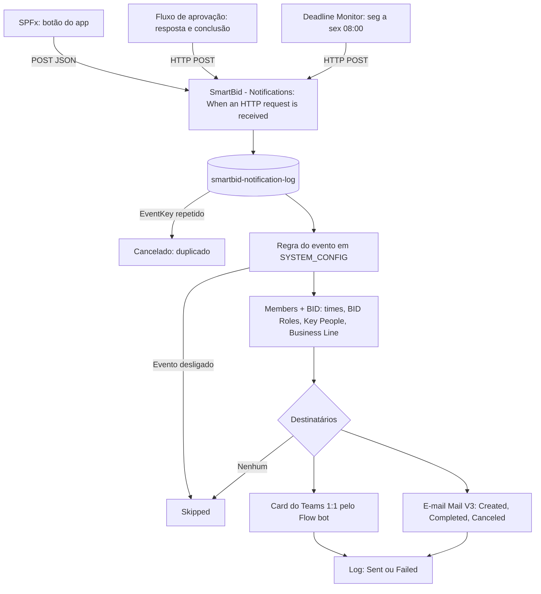

# Notificações do SmartBID — fluxo HTTP, cards do Teams e e-mail

Roteiro dos fluxos que entregam as notificações do SmartBID. O app (e dois outros fluxos) chamam um
fluxo **Instant** com o gatilho **When an HTTP request is received**. Esse fluxo lê as regras salvas em
**System Configuration > Notifications**, monta a lista de destinatários e envia:

- um **card do Teams** (Adaptive Card) no chat de cada pessoa com o **Flow bot**;
- um **e-mail** (somente nos eventos Created, Completed e Canceled).

Regras principais:

- O time de Engineering decide, por evento e por time, quem recebe: **Off**, **Whole team** ou
  **Custom** (BID Roles específicas e/ou **Key People** do BID).
- Se um time estiver **Off** para um evento, ninguém desse time recebe. Se estiver ativo, recebe.
- Quem disparou o evento **não** recebe a própria notificação.
- Em BID confidencial, só recebe quem tem acesso ao BID.
- Cada evento é registrado na lista `smartbid-notification-log`, que também impede envios repetidos.

> **Escopo:** roteiro de configuração. Não é um fluxo exportado nem testado no tenant. Itens marcados
> com **Verificar** dependem do ambiente e devem ser confirmados no primeiro teste.

## Arquivos

| Arquivo                                                                    | Uso                                                          |
| -------------------------------------------------------------------------- | ------------------------------------------------------------ |
| [`notifications/payload-schema.json`](./notifications/payload-schema.json) | Schema do corpo da requisição, colado no gatilho (passo 1)   |
| [`notifications/card-parts.json`](./notifications/card-parts.json)         | Partes do Adaptive Card, coladas no `comCardParts`           |
| [`notifications/card-preview.json`](./notifications/card-preview.json)     | Card de exemplo para ver o visual no Adaptive Cards Designer |
| [`notifications/email-template.html`](./notifications/email-template.html) | HTML do e-mail, colado no `Send_email`                       |

---

## 1. Visão geral

### 1.1 Como funciona



### 1.2 Eventos e onde disparam

| Evento                      | Chave (`event`)               | Canais        | Onde dispara                                                                                              | Origem                   |
| --------------------------- | ----------------------------- | ------------- | --------------------------------------------------------------------------------------------------------- | ------------------------ |
| SmartBID Created            | `BID_CREATED`                 | Email + Teams | Página **Create Request** > botão **Submit Request**                                                      | App                      |
| SmartBID Assigned           | `BID_ASSIGNED`                | Teams         | **Unassigned Requests** > painel Assign > botão **Assign**                                                | App                      |
| Phase Changed               | `PHASE_CHANGED`               | Teams         | BID Details > painel Status/Phase (seletor de fase, Advance / Revert)                                     | App                      |
| Status Changed              | `STATUS_CHANGED`              | Teams         | BID Details > painel Status/Phase (chips de status)                                                       | App                      |
| SmartBID On Hold / Resumed  | `BID_ON_HOLD`                 | Teams         | Mesmo painel: status **On Hold**, ou saída de On Hold                                                     | App                      |
| Revision Started            | `REVISION_STARTED`            | Teams         | BID Details > **Revisions** > **+ Start New Revision**                                                    | App                      |
| SmartBID Completed          | `BID_COMPLETED`               | Email + Teams | Status → Completed; Revisions > **Close Revision**; Approval > Override; fechamento do fluxo de aprovação | App + fluxo de aprovação |
| SmartBID Canceled           | `BID_CANCELED`                | Email + Teams | Painel Status/Phase: status **Canceled** ou **Client Canceled**                                           | App                      |
| New Approval Flow Started   | `APPROVAL_STARTED`            | Teams         | BID Details > **Approval** > **Request Approvals**                                                        | App                      |
| Approval Response           | `APPROVAL_RESPONSE`           | Teams         | Aprovador responde no Approvals do Teams (fluxo `SmartBid – Approval Round`, passo 14.11)                 | Fluxo de aprovação       |
| Approval Override           | `APPROVAL_OVERRIDE`           | Teams         | BID Details > **Approval** > **Override Approval**                                                        | App                      |
| Due Date Changed            | `DUE_DATE_CHANGED`            | Teams         | BID Details > **Overview** > Key Dates > **Change**                                                       | App                      |
| Deadline Warning            | `DEADLINE_WARNING`            | Teams         | Verificação diária, seg a sex às 08:00 (Brasília)                                                         | Deadline Monitor         |
| SmartBID Overdue            | `BID_OVERDUE`                 | Teams         | Mesma verificação: 1x quando atrasa e depois 1x por semana. Ignora On Hold e status encerrados            | Deadline Monitor         |
| Technical Proposal Uploaded | `TECHNICAL_PROPOSAL_UPLOADED` | Teams         | BID Details > **Documents** > "This is the Technical Proposal" + **Upload**                               | App                      |

**Um evento por ação.** Quando uma ação muda várias coisas, o app envia só o evento mais específico:

| Ação                                            | Evento enviado                            |
| ----------------------------------------------- | ----------------------------------------- |
| Assign (muda fase e status)                     | `BID_ASSIGNED`                            |
| Status → Completed (com ou sem mudança de fase) | `BID_COMPLETED`                           |
| Status → Canceled / Client Canceled             | `BID_CANCELED`                            |
| Entrar ou sair de On Hold                       | `BID_ON_HOLD`                             |
| Start New Revision (vai para Rework)            | `REVISION_STARTED`                        |
| Request Approvals (vai para Pending Approval)   | `APPROVAL_STARTED`                        |
| Override Approval                               | `APPROVAL_OVERRIDE` **e** `BID_COMPLETED` |
| Fase mudou (e o status também)                  | `PHASE_CHANGED`                           |
| Só o status mudou                               | `STATUS_CHANGED`                          |

`BID_COMPLETED` e `BID_CANCELED` usam a chave `EVENTO|BID|rev{quantidade de revisões}`. O app e o fluxo
de aprovação geram a mesma chave, então a conclusão nunca é enviada duas vezes.

### 1.3 Quem recebe

Para cada evento (linha) e time (coluna) da página **Notifications**:

| Modo           | Quem recebe                                                                                               |
| -------------- | --------------------------------------------------------------------------------------------------------- |
| **Off**        | Ninguém do time                                                                                           |
| **Whole team** | Todo membro **ativo** do time em Members Management                                                       |
| **Custom**     | Membros ativos do time com uma das **BID Roles** escolhidas e/ou os **Key People** do BID que são do time |

- **Key People** = BID Responsible, Analyst, Project Manager, Commercial Requester e Creator do BID.
- **Business Line** (chave na página): quando ligada, Whole team e BID Roles só incluem membros da
  Business Line do BID (ROV, SURVEY, OPG). Membros sem Business Line e Key People sempre recebem.
- **BID confidencial:** só recebem BID Responsible, Analyst e as pessoas liberadas no cadeado do BID.
- **Quem disparou** o evento nunca recebe.
- Evento desligado (chave da linha) não é enviado para ninguém.

### 1.4 Limitações aceitas

- **Premium.** O gatilho **When an HTTP request is received** e a ação **HTTP** são Premium. A conta dona
  dos três fluxos (notificações, Deadline Monitor e aprovação) precisa da licença.
- **URL com "Anyone".** Qualquer pessoa com a URL consegue disparar o fluxo. A URL fica salva na
  configuração do SmartBID. Se ela vazar, gere outra no gatilho e cole a nova na página.
- **Mail V3:** até 100 envios por dia e 5 a cada 5 minutos por conexão, no máximo 100 destinatários por
  e-mail, e o e-mail traz um link de descadastro que não pode ser removido. O volume esperado cabe nisso.
- **Atraso:** o card chega alguns segundos depois da ação. O Deadline Monitor roda uma vez por dia.

---

## 2. Pré-requisitos

### 2.1 Conexões

| Conector        | Classe   | Uso                                                       |
| --------------- | -------- | --------------------------------------------------------- |
| Request         | Premium  | Gatilho **When an HTTP request is received**              |
| HTTP            | Premium  | Deadline Monitor e fluxo de aprovação chamando este fluxo |
| SharePoint      | Standard | Config, Members, BID e lista de log                       |
| Microsoft Teams | Standard | **Post card in a chat or channel** (Flow bot)             |
| Mail            | Standard | **Send an email notification (V3)**                       |

Use a mesma conta de serviço como dona dos fluxos e das conexões.

### 2.2 Lista `smartbid-notification-log`

**Criação automática pelo app (recomendado):** depois de publicar a versão com o provisionamento,
abra **System Configuration > AI Assistant & API > Provision notification log** e clique em
**Create notification list and columns**. Aguarde a mensagem **OK**. O app cria a lista no site do
SmartBID, as oito colunas adicionais e configura o `Title` como obrigatório, indexado e único.
É necessário ter **Edit** na página e permissão **Manage Lists** no SharePoint. Pode executar de
novo: registros existentes são preservados e colunas faltantes são criadas. Se houver erro, a
mensagem identifica a etapa; corrija a permissão, tipo incompatível ou títulos duplicados e tente
novamente. O botão não cria o fluxo nem as conexões do Power Automate.

**Alternativa manual:** crie a lista no site do SmartBID (`Site contents` > **New** > **List** >
**Blank list**), com o nome `smartbid-notification-log`. Depois crie as colunas (**+ Add column**)
exatamente com estes nomes:

| Coluna           | Tipo                   | Configuração                                                                   |
| ---------------- | ---------------------- | ------------------------------------------------------------------------------ |
| `Title`          | já existe              | List settings > Title > **Enforce unique values: Yes** (aceite criar o índice) |
| `Event`          | Single line of text    |                                                                                |
| `BidNumber`      | Single line of text    |                                                                                |
| `Source`         | Single line of text    |                                                                                |
| `Actor`          | Single line of text    |                                                                                |
| `DeliveryStatus` | Choice                 | Opções `Received`, `Sent`, `Skipped`, `Failed`; padrão `Received`              |
| `Recipients`     | Multiple lines of text | **Plain text**                                                                 |
| `Payload`        | Multiple lines of text | **Plain text**                                                                 |
| `Notes`          | Multiple lines of text | **Plain text**                                                                 |

O `Title` guarda o `eventKey`. Como ele é **único**, um segundo envio com a mesma chave falha ao criar o
item, e o fluxo para ali (passo 4). É isso que evita notificações repetidas.

A conta dona do fluxo precisa de permissão de edição nesta lista.

### 2.3 Configuração no SmartBID

**Antes de Send test:** crie a lista (seção 2.2) e monte **todos os passos 1 a 16 da seção 3**,
incluindo as ações de envio do Teams e do Mail. Salvar apenas o gatilho HTTP gera uma URL, mas
não envia mensagens. Um fluxo com somente o gatilho e **Terminate / Terminar** também não envia
nada. Se o Terminate estiver configurado com Status **Failed**, a execução aparece como falha,
mesmo quando o gatilho e o próprio Terminate exibem marca verde.

Depois de montar e salvar o fluxo completo e copiar a URL do gatilho:

1. SmartBID > **System Configuration** > **Notifications**.
2. Cole a URL em **Flow URL (HTTP POST)**.
3. Ajuste os eventos e os times na matriz e clique em **Save Changes**. Isso garante que
   `SYSTEM_CONFIG` e as regras que o fluxo lê estejam gravados.
4. Clique em **Send test**. Com o fluxo completo, o teste chega só para você, no Teams e no e-mail.
5. Confira o histórico do fluxo e a lista: `Event = TEST`, `DeliveryStatus = Sent` e seu e-mail em
   `Recipients`. O aviso de requisição aceita no app **não confirma a entrega**: sem Response, o
   gatilho responde `202 Accepted` antes de terminar as ações. Uma falha posterior aparece no
   histórico e, quando o fluxo chega à atualização do log, em `DeliveryStatus = Failed`.

Enquanto a URL não for salva, o app não envia nada.

#### 2.3.1 Teste rápido da conexão do Teams (opcional, antes do fluxo completo)

Para verificar somente o gatilho e a conexão do Teams, sem precisar montar todo o fluxo primeiro:

1. Configure o gatilho conforme seção 3, passo 1 (Anyone, POST, schema).
2. Remova o **Terminar** do fluxo mínimo, caso exista.
3. Logo após o gatilho, adicione Microsoft Teams > **Post message in a chat or channel**.
4. Escolha **Post as = Flow bot**, **Post in = Chat with Flow bot**.
5. Em **Recipient**, insira pelo **fx**: `triggerBody()?['actor']?['email']`.
6. Em **Message**, digite `Teste de conexão SmartBID recebido.`.
7. Salve, cole a URL em Notifications e clique em **Send test**. O texto deve chegar apenas no
   seu chat com o Flow bot. Abra a ação de envio no histórico se ela falhar.

Este é um fluxo **temporário, exclusivo para TEST**: não tem card, e-mail, regras, log nem proteção
de confidencialidade. Não use para eventos reais e não deixe esta ação no fluxo definitivo.
Depois, remova a ação temporária e monte os passos 2 a 16 da seção 3. O teste completo de card e
e-mail usa o próprio evento `TEST`; não precisa de um fluxo separado de teste.

### 2.4 Contrato do payload

Todo envio (app, fluxo de aprovação e Deadline Monitor) usa este JSON:

| Campo           | Tipo   | Conteúdo                                                                                 |
| --------------- | ------ | ---------------------------------------------------------------------------------------- |
| `schemaVersion` | número | `1`                                                                                      |
| `eventKey`      | texto  | Chave única do envio (vai para o `Title` do log)                                         |
| `event`         | texto  | Chave do evento (tabela 1.2) ou `TEST`                                                   |
| `source`        | texto  | `app`, `approvalFlow` ou `deadlineMonitor`                                               |
| `occurredAt`    | texto  | Data/hora UTC ISO 8601                                                                   |
| `bidNumber`     | texto  | Número do BID (`Title` da `smartbid-tracker`); vazio no `TEST`                           |
| `deepLink`      | texto  | Link do BID no SmartBID                                                                  |
| `actor`         | objeto | `{ "name", "email" }` de quem disparou; não recebe a notificação                         |
| `channels`      | lista  | `["teams"]` ou `["email", "teams"]`                                                      |
| `presentation`  | objeto | `{ "title", "emoji", "tone" }`; `tone` = `brand`, `info`, `success`, `warning`, `danger` |
| `headline`      | texto  | Frase principal do card e do e-mail (PT-BR, texto puro)                                  |
| `facts`         | lista  | `[{ "title", "value" }]` com os detalhes do evento                                       |

Exemplo (Phase Changed enviado pelo app):

```json
{
  "schemaVersion": 1,
  "eventKey": "PHASE_CHANGED|REQ-2026-0010|1791557000000",
  "event": "PHASE_CHANGED",
  "source": "app",
  "occurredAt": "2026-10-09T14:30:00.000Z",
  "bidNumber": "REQ-2026-0010",
  "deepLink": "https://oceaneering.sharepoint.com/sites/G-OPGSSRBrazilEngineering/SitePages/SmartBid.aspx#/bid/REQ-2026-0010",
  "actor": { "name": "Raphael Costa", "email": "rcosta1@oceaneering.com" },
  "channels": ["teams"],
  "presentation": { "title": "Fase alterada", "emoji": "🔀", "tone": "info" },
  "headline": "A fase mudou de \"Technical Analysis\" para \"Cost & Resources\".",
  "facts": [
    { "title": "De", "value": "Technical Analysis" },
    { "title": "Para", "value": "Cost & Resources" },
    { "title": "Status", "value": "Cost Gathering" },
    { "title": "Alterado por", "value": "Raphael Costa" }
  ]
}
```

O fluxo completa o card e o e-mail com os dados atuais do BID (cliente, projeto, CRM, divisão, fase,
status e prazo), lidos da `smartbid-tracker`.

### 2.5 Como ler este guia

Cada ação aparece com **Onde** (posição), **Ação** (conector → nome da ação), **Nome** (renomeie a ação
pelo menu `...` → **Rename**; as expressões dependem desses nomes) e uma tabela Campo | Como preencher | Valor.

| Como preencher | O que fazer                                                                                                                                     |
| -------------- | ----------------------------------------------------------------------------------------------------------------------------------------------- |
| **Lista**      | Escolha a opção na lista suspensa.                                                                                                              |
| **Texto**      | Digite o valor exatamente como está.                                                                                                            |
| **fx**         | Clique no campo → ícone **fx** (ou aba **Expression**) → cole a expressão **sem** `@{ }` → **Add**.                                             |
| **Texto + fx** | Cole a linha inteira; o designer converte cada `@{...}` num bloco. Se algum trecho ficar como texto, apague-o e insira a expressão pelo **fx**. |
| **JSON**       | Cole o bloco JSON inteiro no campo. Os trechos `@{...}` dentro das aspas viram expressões.                                                      |

- **Conditions e Filter array no modo básico.** Esquerda sempre pelo **fx**. Na direita, `fx true` / `fx 0`
  = insira pelo **fx**; `texto Failed` = digite. Várias linhas: seletor em **AND**.
- **Select em modo texto:** no campo **Map**, clique no ícone **T** (_Switch Map to text mode_) antes de
  inserir a expressão.
- **Configure run after:** designer novo: selecione a ação → **Settings** → **Run after**. Clássico:
  `...` → **Configure run after**.
- **Choice com expressão:** escolha **Enter custom value** e insira pelo **fx**.
- **Crases:** as crases (`` ` ``) das tabelas são só formatação; não copie. Não deixe espaço antes do valor.
- Espaços viram `_` nos nomes usados nas expressões (`Get items` = `Get_items`).

---

## 3. Fluxo 1 — `SmartBid – Notifications`

Crie um **Instant cloud flow**, escolha **When an HTTP request is received** e siga os passos na ordem.

### 3.0 Mapa do fluxo

```text
[1]   When an HTTP request is received (Anyone, POST, schema)
[2]   Initialize variable (6 ações)
[3]   Create_log
[4]   Condition_duplicate            (run after Create_log: is successful + has failed)
      └─ True: Terminate_duplicate
[5]   Get_config → comSettings → comRule
[6]   Get_bid → comBid
[7]   Condition_can_send
      └─ False: Update_log_skipped → Terminate_skipped
[8]   Get_members → comMembers
[9]   selKeyPeople → comKeyPeople → comBusinessLines → selAllowed → comIsConfidential
[10]  filRecipients → selRecipientEmails → filFinalRecipients
[11]  Condition_has_recipients
      └─ False: Update_log_norecipients → Terminate_norecipients
[12]  comTone → comToneMap → comSubtitle → comFooter → comDueRaw → comDueLabel → comBidFacts → comFacts
[13]  comCardParts → comCard
[14]  Scope_deliver
      ├─ Condition_send_email
      │  └─ True: selEmailRows → joinEmailRows → comSafe → Send_email
      └─ Condition_send_teams        (run after Condition_send_email: is successful + has failed)
         └─ True: Apply_to_each_recipient (Concurrency On, 5)
                  └─ Post_card_recipient
[15]  Update_log_done                (run after Scope_deliver: is successful + has failed + has timed out)
[16]  Condition_delivery_failed
      └─ True: Terminate_failed
```

### Fase 1 — Gatilho e registro

#### 1) Gatilho

**Ação:** Request → **When an HTTP request is received**.

| Campo                        | Como preencher | Valor                                                                                  |
| ---------------------------- | -------------- | -------------------------------------------------------------------------------------- |
| Who can trigger the flow?    | Lista          | **Anyone**                                                                             |
| Request Body JSON Schema     | JSON           | conteúdo de [`notifications/payload-schema.json`](./notifications/payload-schema.json) |
| Method (Advanced parameters) | Lista          | **POST**                                                                               |

Salve o fluxo. O campo **HTTP URL** aparece preenchido: copie e cole em SmartBID > System Configuration >
Notifications > **Flow URL** (seção 2.3).

- Não adicione a ação **Response**: sem ela o fluxo responde `202 Accepted` na hora, e o app não espera.
- **Verificar:** se a opção **Anyone** não aparecer, o administrador do ambiente bloqueou gatilhos
  anônimos. Peça a liberação para este fluxo.

#### 2) Variáveis

**Onde:** logo abaixo do gatilho. Uma ação **Variable → Initialize variable** por linha, nesta ordem.

| Name            | Type    | Como preencher Value | Value                                                                                                                                                  |
| --------------- | ------- | -------------------- | ------------------------------------------------------------------------------------------------------------------------------------------------------ |
| `varEvent`      | String  | fx                   | `coalesce(triggerBody()?['event'], '')`                                                                                                                |
| `varBidNumber`  | String  | fx                   | `coalesce(triggerBody()?['bidNumber'], '')`                                                                                                            |
| `varActorEmail` | String  | fx                   | `toLower(coalesce(triggerBody()?['actor']?['email'], ''))`                                                                                             |
| `varIsTest`     | Boolean | fx                   | `equals(triggerBody()?['event'], 'TEST')`                                                                                                              |
| `varAppUrl`     | String  | Texto                | URL da página do SmartBID, sem o `#` e o que vem depois (copie da barra do navegador)                                                                  |
| `varDeepLink`   | String  | fx                   | `if(empty(coalesce(triggerBody()?['deepLink'], '')), concat(variables('varAppUrl'), '#/bid/', variables('varBidNumber')), triggerBody()?['deepLink'])` |

#### 3) Create item `Create_log`

**Onde:** abaixo da última Initialize variable.
**Ação:** SharePoint → **Create item**. **Nome:** `Create_log`.

| Campo          | Como preencher | Valor                                       |
| -------------- | -------------- | ------------------------------------------- |
| Site Address   | Lista          | site do SmartBID                            |
| List Name      | Lista          | `smartbid-notification-log`                 |
| Title          | fx             | `triggerBody()?['eventKey']`                |
| Event          | fx             | `variables('varEvent')`                     |
| BidNumber      | fx             | `variables('varBidNumber')`                 |
| Source         | fx             | `coalesce(triggerBody()?['source'], 'app')` |
| Actor          | fx             | `variables('varActorEmail')`                |
| DeliveryStatus | Lista          | `Received`                                  |
| Payload        | fx             | `string(triggerBody())`                     |

#### 4) Condition `Condition_duplicate`

**Onde:** abaixo de `Create_log`.
**Ação:** Control → **Condition**. **Nome:** `Condition_duplicate`.

| Esquerda (fx)                      | Operador    | Direita        |
| ---------------------------------- | ----------- | -------------- |
| `actions('Create_log')?['status']` | is equal to | texto `Failed` |

| Configuração                        | Como preencher | Valor                              |
| ----------------------------------- | -------------- | ---------------------------------- |
| Settings → Run after (`Create_log`) | marcar         | **is successful** e **has failed** |

- **True:** Control → **Terminate**, **Nome:** `Terminate_duplicate`, Status **Cancelled**. O `eventKey`
  já existe no log: o evento já foi tratado.
- **False:** deixe vazio.

> O passo 5 fica **abaixo** de `Condition_duplicate`, fora dela.

### Fase 2 — Regra e BID

#### 5) Regra do evento

**5.1) Get items `Get_config`**

**Onde:** abaixo de `Condition_duplicate`.
**Ação:** SharePoint → **Get items**. **Nome:** `Get_config`.

| Campo                              | Como preencher | Valor                      |
| ---------------------------------- | -------------- | -------------------------- |
| Site Address                       | Lista          | site do SmartBID           |
| List Name                          | Lista          | `smartbid-config`          |
| Filter Query (Advanced parameters) | Texto          | `Title eq 'SYSTEM_CONFIG'` |
| Top Count (Advanced parameters)    | Texto          | `1`                        |

**5.2) Compose `comSettings`**

**Ação:** Data Operation → **Compose**. **Nome:** `comSettings`.

| Campo  | Como preencher | Valor                                                                         |
| ------ | -------------- | ----------------------------------------------------------------------------- |
| Inputs | fx             | `json(first(body('Get_config')?['value'])?['ConfigValue'])?['notifications']` |

**5.3) Compose `comRule`** — a regra do evento recebido.

| Campo  | Como preencher | Valor                                                      |
| ------ | -------------- | ---------------------------------------------------------- |
| Inputs | fx             | `outputs('comSettings')?['rules']?[variables('varEvent')]` |

#### 6) BID

**6.1) Get items `Get_bid`**

**Ação:** SharePoint → **Get items**. **Nome:** `Get_bid`.

| Campo                              | Como preencher | Valor                                                            |
| ---------------------------------- | -------------- | ---------------------------------------------------------------- |
| Site Address                       | Lista          | site do SmartBID                                                 |
| List Name                          | Lista          | `smartbid-tracker`                                               |
| Filter Query (Advanced parameters) | Texto + fx     | `Title eq '@{replace(variables('varBidNumber'), '''', '''''')}'` |
| Top Count (Advanced parameters)    | Texto          | `1`                                                              |

**6.2) Compose `comBid`** — o JSON do BID (vazio no `TEST`).

| Campo  | Como preencher | Valor                                                                 |
| ------ | -------------- | --------------------------------------------------------------------- |
| Inputs | fx             | `json(coalesce(first(body('Get_bid')?['value'])?['jsondata'], '{}'))` |

#### 7) Condition `Condition_can_send`

**Onde:** abaixo de `comBid`.
**Ação:** Control → **Condition**. **Nome:** `Condition_can_send`.

| Esquerda (fx)                                                                                                                | Operador    | Direita   |
| ---------------------------------------------------------------------------------------------------------------------------- | ----------- | --------- |
| `or(variables('varIsTest'), and(equals(outputs('comRule')?['enabled'], true), not(empty(outputs('comBid')?['bidNumber']))))` | is equal to | fx `true` |

Passa quando é um teste, ou quando o evento está ligado e o BID foi encontrado.

- **True:** deixe vazio.
- **False:** ações 7.1 e 7.2.

**7.1) Update item `Update_log_skipped`** — no ramo **False**.

| Campo          | Como preencher | Valor                                                                                                           |
| -------------- | -------------- | --------------------------------------------------------------------------------------------------------------- |
| Site Address   | Lista          | site do SmartBID                                                                                                |
| List Name      | Lista          | `smartbid-notification-log`                                                                                     |
| Id             | fx             | `body('Create_log')?['ID']`                                                                                     |
| Title          | fx             | `triggerBody()?['eventKey']`                                                                                    |
| DeliveryStatus | Lista          | `Skipped`                                                                                                       |
| Notes          | Texto + fx     | `Evento desligado em System Configuration > Notifications, ou BID @{variables('varBidNumber')} não encontrado.` |

**7.2) Terminate `Terminate_skipped`** — no ramo **False**, abaixo da 7.1. Status **Succeeded**.

> O passo 8 fica **abaixo** de `Condition_can_send`, fora dela.

### Fase 3 — Destinatários

#### 8) Members

**8.1) Get items `Get_members`**

**Ação:** SharePoint → **Get items**. **Nome:** `Get_members`.

| Campo                              | Como preencher | Valor                     |
| ---------------------------------- | -------------- | ------------------------- |
| Site Address                       | Lista          | site do SmartBID          |
| List Name                          | Lista          | `smartbid-config`         |
| Filter Query (Advanced parameters) | Texto          | `Title eq 'TEAM_MEMBERS'` |
| Top Count (Advanced parameters)    | Texto          | `1`                       |

**8.2) Compose `comMembers`** — a lista de membros de Members Management.

| Campo  | Como preencher | Valor                                                                                                          |
| ------ | -------------- | -------------------------------------------------------------------------------------------------------------- |
| Inputs | fx             | `coalesce(json(coalesce(first(body('Get_members')?['value'])?['ConfigValue'], '{}'))?['members'], json('[]'))` |

**Verificar:** o item `TEAM_MEMBERS` deve estar no formato `{ "members": [ ... ] }`. Se o fluxo falhar aqui
com "Array elements can only be selected using an integer index", abra Members Management e salve
qualquer membro uma vez: o app regrava no formato atual.

#### 9) Key People, Business Line e confidencialidade

**9.1) Select `selKeyPeople`** — e-mails dos Key People do BID.

| Campo            | Como preencher | Valor                                                                                                                                                                                                                                                                                                                        |
| ---------------- | -------------- | ---------------------------------------------------------------------------------------------------------------------------------------------------------------------------------------------------------------------------------------------------------------------------------------------------------------------------- |
| From             | fx             | `union(coalesce(outputs('comBid')?['engineerResponsible'], json('[]')), coalesce(outputs('comBid')?['analyst'], json('[]')), coalesce(outputs('comBid')?['projectManager'], json('[]')), createArray(coalesce(outputs('comBid')?['commercialRequester'], json('{}')), coalesce(outputs('comBid')?['creator'], json('{}'))))` |
| Map (modo **T**) | fx             | `toLower(coalesce(item()?['email'], ''))`                                                                                                                                                                                                                                                                                    |

**9.2) Compose `comKeyPeople`** — Inputs (fx): `union(body('selKeyPeople'), body('selKeyPeople'))`

**9.3) Compose `comBusinessLines`** — Business Lines do BID, a mesma regra do app. Inputs (fx):

```text
if(equals(toLower(coalesce(outputs('comBid')?['serviceLine'], '')), 'integrated'), createArray('ROV', 'SURVEY'), if(equals(toLower(coalesce(outputs('comBid')?['serviceLine'], '')), 'rov'), createArray('ROV'), if(equals(toLower(coalesce(outputs('comBid')?['serviceLine'], '')), 'survey'), createArray('SURVEY'), if(startsWith(toUpper(coalesce(outputs('comBid')?['division'], '')), 'OPG'), createArray('OPG'), createArray('ROV', 'SURVEY')))))
```

| Service Line / Divisão do BID | Business Lines |
| ----------------------------- | -------------- |
| `Integrated`                  | ROV e SURVEY   |
| `ROV`                         | ROV            |
| `Survey`                      | SURVEY         |
| Divisão `OPG`                 | OPG            |
| Outros casos (SSR)            | ROV e SURVEY   |

**9.4) Select `selAllowed`** — quem pode ver um BID confidencial.

| Campo            | Como preencher | Valor                                                                                                                                                                                                        |
| ---------------- | -------------- | ------------------------------------------------------------------------------------------------------------------------------------------------------------------------------------------------------------ |
| From             | fx             | `union(coalesce(outputs('comBid')?['engineerResponsible'], json('[]')), coalesce(outputs('comBid')?['analyst'], json('[]')), coalesce(outputs('comBid')?['confidentiality']?['allowedPeople'], json('[]')))` |
| Map (modo **T**) | fx             | `toLower(coalesce(item()?['email'], ''))`                                                                                                                                                                    |

**9.5) Compose `comIsConfidential`** — Inputs (fx):
`equals(outputs('comBid')?['confidentiality']?['enabled'], true)`

#### 10) Lista de destinatários

**10.1) Filter array `filRecipients`** — aplica a regra do evento a cada membro.

**Ação:** Data Operation → **Filter array**. **Nome:** `filRecipients`.

| Campo | Como preencher | Valor                   |
| ----- | -------------- | ----------------------- |
| From  | fx             | `outputs('comMembers')` |

| Esquerda (fx)                    | Operador    | Direita   |
| -------------------------------- | ----------- | --------- |
| expressão abaixo, colada inteira | is equal to | fx `true` |

```text
and(equals(item()?['isActive'], true), not(empty(coalesce(item()?['email'], ''))), or(and(equals(outputs('comRule')?['teams']?[string(item()?['sector'])]?['mode'], 'all'), or(not(equals(outputs('comSettings')?['filterByBusinessLine'], true)), empty(coalesce(item()?['businessLines'], json('[]'))), greater(length(intersection(coalesce(item()?['businessLines'], json('[]')), outputs('comBusinessLines'))), 0))), and(equals(outputs('comRule')?['teams']?[string(item()?['sector'])]?['mode'], 'custom'), or(and(contains(coalesce(outputs('comRule')?['teams']?[string(item()?['sector'])]?['bidRoles'], json('[]')), string(item()?['bidRole'])), or(not(equals(outputs('comSettings')?['filterByBusinessLine'], true)), empty(coalesce(item()?['businessLines'], json('[]'))), greater(length(intersection(coalesce(item()?['businessLines'], json('[]')), outputs('comBusinessLines'))), 0))), and(equals(outputs('comRule')?['teams']?[string(item()?['sector'])]?['keyPeople'], true), contains(outputs('comKeyPeople'), toLower(string(item()?['email']))))))))
```

Em palavras: membro ativo, com e-mail, e

- o time dele está em **Whole team** (respeitando a Business Line); ou
- o time está em **Custom** e ele tem uma das BID Roles marcadas (respeitando a Business Line), ou é
  Key People do BID com **Key People** marcado.

**10.2) Select `selRecipientEmails`**

| Campo            | Como preencher | Valor                       |
| ---------------- | -------------- | --------------------------- |
| From             | fx             | `body('filRecipients')`     |
| Map (modo **T**) | fx             | `toLower(item()?['email'])` |

**10.3) Filter array `filFinalRecipients`** — tira repetidos, quem disparou e, em BID confidencial, quem
não tem acesso. No `TEST`, a lista é só quem clicou em **Send test**.

| Campo | Como preencher | Valor                                                                                                                                |
| ----- | -------------- | ------------------------------------------------------------------------------------------------------------------------------------ |
| From  | fx             | `if(variables('varIsTest'), createArray(variables('varActorEmail')), union(body('selRecipientEmails'), body('selRecipientEmails')))` |

| Esquerda (fx)                                                                                                                                                   | Operador    | Direita   |
| --------------------------------------------------------------------------------------------------------------------------------------------------------------- | ----------- | --------- |
| `or(variables('varIsTest'), and(not(equals(item(), variables('varActorEmail'))), or(not(outputs('comIsConfidential')), contains(body('selAllowed'), item()))))` | is equal to | fx `true` |

#### 11) Condition `Condition_has_recipients`

| Esquerda (fx)                        | Operador        | Direita |
| ------------------------------------ | --------------- | ------- |
| `length(body('filFinalRecipients'))` | is greater than | fx `0`  |

- **True:** deixe vazio.
- **False:** ações 11.1 e 11.2.

**11.1) Update item `Update_log_norecipients`** — no ramo **False**.

| Campo          | Como preencher | Valor                                                        |
| -------------- | -------------- | ------------------------------------------------------------ |
| Site Address   | Lista          | site do SmartBID                                             |
| List Name      | Lista          | `smartbid-notification-log`                                  |
| Id             | fx             | `body('Create_log')?['ID']`                                  |
| Title          | fx             | `triggerBody()?['eventKey']`                                 |
| DeliveryStatus | Lista          | `Skipped`                                                    |
| Notes          | Texto          | `Nenhum destinatário depois de aplicar as regras dos times.` |

**11.2) Terminate `Terminate_norecipients`** — no ramo **False**, abaixo da 11.1. Status **Succeeded**.

> O passo 12 fica **abaixo** de `Condition_has_recipients`, fora dela.

### Fase 4 — Conteúdo

#### 12) Textos e dados do BID

Um **Compose** por linha, nesta ordem.

| Nome (Compose) | Como preencher Inputs | Inputs                                                                                                                                                                                                                                                   |
| -------------- | --------------------- | -------------------------------------------------------------------------------------------------------------------------------------------------------------------------------------------------------------------------------------------------------- |
| `comTone`      | fx                    | `coalesce(triggerBody()?['presentation']?['tone'], 'brand')`                                                                                                                                                                                             |
| `comToneMap`   | JSON                  | bloco abaixo                                                                                                                                                                                                                                             |
| `comSubtitle`  | fx                    | `if(variables('varIsTest'), 'Teste do fluxo de notificações', concat(variables('varBidNumber'), ' · ', coalesce(outputs('comBid')?['opportunityInfo']?['client'], '-'), ' · ', coalesce(outputs('comBid')?['opportunityInfo']?['projectName'], '-')))`   |
| `comFooter`    | fx                    | `concat('Por ', if(empty(coalesce(triggerBody()?['actor']?['name'], '')), 'SmartBID', triggerBody()?['actor']?['name']), ' · ', convertFromUtc(coalesce(triggerBody()?['occurredAt'], utcNow()), 'E. South America Standard Time', 'dd/MM/yyyy HH:mm'))` |
| `comDueRaw`    | fx                    | `if(empty(coalesce(outputs('comBid')?['dueDate'], '')), coalesce(outputs('comBid')?['desiredDueDate'], ''), outputs('comBid')?['dueDate'])`                                                                                                              |
| `comDueLabel`  | fx                    | expressão abaixo                                                                                                                                                                                                                                         |
| `comBidFacts`  | JSON                  | bloco abaixo                                                                                                                                                                                                                                             |
| `comFacts`     | fx                    | `if(variables('varIsTest'), coalesce(triggerBody()?['facts'], json('[]')), union(coalesce(triggerBody()?['facts'], json('[]')), outputs('comBidFacts')))`                                                                                                |

`comToneMap` — estilo do card e cor do e-mail para cada tom:

```json
{
  "brand": { "card": "accent", "color": "#0d9488" },
  "info": { "card": "emphasis", "color": "#0e7490" },
  "success": { "card": "good", "color": "#059669" },
  "warning": { "card": "warning", "color": "#d97706" },
  "danger": { "card": "attention", "color": "#dc2626" }
}
```

`comDueLabel` — o prazo em `dd/MM/yyyy` no horário de Brasília (datas antigas vêm só com `yyyy-MM-dd`):

```text
if(empty(outputs('comDueRaw')), '-', convertFromUtc(if(empty(outputs('comDueRaw')), '2000-01-01T12:00:00Z', if(equals(length(outputs('comDueRaw')), 10), concat(outputs('comDueRaw'), 'T12:00:00Z'), outputs('comDueRaw'))), 'E. South America Standard Time', 'dd/MM/yyyy'))
```

`comBidFacts` — os dados do BID que entram no fim de todo card e e-mail:

```json
[
  { "title": "BID", "value": "@{variables('varBidNumber')}" },
  {
    "title": "Cliente",
    "value": "@{coalesce(outputs('comBid')?['opportunityInfo']?['client'], '-')}"
  },
  {
    "title": "Projeto",
    "value": "@{coalesce(outputs('comBid')?['opportunityInfo']?['projectName'], '-')}"
  },
  {
    "title": "CRM",
    "value": "@{coalesce(outputs('comBid')?['crmNumber'], '-')}"
  },
  {
    "title": "Divisão / Service Line",
    "value": "@{coalesce(outputs('comBid')?['division'], '-')} / @{coalesce(outputs('comBid')?['serviceLine'], '-')}"
  },
  {
    "title": "Fase",
    "value": "@{coalesce(outputs('comBid')?['currentPhase'], '-')}"
  },
  {
    "title": "Status",
    "value": "@{coalesce(outputs('comBid')?['currentStatus'], '-')}"
  },
  { "title": "Prazo", "value": "@{outputs('comDueLabel')}" }
]
```

`comFacts` junta os detalhes do evento (primeiro) com os dados do BID. No `TEST`, só os detalhes do evento.

#### 13) Adaptive Card

**13.1) Compose `comCardParts`**

| Campo  | Como preencher | Valor                                                                                       |
| ------ | -------------- | ------------------------------------------------------------------------------------------- |
| Inputs | JSON           | conteúdo de [`notifications/card-parts.json`](./notifications/card-parts.json), sem alterar |

O arquivo tem três partes: `shell` (versão e botão **Abrir no SmartBID**), `top` (faixa colorida com
marca, emoji, título e subtítulo + a frase principal) e `bottom` (rodapé com quem disparou e quando).

**13.2) Compose `comCard`** — monta o card final: `top`, os fatos e `bottom`. Inputs (fx):

```text
setProperty(outputs('comCardParts')?['shell'], 'body', union(outputs('comCardParts')?['top'], createArray(setProperty(json('{"type":"FactSet","spacing":"Medium","separator":true}'), 'facts', outputs('comFacts'))), outputs('comCardParts')?['bottom']))
```

Montar o card com Compose (e não colando o JSON direto na ação do Teams) evita que aspas ou quebras de
linha no nome do cliente ou num comentário quebrem o JSON do card.

Para ver o visual antes de testar, cole [`notifications/card-preview.json`](./notifications/card-preview.json)
em https://adaptivecards.io/designer (Host app: **Microsoft Teams**).

### Fase 5 — Entrega

#### 14) Scope `Scope_deliver`

**Onde:** abaixo de `comCard`.
**Ação:** Control → **Scope**. **Nome:** `Scope_deliver`. As ações 14.1 e 14.2 ficam **dentro** do Scope.

**14.1) Condition `Condition_send_email`** — dentro do Scope, primeira ação.

| Esquerda (fx)                                                         | Operador    | Direita   |
| --------------------------------------------------------------------- | ----------- | --------- |
| `contains(coalesce(triggerBody()?['channels'], json('[]')), 'email')` | is equal to | fx `true` |

- **True:** ações a a d.
- **False:** deixe vazio.

a. **Select `selEmailRows`** — uma linha `<tr>` por fato, com o texto escapado.

| Campo            | Como preencher | Valor                 |
| ---------------- | -------------- | --------------------- |
| From             | fx             | `outputs('comFacts')` |
| Map (modo **T**) | fx             | expressão abaixo      |

```text
concat('<tr><td style="padding:10px 14px;border-bottom:1px solid #e2e8f0;color:#64748b;font-size:13px;width:190px;vertical-align:top">', replace(replace(replace(string(item()?['title']), '&', '&amp;'), '<', '&lt;'), '>', '&gt;'), '</td><td style="padding:10px 14px;border-bottom:1px solid #e2e8f0;color:#0f172a;font-size:13px;font-weight:600">', replace(replace(replace(replace(string(item()?['value']), '&', '&amp;'), '<', '&lt;'), '>', '&gt;'), decodeUriComponent('%0A'), '<br>'), '</td></tr>')
```

b. **Join `joinEmailRows`**

| Campo     | Como preencher | Valor                       |
| --------- | -------------- | --------------------------- |
| From      | fx             | `body('selEmailRows')`      |
| Join With | fx             | `decodeUriComponent('%0A')` |

c. **Compose `comSafe`** — textos do e-mail com `& < >` escapados. Inputs (JSON):

```json
{
  "title": "@{replace(replace(replace(concat(coalesce(triggerBody()?['presentation']?['emoji'], ''), ' ', coalesce(triggerBody()?['presentation']?['title'], 'SmartBID')), '&', '&amp;'), '<', '&lt;'), '>', '&gt;')}",
  "subtitle": "@{replace(replace(replace(outputs('comSubtitle'), '&', '&amp;'), '<', '&lt;'), '>', '&gt;')}",
  "headline": "@{replace(replace(replace(coalesce(triggerBody()?['headline'], ''), '&', '&amp;'), '<', '&lt;'), '>', '&gt;')}",
  "footer": "@{replace(replace(replace(outputs('comFooter'), '&', '&amp;'), '<', '&lt;'), '>', '&gt;')}"
}
```

d. **Send an email notification (V3) `Send_email`**
**Ação:** Mail → **Send an email notification (V3)**. **Nome:** `Send_email`.

| Campo   | Como preencher | Valor                                                                                                                                                                                                       |
| ------- | -------------- | ----------------------------------------------------------------------------------------------------------------------------------------------------------------------------------------------------------- |
| To      | fx             | `join(body('filFinalRecipients'), ';')`                                                                                                                                                                     |
| Subject | Texto + fx     | `[SmartBID] @{triggerBody()?['presentation']?['title']}@{if(variables('varIsTest'), '', concat(' · ', variables('varBidNumber'), ' · ', coalesce(outputs('comBid')?['opportunityInfo']?['client'], '-')))}` |
| Body    | Texto + fx     | HTML de [`notifications/email-template.html`](./notifications/email-template.html), colado no modo código (`</>`), com os tokens abaixo                                                                     |

Antes de colar, apague o comentário `<!-- ... -->` do topo do HTML e troque cada token:

| Token                | Substituir por                                            |
| -------------------- | --------------------------------------------------------- |
| `[[TONE_COLOR]]`     | `@{outputs('comToneMap')?[outputs('comTone')]?['color']}` |
| `[[TITLE]]`          | `@{outputs('comSafe')?['title']}`                         |
| `[[SUBTITLE]]`       | `@{outputs('comSafe')?['subtitle']}`                      |
| `[[HEADLINE]]`       | `@{outputs('comSafe')?['headline']}`                      |
| `[[FACT_ROWS_HTML]]` | `@{body('joinEmailRows')}`                                |
| `[[DEEP_LINK]]`      | `@{variables('varDeepLink')}`                             |
| `[[FOOTER]]`         | `@{outputs('comSafe')?['footer']}`                        |

`[[TONE_COLOR]]` aparece duas vezes no HTML: troque as duas.

**14.2) Condition `Condition_send_teams`** — dentro do Scope, abaixo de `Condition_send_email`.

| Esquerda (fx)                                                         | Operador    | Direita   |
| --------------------------------------------------------------------- | ----------- | --------- |
| `contains(coalesce(triggerBody()?['channels'], json('[]')), 'teams')` | is equal to | fx `true` |

| Configuração                                  | Como preencher | Valor                              |
| --------------------------------------------- | -------------- | ---------------------------------- |
| Settings → Run after (`Condition_send_email`) | marcar         | **is successful** e **has failed** |

Assim uma falha no e-mail não impede os cards do Teams.

- **True:** ações a e b.
- **False:** deixe vazio.

a. **Apply to each `Apply_to_each_recipient`**

| Campo                                | Como preencher | Valor                        |
| ------------------------------------ | -------------- | ---------------------------- |
| Select an output from previous steps | fx             | `body('filFinalRecipients')` |
| Settings → Concurrency control       | Lista          | **On**                       |
| Settings → Degree of parallelism     | Texto          | `5`                          |

b. **Post card in a chat or channel `Post_card_recipient`** — dentro de `Apply_to_each_recipient`.
**Ação:** Microsoft Teams → **Post card in a chat or channel**. **Nome:** `Post_card_recipient`.

| Campo         | Como preencher | Valor                              |
| ------------- | -------------- | ---------------------------------- |
| Post as       | Lista          | **Flow bot**                       |
| Post in       | Lista          | **Chat with Flow bot**             |
| Recipient     | fx             | `items('Apply_to_each_recipient')` |
| Adaptive Card | fx             | `string(outputs('comCard'))`       |

Se uma pessoa não puder receber (sem licença do Teams, por exemplo), só o card dela falha; os outros
continuam, e o log fica `Failed` para você conferir.

#### 15) Update item `Update_log_done`

**Onde:** abaixo de `Scope_deliver`, fora dele.
**Ação:** SharePoint → **Update item**. **Nome:** `Update_log_done`.

| Campo                                  | Como preencher          | Valor                                                                                                                                            |
| -------------------------------------- | ----------------------- | ------------------------------------------------------------------------------------------------------------------------------------------------ |
| Site Address                           | Lista                   | site do SmartBID                                                                                                                                 |
| List Name                              | Lista                   | `smartbid-notification-log`                                                                                                                      |
| Id                                     | fx                      | `body('Create_log')?['ID']`                                                                                                                      |
| Title                                  | fx                      | `triggerBody()?['eventKey']`                                                                                                                     |
| DeliveryStatus                         | Enter custom value → fx | `if(equals(actions('Scope_deliver')?['status'], 'Succeeded'), 'Sent', 'Failed')`                                                                 |
| Recipients                             | fx                      | `join(body('filFinalRecipients'), '; ')`                                                                                                         |
| Notes                                  | fx                      | `concat('Canais: ', join(coalesce(triggerBody()?['channels'], json('[]')), ', '), '. Destinatários: ', length(body('filFinalRecipients')), '.')` |
| Settings → Run after (`Scope_deliver`) | marcar                  | **is successful**, **has failed** e **has timed out**                                                                                            |

#### 16) Condition `Condition_delivery_failed`

**Onde:** abaixo de `Update_log_done`.

| Esquerda (fx)                         | Operador        | Direita           |
| ------------------------------------- | --------------- | ----------------- |
| `actions('Scope_deliver')?['status']` | is not equal to | texto `Succeeded` |

- **True:** Control → **Terminate**, **Nome:** `Terminate_failed`, Status **Failed**, Code `DELIVERY_FAILED`,
  Message (Texto + fx) `Entrega incompleta: @{triggerBody()?['eventKey']}`. Assim a execução aparece como
  falha no histórico.
- **False:** deixe vazio.

---

## 4. Fluxo 2 — `SmartBid – Deadline Monitor`

Envia **Deadline Warning** e **SmartBID Overdue**. Crie um **Scheduled cloud flow** separado.

Regras:

- **Deadline Warning:** quando faltam de 0 até N dias para o prazo (N = **Deadline warning** da página,
  padrão 2). Na sexta-feira a janela ganha mais 2 dias, para cobrir o fim de semana. Uma vez por prazo:
  se o prazo mudar, um novo aviso pode sair.
- **Overdue:** no primeiro dia útil depois do prazo e depois uma vez por semana enquanto continuar
  atrasado.
- BIDs **On Hold** ou com status encerrado (Completed, Canceled, No Bid e os Terminal Statuses da
  configuração) são ignorados.
- O dia do prazo não conta como atraso, igual ao SmartBID.

### 4.0 Mapa do fluxo

```text
[1]  Recurrence (Week, seg a sex, 08:00 Brasília)
[2]  Initialize variable (3 ações): varAppUrl, varToday, varIsFriday
[3]  Get_config → comConfig → comSettings
[4]  comOverdueOn → comWarnOn → comWindowDays → selTerminal → comSkipStatuses
[5]  Condition_monitor_on
     └─ False: Terminate_off
[6]  Get_due_bids (Pagination On)
[7]  Apply_to_each_bid (Concurrency On, 5)
     ├─ comB → comDueRawM → comDueDay → comDays → comActive → selResponsible
     ├─ Condition_overdue
     │  └─ True: Post_overdue (HTTP)
     └─ Condition_warning
        └─ True: Post_warning (HTTP)
```

#### 1) Recurrence

| Campo                                  | Como preencher | Valor                                        |
| -------------------------------------- | -------------- | -------------------------------------------- |
| Interval                               | Texto          | `1`                                          |
| Frequency                              | Lista          | **Week**                                     |
| Time zone (Advanced parameters)        | Lista          | **(UTC-03:00) Brasilia**                     |
| On these days (Advanced parameters)    | Lista          | Monday, Tuesday, Wednesday, Thursday, Friday |
| At these hours (Advanced parameters)   | Lista          | `8`                                          |
| At these minutes (Advanced parameters) | Texto          | `0`                                          |

#### 2) Variáveis

| Name          | Type    | Como preencher Value | Value                                                                              |
| ------------- | ------- | -------------------- | ---------------------------------------------------------------------------------- |
| `varAppUrl`   | String  | Texto                | a mesma URL da página do SmartBID usada no Fluxo 1 (sem `#`)                       |
| `varToday`    | String  | fx                   | `convertFromUtc(utcNow(), 'E. South America Standard Time', 'yyyy-MM-dd')`         |
| `varIsFriday` | Boolean | fx                   | `equals(dayOfWeek(convertFromUtc(utcNow(), 'E. South America Standard Time')), 5)` |

#### 3) Configuração

**3.1) Get items `Get_config`** — SharePoint → **Get items**.

| Campo                              | Como preencher | Valor                      |
| ---------------------------------- | -------------- | -------------------------- |
| Site Address                       | Lista          | site do SmartBID           |
| List Name                          | Lista          | `smartbid-config`          |
| Filter Query (Advanced parameters) | Texto          | `Title eq 'SYSTEM_CONFIG'` |
| Top Count (Advanced parameters)    | Texto          | `1`                        |

**3.2) Compose `comConfig`** — Inputs (fx): `json(first(body('Get_config')?['value'])?['ConfigValue'])`

**3.3) Compose `comSettings`** — Inputs (fx): `outputs('comConfig')?['notifications']`

#### 4) Regras do monitor

Um **Compose** por linha (exceto `selTerminal`, que é um **Select**), nesta ordem.

| Nome              | Ação    | Como preencher   | Valor                                                                                                       |
| ----------------- | ------- | ---------------- | ----------------------------------------------------------------------------------------------------------- |
| `comOverdueOn`    | Compose | fx               | `equals(outputs('comSettings')?['rules']?['BID_OVERDUE']?['enabled'], true)`                                |
| `comWarnOn`       | Compose | fx               | `equals(outputs('comSettings')?['rules']?['DEADLINE_WARNING']?['enabled'], true)`                           |
| `comWindowDays`   | Compose | fx               | `add(int(coalesce(outputs('comSettings')?['deadlineWarningDays'], 2)), if(variables('varIsFriday'), 2, 0))` |
| `selTerminal`     | Select  | From (fx)        | `coalesce(outputs('comConfig')?['terminalStatuses'], json('[]'))`                                           |
|                   |         | Map (modo T, fx) | `string(item()?['value'])`                                                                                  |
| `comSkipStatuses` | Compose | fx               | `union(body('selTerminal'), createArray('Completed', 'Canceled', 'No Bid', 'On Hold'))`                     |

#### 5) Condition `Condition_monitor_on`

Seletor **AND**.

| #   | Esquerda (fx)                                             | Operador    | Direita    |
| --- | --------------------------------------------------------- | ----------- | ---------- |
| 1   | `empty(coalesce(outputs('comSettings')?['flowUrl'], ''))` | is equal to | fx `false` |
| 2   | `or(outputs('comOverdueOn'), outputs('comWarnOn'))`       | is equal to | fx `true`  |

- **True:** deixe vazio.
- **False:** Control → **Terminate**, **Nome:** `Terminate_off`, Status **Succeeded**.

> O passo 6 fica **abaixo** de `Condition_monitor_on`, fora dela.

#### 6) Get items `Get_due_bids`

**Ação:** SharePoint → **Get items**. **Nome:** `Get_due_bids`.

| Campo                              | Como preencher | Valor                                                                                                                                                                      |
| ---------------------------------- | -------------- | -------------------------------------------------------------------------------------------------------------------------------------------------------------------------- |
| Site Address                       | Lista          | site do SmartBID                                                                                                                                                           |
| List Name                          | Lista          | `smartbid-tracker`                                                                                                                                                         |
| Filter Query (Advanced parameters) | Texto + fx     | `DueDate le '@{addDays(variables('varToday'), add(outputs('comWindowDays'), 1), 'yyyy-MM-dd')}' and Status ne 'Completed' and Status ne 'Canceled' and Status ne 'No Bid'` |
| Top Count (Advanced parameters)    | Texto          | `5000`                                                                                                                                                                     |
| Settings → Pagination              | Lista          | **On**, Threshold `5000`                                                                                                                                                   |

O filtro pela coluna `Status` só reduz a lista; a regra real (passo 7) olha o status dentro do JSON do BID.
**Verificar:** se a `smartbid-tracker` passar de 5.000 itens, indexe as colunas `DueDate` e `Status`
(List settings > Indexed columns).

#### 7) Apply to each `Apply_to_each_bid`

| Campo                                | Como preencher | Valor                            |
| ------------------------------------ | -------------- | -------------------------------- |
| Select an output from previous steps | fx             | `body('Get_due_bids')?['value']` |
| Settings → Concurrency control       | Lista          | **On**                           |
| Settings → Degree of parallelism     | Texto          | `5`                              |

Dentro do loop, nesta ordem. **Não use Set variable aqui dentro** (o loop roda em paralelo).

**7.1) Composes do BID** — um Compose por linha:

| Nome         | Como preencher | Inputs                                                                                                                                                                                                                                        |
| ------------ | -------------- | --------------------------------------------------------------------------------------------------------------------------------------------------------------------------------------------------------------------------------------------- |
| `comB`       | fx             | `json(items('Apply_to_each_bid')?['jsondata'])`                                                                                                                                                                                               |
| `comDueRawM` | fx             | `if(empty(coalesce(outputs('comB')?['dueDate'], '')), coalesce(outputs('comB')?['desiredDueDate'], ''), outputs('comB')?['dueDate'])`                                                                                                         |
| `comDueDay`  | fx             | `convertFromUtc(if(empty(outputs('comDueRawM')), '2000-01-01T12:00:00Z', if(equals(length(outputs('comDueRawM')), 10), concat(outputs('comDueRawM'), 'T12:00:00Z'), outputs('comDueRawM'))), 'E. South America Standard Time', 'yyyy-MM-dd')` |
| `comDays`    | fx             | `div(sub(ticks(concat(outputs('comDueDay'), 'T00:00:00Z')), ticks(concat(variables('varToday'), 'T00:00:00Z'))), 864000000000)`                                                                                                               |
| `comActive`  | fx             | `and(not(empty(outputs('comDueRawM'))), not(contains(outputs('comSkipStatuses'), string(outputs('comB')?['currentStatus']))))`                                                                                                                |

`comDays` = dias do hoje até o prazo: `0` = vence hoje, `1` = amanhã, negativo = atrasado.

**7.2) Select `selResponsible`**

| Campo            | Como preencher | Valor                                                           |
| ---------------- | -------------- | --------------------------------------------------------------- |
| From             | fx             | `coalesce(outputs('comB')?['engineerResponsible'], json('[]'))` |
| Map (modo **T**) | fx             | `coalesce(item()?['name'], '')`                                 |

**7.3) Condition `Condition_overdue`** — Seletor **AND**.

| #   | Esquerda (fx)             | Operador     | Direita   |
| --- | ------------------------- | ------------ | --------- |
| 1   | `outputs('comActive')`    | is equal to  | fx `true` |
| 2   | `outputs('comOverdueOn')` | is equal to  | fx `true` |
| 3   | `outputs('comDays')`      | is less than | fx `0`    |

- **True:** ação **HTTP** `Post_overdue` (abaixo).
- **False:** deixe vazio.

**HTTP `Post_overdue`** — **Ação:** HTTP → **HTTP**. **Nome:** `Post_overdue`.

| Campo             | Como preencher | Valor                                |
| ----------------- | -------------- | ------------------------------------ |
| Method            | Lista          | `POST`                               |
| URI               | fx             | `outputs('comSettings')?['flowUrl']` |
| Headers (1 linha) | Texto          | `Content-Type` = `application/json`  |
| Body              | JSON           | bloco abaixo                         |

```json
{
  "schemaVersion": 1,
  "eventKey": "BID_OVERDUE|@{outputs('comB')?['bidNumber']}|@{outputs('comDueDay')}|W@{div(sub(sub(0, outputs('comDays')), 1), 7)}",
  "event": "BID_OVERDUE",
  "source": "deadlineMonitor",
  "occurredAt": "@{utcNow()}",
  "bidNumber": "@{outputs('comB')?['bidNumber']}",
  "deepLink": "@{variables('varAppUrl')}#/bid/@{outputs('comB')?['bidNumber']}",
  "actor": { "name": "SmartBID", "email": "" },
  "channels": ["teams"],
  "presentation": {
    "title": "SmartBID atrasado",
    "emoji": "🔴",
    "tone": "danger"
  },
  "headline": "O prazo deste SmartBID venceu há @{sub(0, outputs('comDays'))} dia(s) e ele ainda está em @{outputs('comB')?['currentStatus']}.",
  "facts": [
    {
      "title": "Prazo",
      "value": "@{formatDateTime(concat(outputs('comDueDay'), 'T12:00:00Z'), 'dd/MM/yyyy')}"
    },
    { "title": "Dias de atraso", "value": "@{sub(0, outputs('comDays'))}" },
    {
      "title": "BID Responsible",
      "value": "@{join(body('selResponsible'), ', ')}"
    }
  ]
}
```

O final `W...` da chave muda a cada 7 dias de atraso: `W0` na primeira semana, `W1` na segunda, e assim
por diante. O Fluxo 1 descarta a mesma chave nos outros dias, então sai um aviso por semana.

**7.4) Condition `Condition_warning`** — abaixo de `Condition_overdue`, fora dela. Seletor **AND**.

| #   | Esquerda (fx)          | Operador                    | Direita                       |
| --- | ---------------------- | --------------------------- | ----------------------------- |
| 1   | `outputs('comActive')` | is equal to                 | fx `true`                     |
| 2   | `outputs('comWarnOn')` | is equal to                 | fx `true`                     |
| 3   | `outputs('comDays')`   | is greater than or equal to | fx `0`                        |
| 4   | `outputs('comDays')`   | is less than or equal to    | fx `outputs('comWindowDays')` |

- **True:** ação **HTTP** `Post_warning` (abaixo).
- **False:** deixe vazio.

**HTTP `Post_warning`** — **Ação:** HTTP → **HTTP**. **Nome:** `Post_warning`.

| Campo             | Como preencher | Valor                                |
| ----------------- | -------------- | ------------------------------------ |
| Method            | Lista          | `POST`                               |
| URI               | fx             | `outputs('comSettings')?['flowUrl']` |
| Headers (1 linha) | Texto          | `Content-Type` = `application/json`  |
| Body              | JSON           | bloco abaixo                         |

```json
{
  "schemaVersion": 1,
  "eventKey": "DEADLINE_WARNING|@{outputs('comB')?['bidNumber']}|@{outputs('comDueDay')}",
  "event": "DEADLINE_WARNING",
  "source": "deadlineMonitor",
  "occurredAt": "@{utcNow()}",
  "bidNumber": "@{outputs('comB')?['bidNumber']}",
  "deepLink": "@{variables('varAppUrl')}#/bid/@{outputs('comB')?['bidNumber']}",
  "actor": { "name": "SmartBID", "email": "" },
  "channels": ["teams"],
  "presentation": {
    "title": "Prazo se aproximando",
    "emoji": "⏰",
    "tone": "warning"
  },
  "headline": "O prazo deste SmartBID vence @{if(equals(outputs('comDays'), 0), 'hoje', if(equals(outputs('comDays'), 1), 'amanhã', concat('em ', string(outputs('comDays')), ' dias')))}.",
  "facts": [
    {
      "title": "Prazo",
      "value": "@{formatDateTime(concat(outputs('comDueDay'), 'T12:00:00Z'), 'dd/MM/yyyy')}"
    },
    { "title": "Dias restantes", "value": "@{outputs('comDays')}" },
    {
      "title": "BID Responsible",
      "value": "@{join(body('selResponsible'), ', ')}"
    }
  ]
}
```

---

## 5. Integração com `SmartBid – Approval Round`

O fluxo de aprovação ([APPROVALS-INDIVIDUAL.md](./APPROVALS-INDIVIDUAL.md)) passa a enviar dois eventos
para o Fluxo 1. O e-mail de conclusão do fluxo de aprovação **deixa de existir**: o único e-mail de
conclusão é o do evento **SmartBID Completed**. O card final no chat em grupo continua.

#### 5.1) Variável `varNotifyUrl`

**Onde:** no passo 4 do fluxo de aprovação, abaixo da última Initialize variable (`varAdminEmail`).
**Ação:** Variable → **Initialize variable**.

| Name           | Type   | Como preencher Value | Value                                                      |
| -------------- | ------ | -------------------- | ---------------------------------------------------------- |
| `varNotifyUrl` | String | Texto                | a mesma URL colada em System Configuration > Notifications |

Se a URL do Fluxo 1 mudar, atualize esta variável também.

#### 5.2) HTTP `Post_notify_response` — Approval Response

**Onde:** passo 14.11 do fluxo de aprovação, no ramo **True** de `Condition_written_inc`, **abaixo** de
`Condition_person_rejected` (fora dela). É a última ação desse ramo.
**Ação:** HTTP → **HTTP**. **Nome:** `Post_notify_response`.

| Campo             | Como preencher | Valor                               |
| ----------------- | -------------- | ----------------------------------- |
| Method            | Lista          | `POST`                              |
| URI               | fx             | `variables('varNotifyUrl')`         |
| Headers (1 linha) | Texto          | `Content-Type` = `application/json` |
| Body              | JSON           | bloco abaixo                        |

```json
{
  "schemaVersion": 1,
  "eventKey": "APPROVAL_RESPONSE|@{variables('varBidNumber')}|R@{variables('varRound')}|@{items('Apply_to_each_person')}",
  "event": "APPROVAL_RESPONSE",
  "source": "approvalFlow",
  "occurredAt": "@{outputs('comResponseDate')}",
  "bidNumber": "@{variables('varBidNumber')}",
  "deepLink": "@{variables('varDeepLink')}",
  "actor": {
    "name": "@{outputs('comPersonName')}",
    "email": "@{items('Apply_to_each_person')}"
  },
  "channels": ["teams"],
  "presentation": {
    "title": "@{if(equals(outputs('comDecision'), 'approved'), 'Aprovação registrada', 'Aprovação recusada')}",
    "emoji": "@{if(equals(outputs('comDecision'), 'approved'), '✅', '❌')}",
    "tone": "@{if(equals(outputs('comDecision'), 'approved'), 'success', 'danger')}"
  },
  "headline": "@{outputs('comPersonName')} @{if(equals(outputs('comDecision'), 'approved'), 'aprovou', 'recusou')} a rodada @{variables('varRound')} de aprovação.",
  "facts": [
    { "title": "Aprovador", "value": "@{outputs('comPersonName')}" },
    { "title": "Setor(es)", "value": "@{outputs('comPersonSectors')}" },
    {
      "title": "Decisão",
      "value": "@{if(equals(outputs('comDecision'), 'approved'), 'Aprovado', 'Recusado')}"
    },
    { "title": "Rodada", "value": "@{variables('varRound')}" },
    {
      "title": "Progresso",
      "value": "@{outputs('comApprovedPeople')} de @{length(outputs('comUniqueApproverEmails'))} aprovaram"
    },
    {
      "title": "Comentário",
      "value": "@{coalesce(outputs('comComments'), '-')}"
    }
  ]
}
```

O aprovador é o `actor`, então ele não recebe a notificação da própria resposta.

#### 5.3) HTTP `Post_notify_completed` — SmartBID Completed

**Onde:** passo 18 do fluxo de aprovação, no ramo **True** de `Condition_final_approved`, abaixo de
`Post_card_Final`. As ações antigas `selEmailRows`, `joinEmailRows`, `filEmailCc` e `Send_email_V3`
devem ser **excluídas** (menu `...` → **Delete**).
**Ação:** HTTP → **HTTP**. **Nome:** `Post_notify_completed`.

| Campo             | Como preencher | Valor                               |
| ----------------- | -------------- | ----------------------------------- |
| Method            | Lista          | `POST`                              |
| URI               | fx             | `variables('varNotifyUrl')`         |
| Headers (1 linha) | Texto          | `Content-Type` = `application/json` |
| Body              | JSON           | bloco abaixo                        |

```json
{
  "schemaVersion": 1,
  "eventKey": "BID_COMPLETED|@{variables('varBidNumber')}|rev@{length(coalesce(body('Parse_BID_final')?['revisions'], json('[]')))}",
  "event": "BID_COMPLETED",
  "source": "approvalFlow",
  "occurredAt": "@{outputs('comCompletionDate')}",
  "bidNumber": "@{variables('varBidNumber')}",
  "deepLink": "@{variables('varDeepLink')}",
  "actor": { "name": "Fluxo de aprovação", "email": "" },
  "channels": ["email", "teams"],
  "presentation": {
    "title": "SmartBID concluído",
    "emoji": "✅",
    "tone": "success"
  },
  "headline": "Todos os aprovadores aprovaram a rodada @{variables('varRound')} e o SmartBID foi concluído.",
  "facts": [
    { "title": "Rodada", "value": "@{variables('varRound')}" },
    {
      "title": "Aprovadores",
      "value": "@{outputs('comApprovedPeople_final')} de @{length(outputs('comUniqueApproverEmails'))}"
    },
    {
      "title": "Concluído em",
      "value": "@{convertFromUtc(outputs('comCompletionDate'), 'E. South America Standard Time', 'dd/MM/yyyy HH:mm')}"
    }
  ]
}
```

A chave `BID_COMPLETED|BID|rev{n}` é a mesma que o app usa. Se o app também registrar a conclusão, o
Fluxo 1 envia só uma vez.

---

## 6. Templates — visual

| Elemento      | Card do Teams                            | E-mail                                                |
| ------------- | ---------------------------------------- | ----------------------------------------------------- |
| Marca         | Faixa `SMARTBID · OCEANEERING` no topo   | Barra teal `#00c9a7` + cabeçalho navy `#0f1b2d`       |
| Título        | Emoji + título do evento                 | Emoji + título do evento                              |
| Subtítulo     | `BID · Cliente · Projeto`                | `BID · Cliente · Projeto`                             |
| Cor do evento | Estilo do container (`comToneMap.card`)  | Barra lateral da frase principal (`comToneMap.color`) |
| Detalhes      | FactSet: fatos do evento + dados do BID  | Tabela "Detalhes": fatos do evento + dados do BID     |
| Ação          | Botão **Abrir no SmartBID**              | Botão teal `#0d9488` **Abrir no SmartBID**            |
| Rodapé        | `Por {quem disparou} · dd/MM/yyyy HH:mm` | Mesmo texto + aviso de e-mail automático              |

| Tom       | Usado em                                              | Card        | E-mail    |
| --------- | ----------------------------------------------------- | ----------- | --------- |
| `brand`   | Created, Assigned, Approval Started, Test             | `accent`    | `#0d9488` |
| `info`    | Phase, Status, Due Date Changed, Technical Proposal   | `emphasis`  | `#0e7490` |
| `success` | Completed, Resumed, aprovação registrada              | `good`      | `#059669` |
| `warning` | On Hold, Revision Started, Override, Deadline Warning | `warning`   | `#d97706` |
| `danger`  | Canceled, Overdue, aprovação recusada                 | `attention` | `#dc2626` |

---

## 7. Testes de aceitação

1. **Send test** na página → card e e-mail chegam só para você; o log mostra `Sent` com `Event = TEST`.
2. Criar um request (Create Request) → Engineering (Manager / Sr. Manager / Coordinator, padrão) recebe card
   e e-mail; quem criou não recebe.
3. Assign em Unassigned Requests → os Key People ativos (Engineering, Commercial, Project) recebem o card.
4. Desligar Commercial em **Phase Changed**, salvar e mudar a fase → ninguém de Commercial recebe.
5. Commercial em **Whole team** → todos os membros ativos de Commercial da Business Line do BID recebem.
6. Desligar o filtro de Business Line → membros de outras Business Lines também recebem.
7. Custom com **Manager** apenas → só Managers do time recebem.
8. Custom com **Key People** apenas → só o BID Responsible / Analyst / PM / Requester / Creator do time recebem.
9. BID confidencial → só BID Responsible, Analyst e pessoas liberadas recebem, mesmo com Whole team.
10. Desligar a chave do evento → nada é enviado (o app nem chama o fluxo).
11. Status → On Hold e depois de volta → um card "em espera" e um "retomado".
12. Request Approvals → um card **New Approval Flow Started** (sem Phase/Status Changed junto).
13. Aprovador responde → **Approval Response** para os times configurados; o aprovador não recebe.
14. Todos aprovam → um único **SmartBID Completed** (card + e-mail); nenhum e-mail antigo do fluxo de aprovação.
15. Override → **Approval Override** e **SmartBID Completed**.
16. Prazo amanhã → **Deadline Warning** na manhã seguinte (ou na sexta, se o prazo for segunda).
17. BID atrasado → **Overdue** no primeiro dia útil e de novo só 7 dias depois; nada se estiver On Hold.
18. Repetir o mesmo `eventKey` (rodar o monitor duas vezes no mesmo dia) → a segunda execução termina
    `Cancelled` em `Condition_duplicate`.
19. Cliente com aspas, `&` e `<` no nome → card e e-mail aparecem normais, sem HTML executado.

## 8. Implantação

1. Criar a lista `smartbid-notification-log` pelo botão em **AI Assistant & API** (seção 2.2).
2. Criar o Fluxo 1 **completo (passos 1 a 16)**, salvar e copiar a URL do gatilho.
3. Colar a URL na página Notifications, ajustar as regras, **Save Changes** e então **Send test**.
4. Criar o Fluxo 2 (Deadline Monitor) com a mesma `varAppUrl`.
5. Aplicar a seção 5 no fluxo de aprovação (variável + duas ações HTTP, e excluir o e-mail final antigo).
6. Rodar os testes da seção 7 com um BID de teste.

## 9. Solução de problemas

| Sintoma                                                      | Causa provável / ação                                                                                                                                                |
| ------------------------------------------------------------ | -------------------------------------------------------------------------------------------------------------------------------------------------------------------- |
| Só existem o gatilho e **Terminar**; nada chega ao Teams     | Faltam as ações de envio. Monte a seção 3 completa ou use o teste temporário da seção 2.3.1. Confira o Status do Terminar: **Failed** encerra a execução como falha. |
| App mostra requisição aceita, mas nada chega                 | Aceite HTTP não é confirmação de entrega. Abra o histórico do fluxo, confira as ações de envio e o log `TEST`; o fluxo pode ter falhado depois do aceite.            |
| **Send test** mostra "Test failed" e o console cita **CORS** | **Verificar** se o ambiente permite chamada do navegador. Confirme que a URL é a do gatilho e que **Who can trigger** é **Anyone**.                                  |
| Toda execução termina `Cancelled` em `Condition_duplicate`   | `Create_log` está falhando por outro motivo (coluna com nome errado, permissão). Abra `Create_log` no histórico e veja o erro.                                       |
| Execução `Succeeded`, log `Skipped`                          | Evento desligado, regra ainda não salva (salve a página Notifications uma vez) ou BID não encontrado.                                                                |
| Log `Skipped` com "Nenhum destinatário"                      | Nenhum membro ativo atende à regra. Confira time, BID Role e Business Line do membro em Members Management, e lembre que quem disparou não recebe.                   |
| `Post_card_recipient` falha para uma pessoa                  | Usuário sem Teams ou e-mail diferente do UPN. Corrija o e-mail em Members Management.                                                                                |
| `Send_email` falha com 429                                   | Limite do Mail V3 (5 e-mails a cada 5 minutos, 100 por dia). Aguarde; se for frequente, troque por Office 365 Outlook → **Send an email (V2)** com os mesmos campos. |
| Card não aparece / erro "invalid adaptive card"              | `comCardParts` colado com alteração, ou `Adaptive Card` sem `string(...)`. Cole o arquivo de novo e use `string(outputs('comCard'))`.                                |
| Prazo aparece um dia antes                                   | `comDueLabel` / `comDueDay` sem a regra de data curta (`T12:00:00Z`). Cole a expressão inteira de novo.                                                              |

## 10. SPFx — onde o app dispara

| O quê                         | Código                                                                                                                              |
| ----------------------------- | ----------------------------------------------------------------------------------------------------------------------------------- |
| SmartBID Created              | `pages/CreateRequestPage.tsx` → `handleSubmit`, depois de `BidService.updateAfterCreate`                                            |
| SmartBID Assigned             | `pages/UnassignedRequestsPage.tsx` → `handleAssign`, depois de `BidService.update`                                                  |
| Demais eventos do app         | `pages/BidDetailPage.tsx` → `savePatch`, depois de gravar; o evento vem de `utils/notificationEvents.ts` (`deriveBidNotifications`) |
| Envio (POST)                  | `services/NotificationDispatchService.ts`; não envia sem URL válida ou com o evento desligado; erro só no console                   |
| Catálogo de eventos e padrões | `config/notifications.config.ts`                                                                                                    |
| Página Notifications          | `components/settings/NotificationMatrix.tsx`                                                                                        |
| Regras salvas                 | `SYSTEM_CONFIG` → `notifications` (`flowUrl`, `filterByBusinessLine`, `deadlineWarningDays`, `rules`)                               |

O app grava também a coluna `Status` da `smartbid-tracker` a cada alteração do BID, usada no filtro do
Deadline Monitor.
