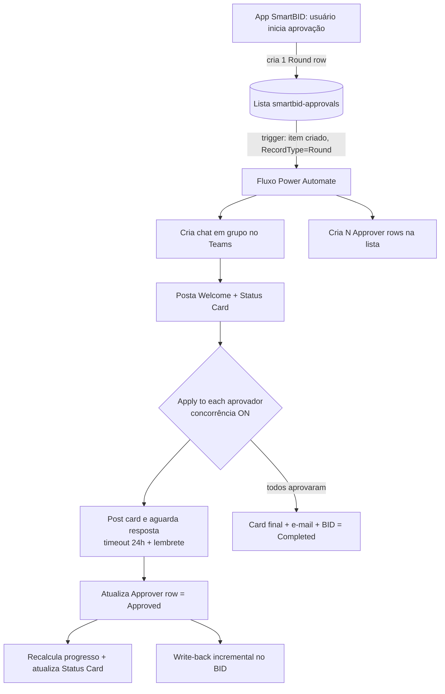

# Fluxo de Aprovação do BID — Power Automate + Teams

Guia passo a passo para construir o fluxo que orquestra a aprovação de um BID via chat em grupo
do Microsoft Teams, com Adaptive Cards, progresso em tempo real, e-mail final e mudança automática
do BID para o status terminal **Completed**.

> Os artefatos prontos estão em:
>
> - `cards/01-welcome.json` — card de boas-vindas
> - `cards/02-status.json` — card de status ao vivo (atualizado a cada aprovação)
> - `cards/03-approver.json` — card de ação individual (botão Aprovar)
> - `cards/04-final.json` — card de conclusão
> - `email/completion-email.html` — e-mail HTML de conclusão

---

## 1. Visão geral



**Princípios de robustez:**

- **1 linha por aprovador** → duas aprovações simultâneas nunca colidem (cada uma escreve só a sua linha).
- **Apply to each com concorrência** → todos aprovam em paralelo; o loop só termina quando todos responderem.
- **Card de status único e atualizado** → recomposto a partir das linhas a cada aprovação (idempotente).
- **Write-back no BID com ETag + retry** → sem perda de atualização concorrente.

---

## 2. Pré-requisitos

### 2.1 Colunas da lista (automático)

As colunas da lista `smartbid-approvals` são criadas automaticamente pelo app em
`ApprovalService.ensureApprovalColumns()` (chamado no início de cada rodada de aprovação). Não é
preciso criar nada manualmente. Colunas provisionadas:

| Coluna                  | Tipo                        | Uso                                               |
| ----------------------- | --------------------------- | ------------------------------------------------- |
| `RecordType`            | Choice (Round / Approver)   | Distingue a linha-gatilho das linhas de aprovador |
| `BidNumber`             | Texto                       | Filtro                                            |
| `RoundNumber`           | Número                      | Rodada de aprovação                               |
| `ApproverEmail`         | Texto                       | Identidade do aprovador                           |
| `ApproverName`          | Texto                       | Nome exibido                                      |
| `Sector`                | Texto                       | Setor (chave)                                     |
| `SectorLabel`           | Texto                       | Setor (rótulo)                                    |
| `ApprovalStatus`        | Choice (Pending / Approved) | Status individual                                 |
| `RespondedDate`         | Data/Hora                   | Quando aprovou                                    |
| `ChatId`                | Texto                       | Id do chat do Teams                               |
| `StatusCardMessageId`   | Texto                       | Id da mensagem do card de status                  |
| `ExpectedApproverCount` | Número                      | Total de aprovadores da rodada                    |

### 2.2 Conexões necessárias

- **Microsoft Teams** — chat em grupo, cards, mensagens e @mentions.
- **SharePoint** (site `G-OPGSSRBrazilEngineering`) — listas + `Send an HTTP request to SharePoint` (write-back).
- **Office 365 Users** — ação `Get my profile (V2)` (descobre o dono do fluxo, passo 7.1).
- **Mail** — ação `Send an email notification (V3)` para o e-mail final (passo 18). **Não usa a sua
  caixa pessoal**: envia a partir de um remetente gerenciado da Microsoft e **não exige** conexão
  autenticada do Outlook. Suporta **CC/BCC** nos parâmetros avançados.

> **Por que V3 (conector Mail) e não o Outlook `Send an email (V2)`?** O V2 envia **da sua caixa**
> (remetente = você) e exige a conexão do Outlook. O V3 envia de um remetente genérico da Microsoft
> (ex.: `no-reply@…`), então o e-mail **não sai da sua conta**. Ambos suportam HTML e CC/BCC — a
> diferença prática é o remetente e a conexão. Como o remetente é genérico, na **primeira vez** o
> e-mail pode cair em Lixo Eletrônico/Spam; peça aos destinatários para marcar como "não é lixo".
> Se precisar de remetente reconhecível, use o V2 sob uma **conta de serviço** (ex.:
> `smartbid-bot@oceaneering.com`) para não sair da sua caixa pessoal — ver §9.

### 2.3 Contrato de dados (o que o app grava na Round row)

Campo `jsondata` (JSON) da linha `RecordType=Round`:

```json
{
  "bidNumber": "REQ-2026-0010",
  "round": 1,
  "approvers": [
    {
      "sector": "project",
      "sectorLabel": "Project",
      "members": [
        {
          "name": "João Silva",
          "email": "jsilva@oceaneering.com",
          "role": "PM"
        }
      ],
      "isAutoLocked": false
    }
  ],
  "requestedBy": { "name": "Ana", "email": "ana@oceaneering.com" },
  "engineerResponsible": [
    { "name": "Raphael Costa", "email": "rcosta1@oceaneering.com" }
  ],
  "analyst": [
    { "name": "Laura Campanati", "email": "lcampanati@oceaneering.com" }
  ],
  "client": "Petrobras",
  "requestedDate": "2026-07-30T12:00:00.000Z",
  "deepLink": "https://.../#/bid/REQ-2026-0010?tab=approval",
  "status": "pending",
  "capexUSD": 123456,
  "division": "SSR-ROV",
  "serviceLine": "ROV"
}
```

> `engineerResponsible`, `analyst` e `client` são gravados pelo `startApprovalRound()` e
> servem para o fluxo montar o chat (engenheiros + analistas + aprovadores) sem precisar
> reler o BID. Ambos são **arrays** (um BID pode ter vários). O `creator` **não** é enviado:
> ele já entra como aprovador (setor Commercial).

### 2.4 Convenção de nomes das ações (importante)

O Power Automate nomeia as ações automaticamente (ex.: `Apply to each`, `Apply to each 2`) e
adiciona sufixos quando há repetição. **Todas as expressões deste guia usam nomes fixos** — se a
ação tiver outro nome, a expressão quebra. Renomeie cada ação (menu `...` → _Rename_) exatamente
como abaixo:

| Ação (tipo)                                    | Nome exato a usar                      | Onde         |
| ---------------------------------------------- | -------------------------------------- | ------------ |
| Parse JSON (trigger)                           | `Parse_JSON`                           | Passo 3      |
| Apply to each (grupos de setor)                | `Apply_to_each_sector`                 | Passo 5      |
| Apply to each (membros do setor)               | `Apply_to_each_member`                 | Passo 5      |
| Get items (smartbid-tracker → ID do BID)       | `Get_items`                            | Passo 6      |
| Get my profile (V2)                            | `Get_my_profile_(V2)`                  | Passo 7.1    |
| Select (e-mails de engenheiros)                | `selEngineerEmails`                    | Passo 7.2    |
| Select (e-mails de analistas)                  | `selAnalystEmails`                     | Passo 7.2    |
| Compose (união de membros do chat)             | `comAllMembers`                        | Passo 7.2    |
| Filter array (remove dono do fluxo)            | `filChatMembers`                       | Passo 7.2    |
| Create a chat                                  | `Create_a_chat`                        | Passo 7.3    |
| Update item (grava ChatId na Round row)        | `Update_ChatId`                        | Passo 8      |
| Select (linhas MD do welcome)                  | `selWelcomeMD`                         | Passo 9      |
| Join (une linhas MD do welcome)                | `joinWelcomeMD`                        | Passo 9      |
| Compose (lista MD do welcome)                  | `comAprovadoresMD`                     | Passo 9      |
| Post card in a chat (Welcome)                  | `Post_card_Welcome`                    | Passo 9      |
| Post card in a chat (Status)                   | `Post_card_Status`                     | Passo 10     |
| Update item (grava StatusCardMessageId)        | `Update_StatusMsgId`                   | Passo 11     |
| Apply to each (cria Approver rows)             | `Apply_to_each_createrow`              | Passo 12     |
| Create item (Approver row)                     | `Create_ApproverRow`                   | Passo 12     |
| Apply to each (loop de aprovação)              | `Apply_to_each`                        | Passos 13–14 |
| Do Until (aguarda aprovador correto)           | `Do_until_valid_response`              | Passo 13.2   |
| Post adaptive card and wait for a response     | `Post_card_and_wait`                   | Passo 13.2   |
| Condition (houve resposta)                     | `Condition_response_received`          | Passo 13.2   |
| Condition (é o aprovador correto)              | `Condition_correct_approver`           | Passo 13.2   |
| Post message (clique da pessoa errada)         | `Post_msg_wrong_approver`              | Passo 13.2   |
| Get an @mention token (lembrete)               | `Get_mention_approver`                 | Passo 13.2   |
| Post message (lembrete)                        | `Post_msg_reminder`                    | Passo 13.2   |
| Get items (linha do aprovador atual)           | `Get_items_appr`                       | Passo 14.1   |
| Update item (Approver row = Approved)          | `Update_ApproverRow`                   | Passo 14.1   |
| Get items (todas as Approver rows)             | `Get_items_all`                        | Passo 14.2   |
| Filter array (aprovados)                       | `filAprovados`                         | Passo 14.2   |
| Select (linhas MD do status card)              | `selStatusMD`                          | Passo 14.3   |
| Join (une linhas MD do status card)            | `joinStatusMD`                         | Passo 14.3   |
| Compose (barra de progresso)                   | `comProgressBar`                       | Passo 14.4   |
| Update an adaptive card (Status ao vivo)       | `Update_StatusCard`                    | Passo 14.5   |
| Post message in a chat (confirmação)           | `Post_msg_confirm`                     | Passo 14.6   |
| **— Write-back incremental (passo 14.7) —**    |                                        |              |
| Get item (BID, incremental)                    | `Get_item_inc`                         | Passo 14.7   |
| Parse JSON (BID, incremental)                  | `Parse_JSON_BID_inc`                   | Passo 14.7   |
| Select (marca a aprovação atual)               | `selApprovals_inc`                     | Passo 14.7   |
| Compose (BID recomposto, incremental)          | `comBidInc`                            | Passo 14.7   |
| Send an HTTP request to SharePoint (increment) | `Send_HTTP_inc`                        | Passo 14.7   |
| Compose (continua após 412, incremental)       | `comContinue_inc`                      | Passo 14.7   |
| Update item (BID — versão simples, increment.) | `Update_BID_inc`                       | Passo 14.7   |
| **— E-mail + write-back final —**              |                                        |              |
| Get items (Approver rows finais)               | `Get_items_final_status`               | Passo 15     |
| Select (linhas MD finais)                      | `selStatusMD_final`                    | Passo 15     |
| Join (une linhas MD finais)                    | `joinStatusMD_final`                   | Passo 15     |
| Update an adaptive card (Status concluído)     | `Update_StatusCard_final`              | Passo 15     |
| Post card in a chat (card final)               | `Post_card_Final`                      | Passo 16     |
| Select (linhas HTML do e-mail)                 | `selEmailRows`                         | Passo 17     |
| Join (une linhas HTML do e-mail)               | `joinEmailRows`                        | Passo 17     |
| Send an email notification (V3)                | `Send_email_V3`                        | Passo 18     |
| Get item (BID, final)                          | `Get_item_final`                       | Passo 19     |
| Parse JSON (BID, final)                        | `Parse_JSON_BID`                       | Passo 19     |
| Select (marca todas aprovações da rodada)      | `selApprovals`                         | Passo 19     |
| Compose (BID recomposto, final)                | `comBidFinal`                          | Passo 19     |
| Send an HTTP request to SharePoint (final)     | `Send_an_HTTP_request_to_SharePoint_1` | Passo 19     |
| Compose (continua após 412, final)             | `comContinue_final`                    | Passo 19     |
| Update item (BID — versão simples, final)      | `Update_BID_final`                     | Passo 19     |
| Update item (Round row = Approved)             | `Update_RoundRow`                      | Passo 19     |

> **Todos os nomes acima são únicos** — não há duas ações com o mesmo nome, então nenhuma expressão
> `body('...')` / `outputs('...')` fica ambígua. Os dois write-backs (incremental **14.7** e final
> **19**) usam conjuntos de nomes distintos (`*_inc` vs `*_final`) **de propósito**: como o fluxo tem
> as duas sub-rotinas, elas precisam de nomes diferentes para não colidir.

---

## 3. Passo a passo do fluxo

### Fase 1 — Gatilho e inicialização

**1) Trigger:** SharePoint → **When an item is created** → Lista `smartbid-approvals`.

**2) Trigger condition** (Settings do trigger) — evita disparar nas linhas de aprovador:

```
@equals(triggerOutputs()?['body/RecordType/Value'], 'Round')
```

> Se o seu tenant retornar a choice como string simples, use
> `@equals(triggerOutputs()?['body/RecordType'], 'Round')`.

**3) Parse JSON** — ação _Data Operations → Parse JSON_:

- Content: `triggerOutputs()?['body/jsondata']`
- Schema: gere a partir do exemplo do item 2.3 ("Generate from sample").

**4) Inicializar variáveis** (_Initialize variable_) — crie **todas** aqui no topo. O Power Automate
**não** permite _Initialize variable_ dentro de loops/condições, então tudo que é usado mais adiante
precisa ser declarado neste passo. Lista completa (as 10 primeiras vêm do payload; as demais são
usadas ao longo do fluxo e por isso costumavam faltar):

| Nome                  | Tipo    | Valor inicial                                 | Onde é preenchida/usada          |
| --------------------- | ------- | --------------------------------------------- | -------------------------------- |
| `varBidNumber`        | String  | `body('Parse_JSON')?['bidNumber']`            | filtros, cards, e-mail           |
| `varRound`            | Integer | `body('Parse_JSON')?['round']`                | filtros, write-back              |
| `varDeepLink`         | String  | `body('Parse_JSON')?['deepLink']`             | cards, e-mail                    |
| `varRequestedBy`      | String  | `body('Parse_JSON')?['requestedBy']?['name']` | cards, e-mail                    |
| `varDivision`         | String  | `body('Parse_JSON')?['division']`             | cards                            |
| `varServiceLine`      | String  | `body('Parse_JSON')?['serviceLine']`          | cards                            |
| `varClient`           | String  | `body('Parse_JSON')?['client']`               | cards, e-mail                    |
| `varApprovers`        | Array   | `json('[]')`                                  | achatado no passo 5              |
| `varApproverEmails`   | Array   | `json('[]')`                                  | passo 5 (campo **To** do e-mail) |
| `varFlowOwnerEmail`   | String  | _(deixe vazio)_                               | passo 7.1                        |
| `varBidItemId`        | Integer | `0`                                           | passo 6, write-back              |
| `varChatId`           | String  | _(vazio)_                                     | passo 7.3                        |
| `varStatusMsgId`      | String  | _(vazio)_                                     | passo 10                         |
| `varApproverRowsHtml` | String  | _(vazio)_                                     | passo 17                         |

> - `createArray()` sem parâmetros é inválido. Para iniciar um array realmente vazio, use a
>   expressão `json('[]')`.
> - **Não crie `varResponded`.** Variáveis do Power Automate são globais à execução, inclusive
>   quando manipuladas dentro de um `Apply to each`. Com concorrência ligada, um aprovador que
>   definisse essa variável como `true` encerraria os loops de **todos** os aprovadores. O passo
>   13 usa diretamente a resposta do card da iteração atual.
> - **Não** crie variáveis globais para o ETag nem para o "gravou OK?" do write-back. O write-back
>   incremental (14.7) roda **dentro do loop paralelo** (`Apply_to_each` com concorrência), e as
>   variáveis do Power Automate são **globais ao run** — duas iterações simultâneas sobrescreveriam
>   uma à outra (condição de corrida). O retry usa a saída da **própria** ação de cada iteração
>   (`outputs('Send_HTTP_inc')?['statusCode']` e `body('Get_item_inc')?['{ETag}']`), isolada por
>   iteração. Detalhes em §5.

**5) Achatar aprovadores** — _Apply to each_ sobre `body('Parse_JSON')?['approvers']` (grupos):

- Dentro, _Apply to each_ sobre `items('Apply_to_each_sector')?['members']`:
  - _Append to array variable_ `varApprovers`:
    ```
    {
      "name": @{items('Apply_to_each_member')?['name']},
      "email": @{items('Apply_to_each_member')?['email']},
      "sector": @{items('Apply_to_each_sector')?['sector']},
      "sectorLabel": @{items('Apply_to_each_sector')?['sectorLabel']}
    }
    ```
  - _Append to array variable_ `varApproverEmails`: `toLower(items('Apply_to_each_member')?['email'])`
    (minúsculo garante deduplicação correta no `union()` do passo 7.2)

**6) Buscar o ID do item do BID** — SharePoint → **Get items** na `smartbid-tracker`:

- Filter Query: `Title eq '@{variables('varBidNumber')}'`
- Top Count: `1`
- Guarde `varBidItemId` = `first(body('Get_items')?['value'])?['ID']` (usado no write-back §5).
- **`varClient` já foi preenchido no passo 4** a partir do payload (`client`), então não é mais
  necessário reler o `jsondata` aqui só para o cliente. Se precisar de outros campos de resumo,
  faça um _Parse JSON_ do `jsondata` do primeiro item.

---

### Fase 2 — Chat, cards e linhas de aprovador

**7) Criar o chat com todos os participantes** (engineerResponsible + analyst + aprovadores).

> **Por que tem etapa extra aqui?** A ação **Create a chat** sempre adiciona o **dono da
> conexão** (quem criou/roda o fluxo) como membro do chat. Se esse mesmo e-mail também
> estiver em "Members to add", o chat pode falhar por **e-mail duplicado**. Por isso
> descobrimos o dono do fluxo e o removemos da lista antes de criar o chat.

**7.1) Descobrir o dono do fluxo** — Office 365 Users → **Get my profile (V2)**:

- _Set variable_ `varFlowOwnerEmail` = `toLower(body('Get_my_profile_(V2)')?['mail'])`.

**7.2) Montar a lista de membros** (sem duplicados e sem o dono do fluxo):

- **Select** `selEngineerEmails` — From: `body('Parse_JSON')?['engineerResponsible']` ·
  Map (modo texto, ícone `T`): `toLower(item()?['email'])`.
- **Select** `selAnalystEmails` — From: `body('Parse_JSON')?['analyst']` ·
  Map (modo texto): `toLower(item()?['email'])`.
- **Compose** `comAllMembers`:
  `union(union(variables('varApproverEmails'), body('selEngineerEmails')), body('selAnalystEmails'))`
- **Filter array** `filChatMembers` — From: `outputs('comAllMembers')` ·
  Condition (modo avançado): `@not(equals(item(), variables('varFlowOwnerEmail')))`.

**7.3) Criar o chat** — Teams → **Create a chat**:

- Members to add: `join(body('filChatMembers'), ';')`
- Title: `SmartBID Approval — @{variables('varBidNumber')} (Round @{variables('varRound')})`
- Guarde o retorno em `varChatId` (`body('Create_a_chat')?['id']`).

> **Notas importantes:**
>
> - O **creator** (quem abriu o BID) já entra como aprovador (setor Commercial), então cai na
>   lista naturalmente — não precisa adicioná-lo à parte.
> - Como tudo está em minúsculas, o `union()` remove repetições (ex.: o comercial que é
>   aprovador **e** creator entra só uma vez).
> - Se o dono do fluxo (ex.: Raphael) também for `engineerResponsible`, ele **continua no chat**
>   (o conector o adiciona como criador) — só não é adicionado duas vezes, evitando o erro.
> - **Limitação:** o dono da conexão sempre fica no chat. Para BIDs em que ele **não** participa,
>   a única forma de mantê-lo fora é o fluxo rodar sob uma **conta dedicada** (uma conta comum de
>   serviço, ex.: `smartbid-bot@oceaneering.com` — não exige ferramenta de TI avançada, só uma
>   conta/caixa normal). Aí o "bot" é quem fica em todos os chats, não uma pessoa. Ver §9.

**8) Salvar ChatId na Round row** — SharePoint → **Update item** (renomeie para `Update_ChatId`;
lista `smartbid-approvals`, Id = `triggerOutputs()?['body/ID']`):

- `Title` = `variables('varBidNumber')` (**obrigatório** — o conector sempre exige o Title; ver §7.1)
- `ChatId` = `variables('varChatId')`

**9) Postar o Welcome Card** — Teams → **Post card in a chat or channel** (renomeie para `Post_card_Welcome`):

- Post as: _Flow bot_ · Post in: _Group chat_ · Chat: `variables('varChatId')`
- Adaptive Card: cole `cards/01-welcome.json` e substitua os tokens (ver §4.1 — formato `@{...}`).
- Para `[[APPROVER_LIST_MD]]`, monte antes a lista markdown em três ações (todos pendentes no início):
  - _Select_ `selWelcomeMD` (modo texto) sobre `variables('varApprovers')` mapeando cada item para
    `concat('⏳ **', item()?['name'], '** · ', item()?['sectorLabel'])`.
  - _Join_ `joinWelcomeMD` (separador `decodeUriComponent('%0A')`).
  - _Compose_ `comAprovadoresMD` = `body('joinWelcomeMD')` (é este que o token `[[APPROVER_LIST_MD]]` usa).

**10) Postar o Status Card** — Teams → **Post card in a chat or channel** (mesmo chat):

- Adaptive Card: `cards/02-status.json` com tokens iniciais (0/N, barra vazia).
- **Importante:** guarde o Id da mensagem retornado em `varStatusMsgId`
  (`body('Post_card_Status')?['id']`; prefira selecionar **Message ID** no conteúdo dinâmico).

**11) Salvar StatusCardMessageId na Round row** — _Update item_ (renomeie para `Update_StatusMsgId`):

- `Title` = `variables('varBidNumber')` (**obrigatório** — ver §7.1)
- `StatusCardMessageId` = `variables('varStatusMsgId')`

**12) Criar as linhas de aprovador** — _Apply to each_ (renomeie para `Apply_to_each_createrow`)
sobre `variables('varApprovers')`:

- SharePoint → **Create item** (renomeie para `Create_ApproverRow`; lista `smartbid-approvals`):
  | Campo | Valor |
  | --- | --- |
  | Title | `variables('varBidNumber')` |
  | RecordType | `Approver` |
  | BidNumber | `variables('varBidNumber')` |
  | RoundNumber | `variables('varRound')` |
  | ApproverEmail | `items('Apply_to_each_createrow')?['email']` |
  | ApproverName | `items('Apply_to_each_createrow')?['name']` |
  | Sector | `items('Apply_to_each_createrow')?['sector']` |
  | SectorLabel | `items('Apply_to_each_createrow')?['sectorLabel']` |
  | ApprovalStatus | `Pending` |
  | ChatId | `variables('varChatId')` |
  | ExpectedApproverCount | `length(variables('varApprovers'))` |

---

### Fase 3 — Loop de aprovação paralelo

**13) Apply to each aprovador** — sobre `variables('varApprovers')`.

- **Settings → Concurrency Control: On**, Degree of Parallelism ≈ **20**.

Todos os cards continuam no **mesmo chat em grupo**. Não use `varResponded`: ela seria compartilhada
pelas iterações paralelas. Cada iteração encerra somente quando o e-mail retornado pelo **seu próprio
card** for o e-mail do aprovador esperado.

**13.1) Do Until** — renomeie para `Do_until_valid_response`. Depois de adicionar as ações internas,
configure a condição (modo avançado) abaixo. O `coalesce(...,'')` também mantém a condição falsa
quando o card expira sem resposta:

```
@equals(
  toLower(coalesce(body('Post_card_and_wait')?['responder']?['email'],'')),
  toLower(items('Apply_to_each')?['email'])
)
```

- Limits: Count `3650`, Timeout **`P30D`** (exatamente assim, **sem `T`**). `P30D` significa 30
  dias; `PT30D` é inválido porque, depois de `T`, só podem aparecer unidades de tempo (`H`, `M`,
  `S`). Já o timeout de 24 horas da ação do card usa `PT24H`, que é válido.

Dentro do Do Until:

**a) Post adaptive card and wait for a response** — Teams (`Post_card_and_wait`):

- Post as: _Flow bot_ · Post in: _Group chat_ · Chat: `variables('varChatId')`
- Update message: `Resposta recebida e enviada ao fluxo para validação.`
- Adaptive Card: `cards/03-approver.json` com tokens do aprovador atual (§4.3).
- **Settings → Timeout: `PT24H`** (para permitir o lembrete de 24h).

> A ação espera uma resposta de **qualquer usuário** do chat e cada card aceita apenas **uma**
> submissão. Por isso, um clique errado consome aquele card. Ele não pode ser reativado; quando a
> condição do Do Until permanece falsa, a iteração seguinte executa `Post_card_and_wait` novamente
> e publica **um card novo da mesma pessoa** no mesmo chat.

**b) Condition `Condition_response_received`** — a ação retornou resposta?

- Condição (modo avançado):
  `@not(empty(body('Post_card_and_wait')?['responder']?['email']))`.
- Em **Configure run after**, marque **is successful** e **has timed out** para que o lembrete também
  rode quando `Post_card_and_wait` expirar após 24 horas.

- **If yes (houve clique):** adicione `Condition_correct_approver`:

  ```
  @equals(
    toLower(body('Post_card_and_wait')?['responder']?['email']),
    toLower(items('Apply_to_each')?['email'])
  )
  ```

  - **If yes:** não defina variável; pode deixar o ramo vazio. Ao terminar a iteração, a condição
    do `Do_until_valid_response` será verdadeira e somente esse aprovador seguirá para o passo 14.
  - **If no:** Teams → **Post message in a chat or channel** (`Post_msg_wrong_approver`), no chat
    `variables('varChatId')`:
    `⚠️ Resposta ignorada: apenas **@{items('Apply_to_each')?['name']}** pode aprovar este item. Um novo card foi enviado abaixo.`
    Ao fim do ramo, o Do Until vê `false`, repete e publica o novo card.

- **If no (timeout, sem resposta):**
  - Teams → **Get an @mention token for a user** (`Get_mention_approver`), usuário =
    `items('Apply_to_each')?['email']`.
  - Teams → **Post message in a chat or channel** (`Post_msg_reminder`), mesmo chat:
    `🔔 @{body('Get_mention_approver')?['atMention']}, sua aprovação do BID **@{variables('varBidNumber')}** ainda está pendente.`
  - Ao fim do ramo, o Do Until continua falso, repete e publica outro card.

**14) Após o Do Until (aprovador respondeu):**

Os passos **14.1 a 14.7 permanecem dentro do `Apply_to_each`**, logo abaixo do
`Do_until_valid_response`. Qualquer ação que use `items('Apply_to_each')` fora desse contêiner causa
o erro _“Apply_to_each must be a parent foreach scope”_.

**14.1) Atualizar a Approver row** — SharePoint → **Get items** (renomeie para `Get_items_appr`):

- Filter: `RecordType eq 'Approver' and BidNumber eq '@{variables('varBidNumber')}' and RoundNumber eq @{variables('varRound')} and ApproverEmail eq '@{items('Apply_to_each')?['email']}'`
- **Update item** (renomeie para `Update_ApproverRow`) — Id = `first(body('Get_items_appr')?['value'])?['ID']`:
  - `Title` = `variables('varBidNumber')` (**obrigatório** — ver §7.1)
  - `ApprovalStatus` = `Approved`
  - `RespondedDate` = `utcNow()`

**14.2) Recalcular progresso** — SharePoint → **Get items** (renomeie para `Get_items_all`):

- Filter: `RecordType eq 'Approver' and BidNumber eq '@{variables('varBidNumber')}' and RoundNumber eq @{variables('varRound')}`
- Order By: `Sector asc, ID asc` (mantém a "sequência natural").
- **Total desta leitura:** `length(body('Get_items_all')?['value'])`.
- **Aprovados:** o Power Automate **não** tem função `filter()` em expressões — use uma ação
  **Filter array** (`filAprovados`):
  - From: `body('Get_items_all')?['value']`
  - Condition (modo avançado):
    `@contains(toLower(string(item()?['ApprovalStatus'])), 'approved')`.
    Essa forma funciona nos dois formatos devolvidos pelo SharePoint: string (`Approved`) ou objeto
    Choice (`{"Value":"Approved"}`).
  - **Aprovados desta leitura:** `length(body('filAprovados'))`.

> Não copie essas contagens para variáveis globais: ramos paralelos poderiam sobrescrever um valor
> mais novo com uma leitura mais antiga. Os passos seguintes usam diretamente as saídas deste ramo.

**14.3) Montar o markdown do card** — _Select_ (`selStatusMD`, modo texto) sobre as linhas ordenadas
(`body('Get_items_all')?['value']`), mapeando cada uma para uma linha de texto, e depois _Join_
(`joinStatusMD`, separador = `decodeUriComponent('%0A')`, uma quebra de linha real; digitar `\n`
literal **não** funciona). Expressão do _Map_:

```
if(contains(toLower(string(item()?['ApprovalStatus'])),'approved'),
   concat('✅ **', item()?['ApproverName'], '** · ', item()?['SectorLabel'], ' — aprovado ', formatDateTime(item()?['RespondedDate'],'HH:mm')),
   concat('⏳ **', item()?['ApproverName'], '** · ', item()?['SectorLabel']))
```

O resultado pronto é `body('joinStatusMD')`; não o copie para variável global.

**14.4) Barra de progresso** — _Compose_ `comProgressBar`:

```
concat(
  substring('▓▓▓▓▓▓▓▓▓▓', 0, div(mul(length(body('filAprovados')),10), length(body('Get_items_all')?['value']))),
  substring('░░░░░░░░░░', 0, sub(10, div(mul(length(body('filAprovados')),10), length(body('Get_items_all')?['value']))))
)
```

**14.5) Atualizar o Status Card ao vivo** — Teams → **Update an adaptive card in a chat or channel**:

- Chat: `variables('varChatId')` · Message Id: `variables('varStatusMsgId')`
- Adaptive Card: `cards/02-status.json` com os tokens recalculados (§4.2).

**14.6) Postar confirmação** — Teams → **Post message in a chat**:

- `✅ **@{items('Apply_to_each')?['name']}** (@{items('Apply_to_each')?['sectorLabel']}) aprovou — @{length(body('filAprovados'))}/@{length(body('Get_items_all')?['value'])}`

**14.7) Write-back incremental no BID.** **Não é um fluxo novo** — é uma sub-rotina montada
**inline, logo após o 14.6, ainda dentro do `Apply_to_each`**. Marca a aprovação **daquela** pessoa
como `approved` no `jsondata` do BID. Há duas formas (detalhes e expressões na §5):

- **Versão simples (recomendada para começar):** `Get_item_inc` → `Parse_JSON_BID_inc` →
  `selApprovals_inc` (Map **incremental**) → `comBidInc` (só `approvals`) → **Update item**
  `Update_BID_inc` com `jsondata` = `string(outputs('comBidInc'))`. Sem headers, sem ETag, sem
  "Enter a valid JSON". Trade-off: **não** protege contra dois cliques no mesmo instante (lost
  update) — suficiente para validar o fluxo ponta a ponta.
- **Versão blindada (ETag + retry):** a sub-rotina completa da §5 com os nomes `*_inc`
  (`Get_item_inc`, `Parse_JSON_BID_inc`, `selApprovals_inc`, `comBidInc`, `Send_HTTP_inc`,
  `comContinue_inc`), dentro de um **Do Until** cuja condição é
  `@equals(outputs('Send_HTTP_inc')?['statusCode'], 204)`. É a forma correta sob concorrência.

---

### Fase 4 — Conclusão (após o Apply to each terminar = todos aprovaram)

Tudo desta fase fica **fora e abaixo** do `Apply_to_each`. Não reutilize `Get_items_all` nem
`joinStatusMD`, pois são ações filhas do loop e não podem ser referenciadas de fora dele.

**15.1) Buscar o estado final** — SharePoint → **Get items** (`Get_items_final_status`), lista
`smartbid-approvals`:

- Filter: `RecordType eq 'Approver' and BidNumber eq '@{variables('varBidNumber')}' and RoundNumber eq @{variables('varRound')}`
- Order By: `Sector asc, ID asc`.

**15.2) Montar a lista final** — _Select_ `selStatusMD_final` (modo texto), From =
`body('Get_items_final_status')?['value']`, Map:

```
concat('✅ **', item()?['ApproverName'], '** · ', item()?['SectorLabel'], ' — aprovado ', formatDateTime(item()?['RespondedDate'],'HH:mm'))
```

Depois, _Join_ `joinStatusMD_final`:

- **From:** `body('selStatusMD_final')`
- **Join with:** expressão `decodeUriComponent('%0A')`.

**15.3) Atualizar o Status Card** — Teams → **Update an adaptive card in a chat or channel**
(`Update_StatusCard_final`):

- Post as: _Flow bot_ · Post in: _Group chat_
- Chat: `variables('varChatId')` · Message Id: `variables('varStatusMsgId')`
- Adaptive Card: `cards/02-status.json` com badge `✅ Concluído`, barra `▓▓▓▓▓▓▓▓▓▓`, contagens
  `length(body('Get_items_final_status')?['value'])` e lista `body('joinStatusMD_final')` (§4.2).

**16) Postar o card final** — Teams → **Post card in a chat or channel** (`Post_card_Final`):

- Post as: _Flow bot_ · Post in: _Group chat_ · Chat: `variables('varChatId')`
- Adaptive Card: `cards/04-final.json` com as expressões da §4.4.

**17) Montar as linhas do e-mail** — _Select_ (`selEmailRows`, modo texto) + _Join_ (`joinEmailRows`)
sobre as Approver rows finais (`body('Get_items_final_status')?['value']`). Expressão do _Map_:

```
concat('<tr><td style="padding:10px 12px;border-bottom:1px solid #eef2f7;">', item()?['ApproverName'],
'</td><td style="padding:10px 12px;border-bottom:1px solid #eef2f7;">', item()?['SectorLabel'],
'</td><td style="padding:10px 12px;border-bottom:1px solid #eef2f7;">', formatDateTime(item()?['RespondedDate'],'dd/MM/yyyy HH:mm'), '</td></tr>')
```

Depois, _Set variable_ `varApproverRowsHtml` = `body('joinEmailRows')`.

**18) Enviar e-mail** — Mail → **Send an email notification (V3)** (renomeie para `Send_email_V3`).
Não sai da sua caixa pessoal (ver §2.2). Campos:

| Campo       | Valor                                                                                                                                              |
| ----------- | -------------------------------------------------------------------------------------------------------------------------------------------------- |
| **To**      | `join(variables('varApproverEmails'), ';')`                                                                                                        |
| **CC**      | `join(union(union(body('selEngineerEmails'), body('selAnalystEmails')), createArray(toLower(body('Parse_JSON')?['requestedBy']?['email']))), ';')` |
| **Subject** | `✅ BID @{variables('varBidNumber')} aprovado por todos os setores`                                                                                |
| **Body**    | HTML pronto de **§6** — clique no botão `</>` (canto do editor) para colar em **modo código**                                                      |

- **To** = os aprovadores (o creator já é aprovador do setor Commercial, então já está na lista).
- **CC** = engenheiros (`selEngineerEmails`) + analistas (`selAnalystEmails`) + o solicitante
  (`requestedBy`). O `union()` **deduplica** (tudo em minúsculas via `toLower`), então quem já está
  no To não aparece duplicado. Se **não** quiser o solicitante em cópia, remova o
  `createArray(toLower(...requestedBy...))` da expressão.
- O corpo em §6 já vem com todos os tokens substituídos por expressões `@{...}` — é só colar.

---

**19) Fechamento — dois blocos independentes.** Coloque os **Bloco A** e **Bloco B** lado a lado
logo após o passo 18: sem dependência entre si, o Power Automate os executa **em paralelo**.

```
        (após o passo 18)
        ┌────────┴────────┐
     Bloco A           Bloco B
  (BID tracker)      (Round row)
        └────────┬────────┘
              (fim)
```

**Bloco A — write-back final no `smartbid-tracker`** (sub-rotina final da §5). Marca **todas** as
`approvals` da rodada como `status='approved'` / `approvedVia='Teams'` e grava no BID
`approvalStatus='approved'`, `currentStatus='Completed'`, `currentPhase='Close Out'`,
`completedDate=utcNow()`. Monte a sub-rotina da **§5** com os nomes `*_final`:

- **Do Until** — condição `@equals(outputs('Send_an_HTTP_request_to_SharePoint_1')?['statusCode'], 204)`;
  Limits: Count `5`, Timeout `PT5M`. Dentro, nesta ordem: `Get_item_final` → `Parse_JSON_BID` →
  `selApprovals` (Map **final**) → `comBidFinal` (com cabeçalho) →
  `Send_an_HTTP_request_to_SharePoint_1` (MERGE, `If-Match` = `@{body('Get_item_final')?['{ETag}']}`) →
  `comContinue_final` (_Compose_ com **run after: successful + has failed**). Expressões completas: §5.

> **Versão simples:** se ainda não migrou para o ETag, troque o Do Until por um único **Update item**
> `Update_BID_final` com `jsondata` = `string(outputs('comBidFinal'))` (após `Get_item_final` →
> `Parse_JSON_BID` → `selApprovals` → `comBidFinal`).

**Bloco B — fechar a Round row** — SharePoint → **Update item** (`Update_RoundRow`, `smartbid-approvals`):

| Campo              | Valor                                                    |
| ------------------ | -------------------------------------------------------- |
| **Id**             | `triggerOutputs()?['body/ID']`                           |
| **Title**          | `variables('varBidNumber')` (**obrigatório** — ver §7.1) |
| **ApprovalStatus** | `Approved`                                               |

**20) (Opcional) Auditoria** — criar item em `smartbid-status-tracker`:

- `Title` = bidNumber, `ChangeType` = `BID_COMPLETED`, `jsondata` = resumo (actor = fluxo, timestamp).

---

## 4. Mapeamento de tokens dos cards

Cada card em `cards/*.json` traz tokens `[[TOKEN]]`. **Substitua cada `[[TOKEN]]` pela expressão
`@{...}` da coluna abaixo** (cole direto no JSON do card, dentro das aspas onde está o token). O
Power Automate resolve o `@{...}` em tempo de execução.

### 4.1 `01-welcome.json` (passo 9)

| Token                  | Expressão (`@{...}`)                   |
| ---------------------- | -------------------------------------- |
| `[[BID_NUMBER]]`       | `@{variables('varBidNumber')}`         |
| `[[CLIENT]]`           | `@{variables('varClient')}`            |
| `[[DIVISION]]`         | `@{variables('varDivision')}`          |
| `[[SERVICE_LINE]]`     | `@{variables('varServiceLine')}`       |
| `[[REQUESTED_BY]]`     | `@{variables('varRequestedBy')}`       |
| `[[TOTAL_COUNT]]`      | `@{length(variables('varApprovers'))}` |
| `[[APPROVER_LIST_MD]]` | `@{outputs('comAprovadoresMD')}`       |
| `[[DEEP_LINK]]`        | `@{variables('varDeepLink')}`          |

### 4.2 `02-status.json` (passos 10, 14.5 e 15)

Os tokens comuns aos três usos são:

| Token            | Expressão (`@{...}`)                        |
| ---------------- | ------------------------------------------- |
| `[[BID_NUMBER]]` | `@{variables('varBidNumber')}`              |
| `[[CLIENT]]`     | `@{variables('varClient')}`                 |
| `[[UPDATED_AT]]` | `@{formatDateTime(utcNow(),'dd/MM HH:mm')}` |

Use os valores abaixo para os tokens de estado:

| Token                  | Passo 10 — inicial                     | Passo 14.5 — ramo atual                      | Passo 15 — final                                      |
| ---------------------- | -------------------------------------- | -------------------------------------------- | ----------------------------------------------------- |
| `[[STATUS_BADGE]]`     | `⏳ Em andamento`                      | `⏳ Em andamento`                            | `✅ Concluído`                                        |
| `[[PROGRESS_BAR]]`     | `░░░░░░░░░░`                           | `@{outputs('comProgressBar')}`               | `▓▓▓▓▓▓▓▓▓▓`                                          |
| `[[APPROVED_COUNT]]`   | `0`                                    | `@{length(body('filAprovados'))}`            | `@{length(body('Get_items_final_status')?['value'])}` |
| `[[TOTAL_COUNT]]`      | `@{length(variables('varApprovers'))}` | `@{length(body('Get_items_all')?['value'])}` | `@{length(body('Get_items_final_status')?['value'])}` |
| `[[APPROVER_LIST_MD]]` | `@{outputs('comAprovadoresMD')}`       | `@{body('joinStatusMD')}`                    | `@{body('joinStatusMD_final')}`                       |

### 4.3 `03-approver.json` (passo 13.2)

| Token                | Expressão (`@{...}`)                        |
| -------------------- | ------------------------------------------- |
| `[[APPROVER_NAME]]`  | `@{items('Apply_to_each')?['name']}`        |
| `[[APPROVER_EMAIL]]` | `@{items('Apply_to_each')?['email']}`       |
| `[[SECTOR]]`         | `@{items('Apply_to_each')?['sector']}`      |
| `[[SECTOR_LABEL]]`   | `@{items('Apply_to_each')?['sectorLabel']}` |
| `[[BID_NUMBER]]`     | `@{variables('varBidNumber')}`              |
| `[[CLIENT]]`         | `@{variables('varClient')}`                 |
| `[[DIVISION]]`       | `@{variables('varDivision')}`               |
| `[[SERVICE_LINE]]`   | `@{variables('varServiceLine')}`            |
| `[[REQUESTED_BY]]`   | `@{variables('varRequestedBy')}`            |
| `[[ROUND]]`          | `@{variables('varRound')}`                  |
| `[[DEEP_LINK]]`      | `@{variables('varDeepLink')}`               |

### 4.4 `04-final.json` (passo 16)

| Token                  | Expressão (`@{...}`)                                                                                      |
| ---------------------- | --------------------------------------------------------------------------------------------------------- |
| `[[BID_NUMBER]]`       | `@{variables('varBidNumber')}`                                                                            |
| `[[CLIENT]]`           | `@{variables('varClient')}`                                                                               |
| `[[TOTAL_COUNT]]`      | `@{length(body('Get_items_final_status')?['value'])}`                                                     |
| `[[COMPLETED_AT]]`     | `@{formatDateTime(utcNow(),'dd/MM/yyyy HH:mm')}`                                                          |
| `[[DURATION]]`         | `@{concat(div(sub(ticks(utcNow()),ticks(body('Parse_JSON')?['requestedDate'])),864000000000),' dia(s)')}` |
| `[[APPROVER_LIST_MD]]` | `@{body('joinStatusMD_final')}`                                                                           |
| `[[DEEP_LINK]]`        | `@{variables('varDeepLink')}`                                                                             |

> **`[[DURATION]]`**: `ticks()` conta intervalos de 100 ns; `864000000000` = 1 dia. A expressão
> devolve dias inteiros entre `requestedDate` (do payload) e agora.

### 4.5 `completion-email.html`

O HTML **já com todos os tokens substituídos** por expressões `@{...}` está pronto em **§6** — basta
colar no campo **Body** do `Send_email_V3` (modo `</>`). O único token dinâmico montado no fluxo é o
`[[APPROVER_ROWS_HTML]]` (passo 17), que vira `@{variables('varApproverRowsHtml')}`.

---

## 5. Sub-rotina: write-back no BID (ETag + retry)

Objetivo: alterar o `jsondata` do item da `smartbid-tracker` **sem perder atualizações concorrentes**
(dois aprovadores clicando ao mesmo tempo). Usa **concorrência otimista** via `ETag`: lê o item,
grava com `If-Match=ETag`; se o item mudou nesse meio-tempo, o SharePoint responde `412` e a gente
relê e tenta de novo.

> **Onde ela é usada (dois nomes distintos).** A mesma receita aparece em **dois lugares**, com
> conjuntos de nomes diferentes para não colidir. Os passos abaixo usam os nomes da variação
> **final**; para o **14.7** troque pelos `*_inc`:
>
> | Papel              | 14.7 (incremental, dentro do loop) | 19 (final, fora do loop)               |
> | ------------------ | ---------------------------------- | -------------------------------------- |
> | Get item           | `Get_item_inc`                     | `Get_item_final`                       |
> | Parse JSON         | `Parse_JSON_BID_inc`               | `Parse_JSON_BID`                       |
> | Select             | `selApprovals_inc`                 | `selApprovals`                         |
> | Compose (recompõe) | `comBidInc`                        | `comBidFinal`                          |
> | Send HTTP (MERGE)  | `Send_HTTP_inc`                    | `Send_an_HTTP_request_to_SharePoint_1` |
> | Compose (continua) | `comContinue_inc`                  | `comContinue_final`                    |

> **Sem variáveis globais aqui.** O ETag e o "gravou OK?" **não** ficam em variáveis: no incremental
> (14.7) o loop é **paralelo** e variáveis do Power Automate são globais ao run (condição de corrida).
> Em vez disso, o `If-Match` lê `@{body('Get_item_final')?['{ETag}']}` direto, e a condição do Do
> Until lê o `statusCode` da **própria** ação HTTP daquela iteração.

**Do Until** — condição (modo avançado):
`@equals(outputs('Send_an_HTTP_request_to_SharePoint_1')?['statusCode'], 204)`; Limits: **Count = 5**,
**Timeout = PT5M**. Dentro do loop, nesta ordem:

1. **Get item** `Get_item_final` — `smartbid-tracker`, Id = `variables('varBidItemId')`. Relê o item a
   cada tentativa (pega o `jsondata` e o `{ETag}` mais recentes).
2. **Parse JSON** `Parse_JSON_BID` — Content = `body('Get_item_final')?['jsondata']`. Use este
   **schema de exemplo** (cole em _Generate from sample_):
   ```json
   {
     "bidNumber": "",
     "approvalStatus": "",
     "currentStatus": "",
     "currentPhase": "",
     "completedDate": "",
     "requestedDate": "",
     "approvals": [
       {
         "round": 1,
         "status": "",
         "respondedDate": "",
         "approvedVia": "",
         "stakeholder": { "name": "", "email": "" }
       }
     ]
   }
   ```
3. **Select** `selApprovals` — **Map em modo texto** (ícone `T`, ver §7.4), From =
   `body('Parse_JSON_BID')?['approvals']`. Expressão do Map:
   - **Write-back incremental** (14.7, dentro do `Apply_to_each`, marca só o aprovador que clicou):
     ```
     if(and(equals(toLower(item()?['stakeholder']?['email']), toLower(items('Apply_to_each')?['email'])),
            equals(item()?['round'], variables('varRound'))),
        setProperty(setProperty(setProperty(item(),'status','approved'),'respondedDate',utcNow()),'approvedVia','Teams'),
        item())
     ```
   - **Write-back final** (19, marca **todos** da rodada como aprovados):
     ```
     if(equals(item()?['round'], variables('varRound')),
        setProperty(setProperty(setProperty(item(),'status','approved'),'respondedDate',utcNow()),'approvedVia','Teams'),
        item())
     ```
4. **Compose** `comBidFinal` — recompõe o objeto do BID com as `approvals` atualizadas. No write-back
   **final**, aninhe os `setProperty` para também gravar o cabeçalho:
   ```
   setProperty(setProperty(setProperty(setProperty(setProperty(body('Parse_JSON_BID'),
     'approvals', body('selApprovals')),
     'approvalStatus','approved'),
     'currentStatus','Completed'),
     'currentPhase','Close Out'),
     'completedDate', utcNow())
   ```
   (No write-back **incremental** basta o primeiro nível: `setProperty(body('Parse_JSON_BID_inc'),'approvals', body('selApprovals_inc'))`.)
5. **Send an HTTP request to SharePoint** `Send_an_HTTP_request_to_SharePoint_1` (MERGE):
   - **Method**: `POST`
   - **Uri**: `_api/web/lists/getbytitle('smartbid-tracker')/items(@{variables('varBidItemId')})`
   - **Headers**:
     - `X-HTTP-Method`: `MERGE`
     - `If-Match`: `@{body('Get_item_final')?['{ETag}']}` — **sem espaço/tab antes do `@`** (ver §7.6)
     - `Content-Type`: `application/json;odata=nometadata`
   - **Body** (**expressão única**, não template de texto — ver §7.2 e §7.7):
     `setProperty(json('{}'), 'jsondata', string(outputs('comBidFinal')))`. O Power Automate serializa
     esse objeto e **escapa as aspas internas** sozinho; o aviso "Enter a valid JSON" é falso positivo.
6. **Compose** `comContinue_final` — Inputs: `outputs('Send_an_HTTP_request_to_SharePoint_1')?['statusCode']`.
   Em **Configure run after**, marque **is successful** _e_ **has failed**. Sem isso, um `412` (a ação
   "falha") **aborta** o Do Until antes de repetir; com o Compose "amortecendo" a falha, a iteração
   termina, o Do Until reavalia (statusCode ≠ 204) e tenta de novo até `204` ou 5 tentativas.

> **Versão simples (sem ETag):** troque o Do Until + HTTP + `comContinue` por um único **Update item**
> (`Update_BID_final` / `Update_BID_inc`) com `jsondata` = `string(outputs('comBidFinal'))`. Mais
> fácil (sem headers, sem "Enter a valid JSON"), mas **sem** proteção contra dois cliques simultâneos.
> Use para validar o fluxo; migre para a versão blindada depois.

> **Alternativa mais à prova de falhas:** extrair esta sub-rotina para um **child flow** com
> _Trigger concurrency = 1_ (serializado), disparado quando uma Approver row muda. Elimina totalmente
> a concorrência no BID. Ver §9.

---

## 6. E-mail de conclusão (HTML pronto)

O arquivo [`email/completion-email.html`](./email/completion-email.html) já traz o layout completo
(cabeçalho gradiente, cartão-resumo, tabela de aprovadores, botão CTA e rodapé). Para usar no passo
18 (`Send_email_V3`), cole o HTML no campo **Body** em **modo código** (`</>`) e substitua os tokens
`[[...]]` pelas expressões `@{...}` abaixo:

| Token no HTML            | Expressão (`@{...}`)                                                                                      |
| ------------------------ | --------------------------------------------------------------------------------------------------------- |
| `[[BID_NUMBER]]`         | `@{variables('varBidNumber')}`                                                                            |
| `[[CLIENT]]`             | `@{variables('varClient')}`                                                                               |
| `[[DIVISION]]`           | `@{variables('varDivision')}`                                                                             |
| `[[SERVICE_LINE]]`       | `@{variables('varServiceLine')}`                                                                          |
| `[[REQUESTED_BY]]`       | `@{variables('varRequestedBy')}`                                                                          |
| `[[COMPLETED_AT]]`       | `@{formatDateTime(utcNow(),'dd/MM/yyyy HH:mm')}`                                                          |
| `[[DURATION]]`           | `@{concat(div(sub(ticks(utcNow()),ticks(body('Parse_JSON')?['requestedDate'])),864000000000),' dia(s)')}` |
| `[[APPROVER_ROWS_HTML]]` | `@{variables('varApproverRowsHtml')}`                                                                     |
| `[[DEEP_LINK]]`          | `@{variables('varDeepLink')}`                                                                             |

**As linhas da tabela (`[[APPROVER_ROWS_HTML]]`)** são montadas no passo 17. Configure o _Select_
`selEmailRows` em **modo texto** (§7.4), From = `body('Get_items_final_status')?['value']`, e no Map:

```
concat(
  '<tr>',
  '<td style="padding:10px 12px;border-bottom:1px solid #e2e8f0;font-weight:600">', item()?['ApproverName'], '</td>',
  '<td style="padding:10px 12px;border-bottom:1px solid #e2e8f0">', item()?['SectorLabel'], '</td>',
  '<td style="padding:10px 12px;border-bottom:1px solid #e2e8f0">', formatDateTime(item()?['RespondedDate'],'dd/MM/yyyy HH:mm'), '</td>',
  '</tr>'
)
```

Depois `joinEmailRows` (separador vazio `''`) e _Set variable_ `varApproverRowsHtml` =
`body('joinEmailRows')`. Ajuste os nomes de coluna (`ApproverName`, `SectorLabel`, `RespondedDate`)
aos reais da sua `smartbid-approvals`.

> **Remetente / Spam:** o `Send_email_V3` envia de um endereço genérico da Microsoft (não da sua
> caixa). Na primeira vez pode cair no **Lixo Eletrônico** — marque como "Não é spam" para treinar o
> filtro (detalhes em §2.2).

---

## 7. Solução de problemas (erros comuns)

### 7.1 `'Title' is required` ao dar _Update item_

As listas do SharePoint têm a coluna **Title** obrigatória. Todo **Update item** precisa preencher
`Title`. Nos nossos passos, use `Title` = `variables('varBidNumber')` em:
`Update_ChatId`, `Update_StatusMsgId`, `Update_ApproverRow` e `Update_RoundRow`.

### 7.2 `The expression is invalid` no _Send an HTTP request to SharePoint_

Quase sempre é aspas/modo do campo. Confira:

- **Uri** exatamente `_api/web/lists/getbytitle('smartbid-tracker')/items(@{variables('varBidItemId')})`.
- **Headers** sem chaves extras; `If-Match` = `@{body('Get_item_final')?['{ETag}']}` (ou `_inc`),
  **sem espaço/tab antes do `@`** (ver §7.6).
- **Body como expressão única** (não template de texto): `setProperty(json('{}'), 'jsondata', string(outputs('comBidFinal')))`.
  Devolver um **objeto** faz o Power Automate serializar e **escapar** as aspas internas sozinho. Um
  template `{"jsondata": "@{string(...)}"}` **quebra em runtime**, porque as aspas do JSON do BID
  encerram a string antes da hora (ver §7.7).

### 7.3 Erro transitório `clientTrackingId` / falha ao salvar o designer

É um erro **temporário de plataforma**, não do seu fluxo. **Recarregue a página** (F5); o
**autosave** já preservou as ações. Se persistir, feche e reabra o fluxo.

### 7.4 O _Map_ do _Select_ não aceita a expressão (só deixa preencher chave/valor)

Clique no ícone **`T`** (canto superior direito do campo Map) para alternar o _Select_ para **modo
texto**. Assim ele aceita uma única expressão de string (em vez do editor de pares chave/valor). Vale
para `selApprovals`, `selApprovals_inc`, `selStatusMD`, `selEmailRows` e `selWelcomeMD`.

### 7.5 _Flow checker_: "Your flow may have a circular loop" no _Create item_

Aviso **esperado e inofensivo**. O gatilho é `When an item is created` na `smartbid-approvals` e o
passo 12 (`Create_ApproverRow`) cria itens **na mesma lista** — o checker sinaliza isso por
heurística. Quem quebra o laço é a **trigger condition** do passo 2
(`@equals(triggerOutputs()?['body/RecordType/Value'], 'Round')`): as _Approver rows_ criadas têm
`RecordType = Approver` e **não** re-disparam o fluxo. O checker **não enxerga** a trigger condition,
então o aviso **não some** — pode publicar assim, desde que (1) a trigger condition esteja salva e
(2) todo `Create_ApproverRow` grave `RecordType = Approver`. É _Warning_, não _Error_.

### 7.6 O write-back sempre volta `412` / "etag value is not valid"

Um **espaço ou TAB** colado antes do `@` no header `If-Match` vai junto com o ETag e o SharePoint
rejeita. No _Code view_ isso aparece como `"If-Match": "\t@{body('Get_item_final')?['{ETag}']}"`.
Apague o valor do campo e redigite `@{body('Get_item_final')?['{ETag}']}` limpo (nada antes do `@`).

### 7.7 "Enter a valid JSON" / "Invalid parameters" no _Body_ do HTTP

Aparece quando o **Body** é uma **expressão que devolve objeto** (`setProperty(json('{}'), ...)`). É
**falso positivo** do validador estático — em runtime roda e escapa certo. Confirme no **Code view**
que o `parameters/body` ficou `@setProperty(...)`. Se preferir zero atrito, use a **versão simples**
(ação **Update item** com `jsondata` = `string(outputs('comBidFinal'))`), que não tem esse validador.

### 7.8 Clique no card errado mostra "Thanks for your response" e não aparece outro card

O conector documenta que **Post adaptive card and wait for a response** espera a resposta de
**qualquer usuário**. A documentação de Adaptive Cards também informa que cada card aceita apenas
**uma submissão**. Portanto, após qualquer clique, o card original é consumido e substituído pelo
texto de _Update message_; ele não pode ser reativado.

Isso **não exige chats individuais**. O `Do_until_valid_response` do passo 13 compara o e-mail do
respondente com o aprovador esperado. Se forem diferentes, publica o aviso e inicia outra iteração;
essa nova iteração executa `Post_card_and_wait` novamente e posta **um novo card da mesma pessoa no
mesmo chat em grupo**.

Se todos os cards desaparecerem após apenas um clique correto, ainda existe uma `varResponded` no
fluxo. Exclua tanto o _Initialize variable_ quanto qualquer _Set variable_ dela e use a condição
direta do passo 13. A variável é global ao run: um único `true` encerraria todos os loops paralelos.

Referências oficiais:

- [Microsoft Teams connector — Post adaptive card and wait for a response](https://learn.microsoft.com/en-us/connectors/teams/#post-adaptive-card-and-wait-for-a-response)
- [Create flows that post adaptive cards — cada card aceita uma única submissão](https://learn.microsoft.com/en-us/power-automate/create-adaptive-cards#troubleshooting-tips-for-adaptive-cards)

### 7.9 O aprovador correto clicou, mas o Status Card continuou em `0/N`

O card de ação fechar sem mensagem de bloqueio confirma apenas que a identidade passou na
`Condition_correct_approver`. Abra o histórico do run, expanda a iteração dessa pessoa em
`Apply_to_each` e encontre a primeira ação não verde entre `Get_items_appr` e
`Update_StatusCard`:

1. `Get_items_appr` deve retornar exatamente uma linha; se retornar zero, revise o Filter Query.
2. `Update_ApproverRow` deve gravar `ApprovalStatus = Approved` e `RespondedDate`.
3. `filAprovados` deve retornar essa linha. Use a condição robusta
   `@contains(toLower(string(item()?['ApprovalStatus'])), 'approved')` para aceitar Choice como
   string ou objeto.
4. `varStatusMsgId` deve conter o campo **`id`** retornado por `Post_card_Status`, e não
   `messageId`: `body('Post_card_Status')?['id']`. Se estiver vazio, `Update_StatusCard` falha e
   `Post_msg_confirm` fica _Skipped_. Prefira inserir **Message ID** pelo conteúdo dinâmico.
5. Confirme que 14.1–14.7 estão dentro da mesma iteração de `Apply_to_each`.

Se não apareceu nem a confirmação `✅ Fulano aprovou`, a execução parou/falhou antes do 14.6; não
é apenas um problema visual do card.

### 7.10 `PT30D is not a valid TimeSpan value` no Do Until

No campo **Timeout** dos limites do `Do_until_valid_response`, use **`P30D`**, não `PT30D`:

- `P30D` = período de 30 dias — válido.
- `PT720H` = 720 horas — equivalente e válido.
- `PT30D` = inválido; `D` pertence à parte de data, antes do `T`.
- `PT24H` = 24 horas — válido para o timeout da ação `Post_card_and_wait`.

Quando esse erro ocorre, o card e as condições internas podem aparecer verdes, mas o contêiner
`Do Until` termina como **Failed**. Todos os passos 14.1–14.7 ficam _Skipped_; consequentemente,
`Update_ApproverRow` não executa e todas as linhas permanecem `ApprovalStatus = Pending`.

---

## 8. Testes de aceitação

1. Iniciar aprovação com 4 aprovadores (2 Project, 2 Operation) → 1 chat, 1 welcome, 1 status card, 4 cards de ação.
2. Aprovar **fora de ordem** (fura-fila) → status card atualiza a cada clique; contagem correta.
3. Aprovar **2 ao mesmo tempo** → nenhuma aprovação perdida (conferir Approver rows e `jsondata` do BID).
4. Deixar 1 pendente por 24h → chega lembrete com @mention.
5. Clicar "Aprovar" no card de outra pessoa → o card antigo é consumido, aparece a mensagem de
   bloqueio e um **novo card daquele aprovador** é postado no mesmo chat; a aprovação não conta.
   Depois, o aprovador correto clica no novo card → somente a linha dele muda para `Approved`.
6. Todos aprovam → card final + e-mail + BID `currentStatus = Completed` + Round row `Approved`.
7. Reabrir o BID no app → aba Approval mostra tudo aprovado, sem conflito com o auto-complete client-side.

---

## 9. Recomendações / melhorias futuras

1. **Reject / Solicitar revisão** como botões no card (hoje as revisões são tratadas por mensagens no chat).
2. **Avatares** nos cards: usar iniciais/nome — fotos base64 e URLs do Graph não renderizam sem autenticação.
3. **Child flow serializado** (_trigger concurrency = 1_) para o write-back no BID: a forma mais robusta de
   evitar qualquer concorrência ao gravar o `jsondata` do BID.
4. **Escalonamento**: após N lembretes, notificar o gestor do setor.
5. **Rejeição encerra a rodada**: se um dia adicionar Reject, encerrar o chat/rodada e reverter o status.
6. **Conta dedicada para o chat**: rodar o fluxo (conexão Teams) sob uma conta comum de serviço
   (ex.: `smartbid-bot@oceaneering.com`) para que o "dono" do chat seja essa conta e não uma
   pessoa. Assim ninguém fica preso em chats de BIDs que não participa. É uma conta normal — não
   exige permissões de admin nem ferramentas avançadas de TI.
